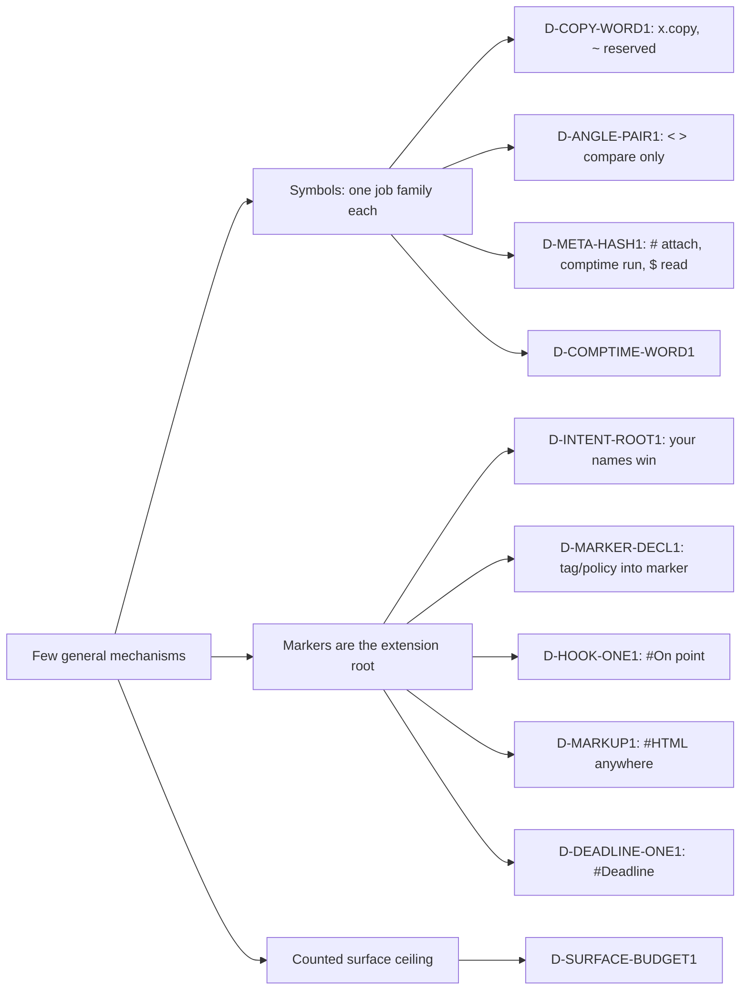

# Owner feedback, 2026-10-05: research report and ballots

Status: proposal. Nothing here is ratified. Each recommendation is an open
ballot draft for the owner. This report answers the owner's feedback of
2026-10-05 (about 20:50): twelve points on sigils, keywords, metaprogramming,
memory, inference, patterns, Lua-style mechanisms, Neovim-style hooks and
WebP. The owner asked for a research-backed evaluation that takes every point
as serious intent, shows *how* to achieve it, and says honestly where an idea
is weaker than an alternative.

Three research agents wrote the parts, and FeedbackSigils (the lead)
integrated them:

| Part | Items | Author |
|---|---|---|
| I. Sigils, keywords and namespaces | 1–5 | FeedbackSigils |
| II. Const parameters, operators, inference, dictionary patterns | 6–9 | FeedbackSemantics |
| III. Lua mechanisms, Neovim hooks, automatic WebP | 10–12 | FeedbackMechanisms |

Evidence base. The repository at master on 2026-10-05; Tower decisions, read
only; about 40 live probes on the dev candidate
`/mnt/jetscratch/candidates/dev-05ea86f65/jet`, each under a 1 GB cap; and
comment- and string-stripped censuses of `Examples/`, `Core/` and `Compiler/`
(287,354 code lines). Primary sources are cited in each part. Claims not
re-read this session are marked `[INFERENCE]` or `[approx]`. Scripts, probes
and raw sections are in `~/.cache/jet-dev/scratch/OwnerFeedback/`.

## Executive summary

**You are not going off the deep end.** Every point names a real weakness or
a real opportunity. Five are right as stated. Four are right with changes.
Two point at a real need that a better route already serves: the freed angle
brackets and `##`. One, const parameters, is something Jet already does
better than the language you are comparing it to.

One principle runs through all twelve answers, and it is your Lua point
applied everywhere: **few, general mechanisms, with good default policies
written in them.**

- Symbols do one job family each. Ownership has `&`, `^` and `@`; outcomes
  have `?` and `!`; the compiler plane has `#`, `$` and `comptime`. Arithmetic
  and rare acts use words.
- New features land as **markers** or **Core names** first: hooks (`#On`),
  deadlines (`#Deadline`), intent labels, and embedded languages (`#HTML { }`).
  A new symbol or keyword needs an owner decision. A counted ceiling enforces
  that rule (D-SURFACE-BUDGET1).
- A name you declare wins over a built-in one, so a Jet release never breaks
  your code. This is the "reserved, expandable root" you asked for, built on
  the marker plane instead of a new sigil.

Headline numbers:

- **87% of today's 1,927 `~` copies become unnecessary** under the ratified
  memory model: a move or a share is identical. At most one meaningful copy
  remains per about 1,200 code lines, and Examples has 8. `x.copy()` costs
  little at that frequency.
- **`<` and `>` appear in about 3,000 comparisons.** Removing generic brackets
  makes them unambiguous, which avoids Rust's turbofish and TypeScript's
  `.tsx` restrictions. That is the most valuable use of the freed brackets.
- **About 1,070 comment lines (6.5%) state intent** that a label or check
  could carry.
- Jet has **51 live keywords** (Lua 22, Go 25, Rust 38, Zig 49), **83 live
  markers**, **61 CLI commands** (peers about 19–30), and **about 14 separate
  hook-registration shapes**. The mechanism merges bring these down and gate
  their growth.
- **82% of parameters are already read-only by default.** A C++-style opt-in
  `const` would add about 28,000 keywords to the corpus.

### Verdicts

| # | Owner point | Verdict | Recommendation | Ballots |
|---|---|---|---|---|
| 1 | Remove `~` as the copy sigil; find a better use | **Adopt** | Spell copies `x.copy()` (compiler-owned, chains). `~` stays reserved, which itself provides the future-proof slot. | D-COPY-WORD1 |
| 2 | Use freed `<>`: `<if>`, inline HTML, bowtie `><`, `<<>>` | **Better alternative** | `<`/`>` compare only; `><` and `<word>` are reserved teaching errors; `<<`/`>>` stay shifts. Web markup: `#HTML { … }` anywhere a value goes, checked and compiled like JSX. | D-ANGLE-PAIR1, D-MARKUP1 |
| 3 | `##` as the metaprogramming operator, `#Markers` its sibling | **Adopt the idea, decline the glyph** | The ontology is right: markers are metaprograms. Keep one spelling per job (`#` attach, `comptime` run, `$` read/splice) and state the family in the spec. `##` is a teaching error. | D-META-HASH1 |
| 4 | Reserved, infinitely expandable namespace; intent in code, not comments | **Adopt, modified** | The marker plane is the root. Your names win clashes with a warning. A one-line marker is an intent label that can grow into a check. No `~` root and no `_`/`__` scheme (`__` already belongs to the machine). | D-INTENT-ROOT1 (+ D-MARKER-DECL1, D-SURFACE-BUDGET1) |
| 5 | `comptime` again now that interpreter and JIT go; build/compile mismatch | **Adopt** | `comptime` replaces `prep` in every form; `jet build` stays (Zig pairs `zig build` with `comptime`). `build` as the word loses: it clashes with `$build` and build entries, and is wrong under `jet check`. | D-COMPTIME-WORD1 |
| 6 | Const parameters: read permission, mutable values, performance | **Already Jet, no change** | The unmarked read parameter is a deep, alias-checked const with no copy (lowers to `&T`). `freeze` is the lasting form. No keyword. | D-PARAM-CONST1 |
| 7 | How far operator overloading goes (C++ `,`, `()`) | **Adopt, modified** | Add the two missing arithmetic hooks, `Neg` (unary `-`) and `Mod` (`%`, `fn mod`). Refuse `()`, `,`, `&&`/`||`, conversions, `->` and `new`; fix the misleading E0102. | D-OP-NEG1, D-OP-CALL1 |
| 8 | Level of type inference | **Adopt (Rust level)** | Written signatures, inferred bodies and effects. Look ahead within one function so `[]`, `[:]` and `None` need no type (about 5,000 written types removed). No whole-program or HM inference across functions. | D-INFER-LEVEL1 |
| 9 | ReScript dictionary pattern matching | **Adopt** | Map/JSON patterns `["k": p]` with optional keys, matching exactly unless the pattern ends with `..`, plus struct and list patterns. Every literal gets a pattern of the same shape. This reverses the mining pass's rejection, with reasons. | D-PAT-MAP1, D-PAT-RECORD1 |
| 10 | Lua: mechanisms over policies; Lua for simplicity | **Adopt** | Fold `tag`/`policy` into `marker`; one `#Deadline` replaces seven timeout setters; fold six CLI commands; counted surface ceilings. Keep shipped default policies, which Lua lacked and later regretted. | D-MARKER-DECL1, D-DEADLINE-ONE1, D-CLI-FOLD1, D-SURFACE-BUDGET1 |
| 11 | Neovim-style hooks into compiler phases and everything else | **Adopt, modified** | One typed hook mechanism from `core.event` (`#On(point)` or `point.on(scope, f)`), with stage, lifecycle and runtime points. Decline mutable compiler internals, as D-METADEPTH1 and D-META-GATE1 already do. | D-HOOK-ONE1, D-HOOK-STAGES1, D-HOOK-LIFECYCLE1, D-HOOK-RUNTIME1 |
| 12 | Automatic WebP in the web framework | **Adopt, modified** | Build-time WebP variants plus `<picture>`; `jet dev` converts on demand; AVIF opt-in. A Jet-written, memory-safe encoder (CVE-2023-4863 argues against bridging libwebp), turned on per source type only after a measured gate. | D-WEB-IMAGE1, D-IMAGE-ENCODE1 |

### How the ballots fit together



Dependencies and consistency checks:

- **D-META-HASH1 and D-COMPTIME-WORD1.** If the owner picks `##` (META-HASH1
  B), the compile-time word becomes moot. Every other combination composes.
- **D-COPY-WORD1 and D-INTENT-ROOT1.** Together they decide `~`. If copies
  move to `.copy()`, INTENT-ROOT1 decides whether `~` stays reserved (A,
  recommended) or becomes an intent root (B).
- **D-INTENT-ROOT1, D-MARKER-DECL1, D-HOOK-ONE1, D-DEADLINE-ONE1 and
  D-MARKUP1** all grow Jet through markers. MARKER-DECL1 makes `marker` the
  one declaration word. INTENT-ROOT1 makes your marker names win clashes.
  The other three add features as markers instead of syntax.
- **D-SURFACE-BUDGET1** enforces the rule the sigil table states: a new
  symbol, keyword, marker or CLI command needs an owner decision. It also
  regenerates the keyword list, which today misses `prep`, `next`, `fact`,
  `yield` and `rust`.
- **D-PAT-MAP1** uses `["k": p]`, not freed angle brackets, so it does not
  compete with D-ANGLE-PAIR1.
- **D-WEB-IMAGE1** emits `<picture>` markup through `web.image`. That fits
  D-MARKUP1's checked `#HTML` blocks.
- **D-PARAM-CONST1 and D-COPY-WORD1** rest on the same fact: read parameters
  never copy (probe p01 lowers to `&Vec`). Copies are rare and deliberate.

### Ballot list

All 22 drafts are in `~/.cache/jet-dev/ballots/READY/`. Each was re-run
together through `node ~/.cache/jet-dev/ballots/READY/validate.mjs` on
2026-10-05: exit 0, no gaps, dry-run `add`. No Tower write was made. All use
the short profile, because research workers cannot start fresh readers.

| Ballot | Item | Card | Recommended (A) | Full profile owed? |
|---|---|---|---|---|
| D-COPY-WORD1 | 1 | c00rqc09 (#4620) | `x.copy()`; `~x` teaching error with fix | yes (Syntax.rs) |
| D-ANGLE-PAIR1 | 2 | c0yxaspm (#4141) | `<`/`>` comparisons only; `><`, tags reserved | no for A |
| D-MARKUP1 | 2 | c0q38sm2 (#4022) | `#HTML { … }` anywhere a value goes | no for A (registry site) |
| D-META-HASH1 | 3 | c0699zei (#4276) | no `##`; spec family table | no for A |
| D-INTENT-ROOT1 | 4 | c0yxaspm (#4141) | markers as the root; your names win; `~` reserved | Main decides (resolution rule) |
| D-COMPTIME-WORD1 | 5 | c0699zei (#4276) | `comptime` | yes (keyword) |
| D-PARAM-CONST1 | 6 | c00rqc09 (#4620) | read access is Jet's const; no keyword | no |
| D-OP-NEG1 | 7 | c0q38sm2 (#4022) | add `Neg` and `Mod` hooks | yes |
| D-OP-CALL1 | 7 | c0q38sm2 (#4022) | no `operator()`; fix E0102 | no for A |
| D-INFER-LEVEL1 | 8 | c0q38sm2 (#4022) | written signatures; function-local look-ahead | no |
| D-PAT-MAP1 | 9 | c0q38sm2 (#4022) | map/JSON patterns, exact unless they end with `..` | yes |
| D-PAT-RECORD1 | 9 | c0q38sm2 (#4022) | struct and list patterns | yes |
| D-MARKER-DECL1 | 10 | c0bs5inj (#4020) | `tag`/`policy` fold into `marker`; `#Policy` = settings | yes |
| D-DEADLINE-ONE1 | 10 | c0q38sm2 (#4022) | one `#Deadline(duration)` | yes |
| D-CLI-FOLD1 | 10 | c0q38sm2 (#4022) | fold six commands (61 → 55) | no |
| D-SURFACE-BUDGET1 | 10 | c0bs5inj (#4020) | counted ceilings; regenerated keyword list | no |
| D-HOOK-ONE1 | 11 | c0yfcz0w (#3520) | typed hook points; `#On` / `.on`; `jet inspect hooks` | yes |
| D-HOOK-STAGES1 | 11 | c0yfcz0w (#3520) | compiler stage points; extends D-DX5-HOOK1 | yes |
| D-HOOK-LIFECYCLE1 | 11 | c0yfcz0w (#3520) | lifecycle points run checked `#Job`s | no |
| D-HOOK-RUNTIME1 | 11 | c0yfcz0w (#3520) | web/game/app points; zero cost unused | no |
| D-WEB-IMAGE1 | 12 | c0h9k3kt (#3561, done; needs a new web-image card) | build-time WebP plus `<picture>` | no |
| D-IMAGE-ENCODE1 | 12 | c0h9k3kt (#3561, done; needs a new web-image card) | Jet-written WebP, gated vs libwebp | no |

Performance-gate obligations (paired cells before ratification) are named in
D-DEADLINE-ONE1, D-HOOK-RUNTIME1 and D-IMAGE-ENCODE1.

### Defects found (card candidates, independent of any ballot)

| Source | Defect |
|---|---|
| Part I | `Docs/spec/reference/metaprogramming.md:19-30` still teaches `@name ::`, `@if` and `@loop`. Those are retired spellings. |
| Part I | D-GENERIC-TYPEFN1 is unbuilt. The dev candidate accepts `fn larger<T: Comparable>`, and `fn larger(prep T: …)` fails with E0357 casing. 507 explicit `name<T>(` calls remain. The `<prep N: Int>` ledger row (D-CONSTGEN2) is superseded but still listed. |
| Parts I/II | E0120 forces `~xs` when a function returns a read parameter (p04), although D-COPY-DEFAULT1 infers a kept parameter there. |
| Part II | E0202 fix text is wrong for parameters (p03); an untyped parameter cascades into a bad E0305 (p21); calling a struct value gives the misleading E0102 (p12); #4374 still reproduces. |
| Part II | `spec.md:205-210`, `:264-265`, `:440` and `:502` still teach bitwise operators and `<>` generics. |
| Part III | `#Policy(audit(...))` does not wrap direct calls; `EventTrace.summary()` prints `<invalid>`; the spec's event example fails E0225; `JET_KEYWORD_LIST` is wrong; the CLI registry has `Fold`; `core.tasks.timeout` only sleeps; `#Policy` still carries scoped settings against D-CALLPOLICY2=C. |

### Checks Main should run

1. `node ~/.cache/jet-dev/ballots/READY/validate.mjs` on the 22 files listed
   above. The lead ran it on 2026-10-05: exit 0.
2. Decide which ballots get the full two-reader profile before posting (column
   above), and open a web-image card for the two item-12 ballots.
3. Optional reproduction: the probe folders `probes/`, `sem-probes/` and
   `mech-probes/`, and the census scripts `sigil-metrics.mjs`,
   `tilde-classify.mjs`, `semantics-metrics.mjs` and `mech-tools/metrics.mjs`
   under `~/.cache/jet-dev/scratch/OwnerFeedback/`. Each probe runs under 1 GB.

---

## Part I. Sigils, keywords and namespaces (items 1–5)

Author: FeedbackSigils. Evidence gathered 2026-10-05 from the repository at
master, Tower decisions (read-only), the dev candidate
`/mnt/jetscratch/candidates/dev-05ea86f65/jet` (`jet check`, 1 GB cap), and
primary sources cited inline. Census scripts:
`~/.cache/jet-dev/scratch/OwnerFeedback/sigil-metrics.mjs` (token census with
comments and strings stripped) and `tilde-classify.mjs` (copy-site
classifier). Probes: `~/.cache/jet-dev/scratch/OwnerFeedback/probes/`.

Corpus measured: every `.jet` file in `Examples/` (1,241 files, 33,506 code
lines), `Core/` (115 files, 35,122) and `Compiler/` (307 files, 218,726);
287,354 code lines in total.

### Summary

You are not going off the deep end. Three of the five ideas are right as
stated, and the other two point at a real need that Jet already has a better
tool for.

| Item | Verdict | Ballots |
|---|---|---|
| 1. Drop `~` as the copy mark | **Adopt.** Spell copies `x.copy()`. Leave `~` unassigned. | D-COPY-WORD1 |
| 2. A use for freed `<>`, `><`, `<<>>` | **Better alternative.** The best thing the freed brackets give is one meaning: `<` and `>` only compare. Web markup goes in `#HTML { … }`, now allowed anywhere a value goes. | D-ANGLE-PAIR1, D-MARKUP1 |
| 3. `##` as the metaprogramming operator | **Decline the glyph, adopt the idea.** Markers really are part of the compile-time family. Write that down, and keep one spelling per job. | D-META-HASH1 |
| 4. A reserved, growable namespace for future features and intent | **Adopt, modified.** Use the marker plane. Your own marker names win a clash, so no release breaks your code. A one-line marker is an intent label that can grow into a check. `~` stays reserved. | D-INTENT-ROOT1 |
| 5. `comptime` instead of `prep` | **Adopt.** Keep `jet build`. Zig shows that the pairing works. | D-COMPTIME-WORD1 |

The recommendations share one rule, and it is Lua's rule applied to syntax:
**a few general mechanisms beat many special-purpose marks**. Each symbol does
one job family. A new feature arrives as a marker, a Core name, or a
library-checked block before it ever takes a new symbol or keyword.

### 1. `~` as the copy mark

#### What Jet has today

`~x` is the one copy spelling (D-SHAPE-COPY1=A, ratified 2026-07-15). It
replaced the word `copy x` because of the owner's rule that "the rarest marked
ownership op gets the last leftover mark". When that choice was made, D-MEM1
made every copy of a reused value a hard error (E0209, "no silent clone
ever"), so copies were written everywhere. D-COPY-DEFAULT1=A later reversed
that premise. Now a last use moves, a reuse shares, and the first write copies.
The memory proposal (section 4.4) says `~x` "is never needed for speed or to
satisfy the checker", only to mean an independent snapshot. D-SIGIL-ALGEBRA1=B
retires `~|` exclusive-or, so after the change `~` has no other meaning.

#### Metrics

Prefix-copy sites, with comments and strings stripped:

| Corpus | `~name` sites | name never used again (move suffices) | only read again (share suffices) | written again (snapshot may be meant) |
|---|---:|---:|---:|---:|
| Examples | 357 | 175 | 166 | 8 |
| Core | 969 | 423 | 463 | 83 |
| Compiler | 601 (+48 on `(…)`) | 192 | 264 | 145 |
| **Total** | **1,927** | **790 (41%)** | **893 (46%)** | **236 (12%)** |

Under the ratified model, 87% of today's tildes are redundant. At most one
copy per about 1,200 code lines might still be needed, and Examples has 8 in
33,506 lines. The "written again" column is an upper bound: any later write
to the root name counts, even a write to a disjoint field.

One more place still forces a tilde today. FeedbackSemantics' probe p04
returns a read parameter and gets E0120, which demands `~xs`. Under
D-COPY-DEFAULT1 a returned parameter is an inferred kept parameter, so that
copy goes away with the share-on-reuse build. It is a defect, not a reason to
keep the mark.

Live probe (`probes/p1_snapshot.jet`): `saved :: board` followed by
`&board.push(4)` gives E0212, "`saved` is a live read view into `board`". Its
fix text already says "make an owned copy". The rare case that needs a
written copy is the one the compiler already points at. Sharing into a struct
field without `~` is accepted today (`p2_share.jet`).

#### Other languages

| Language | Copy spelling | Move spelling |
|---|---|---|
| Swift 5.9 | `copy x`, a contextual keyword (SE-0377, which notes the copy "may still be optimized away") | `consume x` (SE-0366) |
| Hylo | `a.copy()` method (language specification) | `sink` parameters |
| Rust | `.clone()` | implicit move |
| Mojo | copies implicitly for `Copyable` types | postfix `^` "transfer sigil" (mojolang.org ownership manual) |
| Jet today | `~x` | prefix `^x` |

No mainstream language spells copy with a one-character mark. Jet's `^` move
already matches Mojo's mark.

#### Recommendation

Use **`x.copy()`** (D-COPY-WORD1, option A). Methods are snake_case under the
casing law, so the spelling is `.copy()`, not `.Copy()`. The method is
compiler-owned and cannot be redefined. That keeps the reason `.clone()` was
banned: a user-defined copy could break value semantics. It chains without
parentheses: `input.copy().rotate()` replaces `(~input).rotate()`. The cost
is six extra characters on a rare, deliberate act, which is what pillar 3
("friction inversely proportional to commonality") asks for.

#### The best use for a freed `~`

Candidates, ranked against the ratified principle "sigils mean ownership and
outcomes; arithmetic uses words" (card #4141, D-SIGIL-ALGEBRA1):

| Candidate | Precedent | Verdict |
|---|---|---|
| Reserved, no meaning (teaching error) | Rust RFC 3101 reserves syntax with no meaning | **Recommended** (inside D-INTENT-ROOT1 A) |
| Intent / reserved-namespace root (`~hot`) | none as a sigil; Python `__x__`, C `_X` as name prefixes | Second label system beside markers; see item 4 |
| Weak link (`~@Node`) | Swift `weak`, Rust `Weak<T>` are words | Rare. Pillar 3 says use a word. |
| Approximate equality, concatenation (D, Raku), bitwise not | D, Raku, C | Arithmetic or text. Excluded by the ratified principle. |
| Typed literal prefixes (Elixir `~r//`, `~H"""…"""`) | Elixir | Jet already has `Type{ … }` literal heads (D-UNIFYLIT1). It would be a second mechanism. |

Keeping `~` free is the reservation you asked for, at zero learning cost.

### 2. Freed `<>`, the bowtie `><`, and doubled `<<>>`

#### What Jet has today

D-GENERIC-TYPEFN1=A (2026-10-02) removes `<>` from generics. The cutover is
not built yet: the dev candidate still accepts `fn larger<T: Comparable>`
(`p3_angle.jet`), and `fn larger(prep T: …)` fails on casing
(`p4_prep_generic.jet`). After the cutover, `<` and `>` keep comparisons.
`<<` and `>>` stay shifts (D-SIGIL-ALGEBRA1=B) and `<: :>` stays the fence
(D-FENCE2=A). `a >< b` is a parse error today (`p5`), so the bowtie is free.
Byte literals and byte patterns already exist as `[U8]{"…"}` (D-BINPAT1=A).
Inline HTML already exists as `#HTML { <h1>Hi</h1> }`, but only at block and
file sites. `page :: #HTML { … }` gives E0355 "cannot attach at the
Expression site" (`p6_html.jet`).

#### Metrics

Spaced `<` comparisons: 159 (Examples), 1,162 (Core), 1,708 (Compiler).
Shifts `<<`: 25 / 140 / 48. Angle-bracket generic uses still to migrate:
172 / 385 / 21 type positions, and FeedbackSemantics counts 507 explicit
`name<T>(` calls in Examples and Core. Hand-written swap functions: 1 in
Examples, 0 in Core.

#### Evidence

- **Ambiguity is expensive.** Rust needs the turbofish `::<>`. C++11 needed a
  special rule for `>>` closing two templates. TypeScript bans `<T>x` casts
  in `.tsx` files "since TypeScript also uses angle brackets for type
  assertions, combining it with JSX's syntax would introduce certain parsing
  difficulties" (TS handbook, JSX). Generic arrows need `<T,>`. Jet removes
  every one of these hazards by dropping generic brackets. That is the
  dividend: a symbol nobody has to decode.
- **Markup in the grammar has a poor survival record.** Scala 3's reference
  lists XML literals under "Dropped", to be replaced by an `xml"""…"""`
  interpolator (docs.scala-lang.org, verified 2026-10-05). E4X (ECMA-357)
  was removed from Firefox. VB.NET's XML literals never reached C#.
  [INFERENCE: E4X and VB histories not re-read this session.]
- **JSX succeeded because it is not core syntax.** "It is meant to be
  transformed into valid JavaScript, though the semantics of that
  transformation are implementation-specific" (TS handbook). A tool owns
  it, and it compiles to function calls. Jet's library-checked block
  (D-META-DSL1=A) is the same shape: Jet owns the braces and the library
  checks the inside.
- `<if>`-style tags look like template languages (JSP `<c:if>`, Svelte
  `{#if}`). They would be a second spelling of the compile-time word.
- `<<…>>` is Erlang's byte syntax. Jet already has `[U8]{…}`, and `<<` is a
  shift, so this would be a second byte literal and would also force shifts
  to become methods.
- `><` as swap: one use in the corpus. Rust, Python and C++ use a function,
  and Icon's `:=:` swap operator never spread. As relational join, the idea
  is already covered by Jet's query methods, which use words.

#### Recommendation

- **D-ANGLE-PAIR1 A:** `<` and `>` compare and do nothing else. `><` and
  tag-like `<word>` give teaching errors and stay reserved for a later
  ballot. `<<`/`>>` stay shifts.
- **D-MARKUP1 A:** `#HTML { … }` becomes legal anywhere a value goes. It is
  checked like JSX (known tags and attributes, components are functions,
  `{expr}` holes) and compiled to calls. You get the React-style workflow you
  want without HTML entering the core grammar. Every other embedded language
  (SQL, CSS, GraphQL) uses the same mechanism.

### 3. `##` as the metaprogramming operator

#### The idea, evaluated

Your ontology is correct. Markers *are* metaprograms: a marker body reads
target facts and adds items at compile time (D-MARKER-LAW1=A). Jet has three
compile-time jobs and one spelling for each:

| Job | Spelling | Count (Examples / Core / Compiler) |
|---|---|---|
| Attach a rule | `#Name` | 667 / 97 / 17 |
| Run code while compiling | `prep` → `comptime` | 177 / 0 / 116 |
| Read or splice compiler facts | `$` | 102 / 0 / 0 |

In C, `##` is token pasting, which is exactly Jet's `$` name splice (`fn
$method`). Language survey: Jai marks compile-time directives with a single
`#` (`#run`, `#if`, `#insert`). Swift uses `#` for freestanding compile-time
forms (`#if`, `#stringify`) and `@` for attached macros. Rust uses `#[attr]`
and `name!`, Julia `@macro`, and Zig the `comptime` word plus `@builtin`.
**No surveyed language uses `##` as a general metaprogramming operator.**

History matters here. Jet's compile-time mark has been `comptime`, `#Known`
(2026-07-28), `$` (2026-08-06), `@` (2026-08-07) and `prep` (September). Each
symbol form lasted days to weeks. Stefik and Siebert (ACM TOCE 2013,
"An Empirical Investigation into Programming Language Syntax") found that
novices were no more accurate with C-style symbol syntax than with randomly
chosen keywords, while evidence-chosen words did better.

#### Recommendation

**D-META-HASH1 A.** Do not add `##`. Write the family relation into the
metaprogramming reference as one table: `#` attaches, `comptime` runs, `$`
knows. Make `##` a teaching error that points at the right one of the three.
Option B (`##` replaces the word) and option C (`##` replaces `$`, the C
meaning) stay on the ballot as honest alternatives.

### 4. A reserved, growable namespace and intent in code

#### What Jet already has

- Markers must be registry rows (D-MARK-REG1, "no drift, no exceptions").
  A one-line `marker Audited($sites: [.Type])` in source *is* a row
  (`Examples/features/reflection/fact_sigil.jet`).
- Library markers are qualified by their import, capitalized: `#Web.Get`
  (D-MARKER-MODULE1, D-MARKER-CASE1).
- `__name` belongs to the machine (D-SHAPE-DUNDER2, D-NAME-SIGIL1). `core.lang`
  is the language's own drawer (D-LANGNS-NAME1).
- Effect limits already state the most common intents as checks:
  `-[!Mem.Alloc]>`, `!Mem.Copy(above: N)`, `#Unsafe("reason")`.

The gap: if a later release adds a built-in marker with the same name as a
user's local marker, that release breaks the user's code.

#### Metrics

Of 16,537 comment lines, 819 state a rule (must, never, always, do not), 90
purity or side effects, 75 "intentional" or "by design", 54 unsafe or SAFETY,
19 speed or allocation, and 17 invariants or assumptions. About **1,070 lines
(6.5%) carry intent that a label or check could hold.**

#### Evidence

- Comments drift. Tan et al., "/*iComment: Bugs or Bad Comments?*/", SOSP
  2007, mined comment rules in Linux, Mozilla, Wine and Apache and found
  disagreements with the code, several of them real bugs. Wen et al., ICPC
  2019, studied code-comment inconsistencies at scale. [INFERENCE: the
  figures in both papers were not re-read this session.]
- Checked intent works. Rust 1.81 stabilized `#[expect(lint, reason = …)]`,
  which warns when the expected lint does not fire. Java's `@Override` turns
  a stated intent into a compile error when it is wrong.
- Reserved roots. Rust RFC 3101 reserved `ident#…` "as a way of
  future-proofing". It notes that C reserves `_`/`__` names and Python
  reserves `__name__`, and that reserving through a non-identifier character
  "is much less of an imposition". Rust's prelude lets a local item win over
  a newly added prelude name, so additions do not break code. Python 3.10
  added `match`/`case` as soft keywords for the same reason.

#### Recommendation

**D-INTENT-ROOT1 A: the marker plane is the growing root.**

1. New features land as markers or Core names first. A new symbol or keyword
   needs a ballot.
2. A marker you declare wins over a built-in marker of the same name, with a
   warning and a `jet fix` rename. A release can then never break your code.
   This is the Rust prelude rule.
3. A one-line, body-less `marker Hot($sites: [.Function])` is an intent
   label. Inspect lists every use, and a body later turns it into a check.
4. `~` stays unassigned and reserved.

Why not `~hot` (option B)? It creates a second, unregistered label system
beside markers. That contradicts D-MARK-REG1, and the labels would be no more
checkable than comments. Why not a `#Jet.` prefix (option C)? It splits the
built-in markers into two spellings, or forces a rename of all of them.

### 5. `comptime` vs `prep` vs `build`

`prep` was chosen for "shared preparation" that AOT, default run and the
interpreter had to receive with one meaning (D-PREP-SURFACE2 detail). With
one compiled engine left, preparation is simply compile time. On the build
mismatch: `jet check` runs compile-time code without building anything, so
"build time" is not accurate. Compile time covers check, build and run. Zig
pairs the `zig build` command, the `build.zig` file and the `comptime`
keyword, which is exactly the pairing you worry about. `prep` appears once
per about 190 lines of Examples code.

**D-COMPTIME-WORD1 A:** `comptime` marks every compile-time form (block,
`comptime if`, `comptime loop`, `comptime fn`, `comptime T` parameters).
`jet build` stays. `$phase` reads `.Comptime`. One `jet fix` respelling ends
the churn, because the reason for `prep` is gone. Option C (`build` as the
word) collides with `fn build(b: BuildContext)` entries and the `$build`
facts, and it is wrong under `jet check`.

### The whole system in one table

The recommended end state, assuming D-SIGIL-ALGEBRA1=B (already ratified) and
the six ballots above as recommended. Counts are current non-comment uses
(Examples / Core / Compiler).

| Mark | Job family | Meaning | Beginner reads | Expert reads | Change |
|---|---|---|---|---|---|
| `::` | binding | bind once | "is" | immutable binding | — |
| `:=`, `=` | binding | bind changeable; change it | "starts as"; "becomes" | mutable slot, reassignment | — |
| `&x`, `&T` | ownership | write access | "this may change x" | exclusive write window for the call | — (1,099 / 2,603 / 42,946) |
| `^x`, `^T` | ownership | hand over | "give x away" | move/take; prefix only (power → `.pow`) | infix `^` retired (ratified) |
| `@x`, `@T` | ownership | live link | "points at x" | compiler-chosen borrow/count/check (D-MEMREF1); infix `@` = at a source/host | — |
| `x.copy()` | ownership (word) | independent snapshot | "my own copy" | share until first write; compiler-owned | **new**, replaces `~x` (357 / 969 / 649) |
| `~` | — | reserved | error: "write .copy()" | held for a future ballot | **freed** |
| `?` | outcome | may be missing | "maybe" | `T?`, `?.`, `??`, postfix try | — |
| `!` | outcome | may fail; not; deny | "can fail"; "not" | `T!`, Bool not, `!Mem.X` denial in effect rows | integer `!` retired (ratified) |
| `#Name` | compiler plane | attached rule | "a label the compiler reads" | registry marker; `#Pkg.Name` library; your names win clashes | shadow rule (D-INTENT-ROOT1) |
| `#Lang { … }` | compiler plane | embedded language | "HTML/SQL goes here" | library-checked text, compiled to calls | allowed where a value goes (D-MARKUP1) |
| `[T#N]`, `pkg#1.2` | position | fixed size; version pin | "N of them"; "version" | positional, unchanged (D-ONCE-HASH1) | — |
| `$` | compiler plane | what the compiler knows | "a fact about this" | `T.$fields`, `$build`, `$package`, `$phase`, `$program`, name splice; `$NAME` env in config files | — |
| `comptime` | compiler plane (word) | runs while compiling | "done before the program runs" | blocks, if, loop, fn, type params | **renamed** from `prep` (177 / 0 / 116) |
| `<`, `>`, `<=`, `>=`, `<=>` | comparison | compare; three-way compare | "less / greater"; "which order" | never a bracket; `<=>` is built (D-CMP3WAY1=B) | generics removed (ratified); `><` and tags reserved |
| `<<`, `>>` | arithmetic | shift | "shift bits" | shift | — |
| `<: … :>` | structure | fence | "one line, several names" | lock-step expansion | — |
| `->`, `=>`, `-[E]>` | structure | result/arm; lambda; effects | "gives"; "function"; "with effects" | — | — |
| `...`, `.[a, b]`, `..`, `..<`, `\|` | structure | spread; member spread; ranges; alternatives | — | — | — |
| `_`, `__` | names | discard/internal; machine-only | "ignore"; "not mine" | D-NAME-SIGIL1 ladder | — |
| `##` | — | none | error: points at `#`, `comptime` or `$` | — | **reserved** (D-META-HASH1) |

Net effect: the ownership marks drop from four to three, and every
ownership/outcome mark has exactly one meaning. The compiler plane has three
members (`#`, `$`, `comptime`), each doing one job. `<` and `>` lose their
second meaning. Two glyphs (`~`, `><`) and two forms (`##`, `<word>`) go into
reserve. No new symbol is introduced. The keyword count does not change, because
`prep` becomes `comptime`. Jet has 51 live words by FeedbackMechanisms' count
(Lua 5.4 has 22, Go 25, Rust 38). Their D-MARKER-DECL1 removes two of them.
Their D-SURFACE-BUDGET1 turns this section's rule into an enforced ceiling: a
new symbol or keyword needs an owner decision. Their D-HOOK-ONE1 adds hooks as
one marker, `#On(point)`, not as a new symbol. Both follow the same rule as
D-INTENT-ROOT1 A: new features land as markers or Core names.

### Ballots (all validated, `validate.mjs` exit 0, short profile)

| ID | Card | Item | Recommended |
|---|---|---|---|
| D-COPY-WORD1 | c00rqc09 (#4620) | 1 | `x.copy()` |
| D-INTENT-ROOT1 | c0yxaspm (#4141) | 4 (+ freed `~`) | markers as the root; your names win; `~` reserved |
| D-MARKUP1 | c0q38sm2 (#4022) | 2 | `#HTML { … }` anywhere a value goes |
| D-ANGLE-PAIR1 | c0yxaspm (#4141) | 2 | comparisons only; `><`, tags reserved |
| D-META-HASH1 | c0699zei (#4276) | 3 | no `##`; family table in the spec |
| D-COMPTIME-WORD1 | c0699zei (#4276) | 5 | `comptime` |

Each change that touches `Syntax.rs` (COPY-WORD1, COMPTIME-WORD1, and
options B/C elsewhere) still owes the full two-reader profile before posting.
Workers cannot spawn readers, so Main decides.

### Sources

- Swift SE-0377 "borrowing and consuming parameter ownership modifiers"
  (`copy x`); SE-0366 "consume operator". github.com/swiftlang/swift-evolution.
- Hylo language specification, github.com/hylo-lang/specification (`a.copy()`).
- Mojo manual, "Ownership", mojolang.org/docs/manual/values/ownership (`^`
  transfer sigil).
- Rust RFC 3101 "reserved prefixes", rust-lang.github.io/rfcs/3101.
- TypeScript handbook, "JSX", typescriptlang.org/docs/handbook/jsx.html.
- Scala 3 reference, "Dropped: XML Literals", docs.scala-lang.org/scala3/reference/dropped-features/xml.html.
- A. Stefik, S. Siebert, "An Empirical Investigation into Programming Language
  Syntax", ACM TOCE 13(4), 2013.
- L. Tan et al., "/*iComment: Bugs or Bad Comments?*/", SOSP 2007.
- F. Wen et al., "A Large-Scale Empirical Study on Code-Comment
  Inconsistencies", ICPC 2019.
- Zig language reference, "comptime"; Jai `#run` (community documentation)
  [INFERENCE: not re-read this session].
- Jet: Docs/proposals/memory-model-2026-10-05.md §1.1, §4.4; Docs/spec/syntax-decisions.md
  (D-MEM1, D-SHAPE-COPY1, D-NAME-SIGIL1, D-HTML-NAME1); crates/jet-foundation/src/Syntax.rs
  and Syntax/*.rs; Tower decisions cited by ID.

## Part II. Const parameters, operator overloading, type inference, dictionary patterns (items 6–9)

Author: FeedbackSemantics, 2026-10-05. Section for the lead's combined report.
Research only; no Tower writes, no repository edits.

Evidence base:

- **Live probes.** 25 programs on the dev release `/mnt/jetscratch/candidates/dev-05ea86f65/jet`,
  each run under a 1 GB cgroup. Sources and runner:
  `~/.cache/jet-dev/scratch/OwnerFeedback/sem-probes/` (`run.sh`, `p01`–`p36`,
  plus emitted Rust `p01.rs` and `p04.rs`).
- **Corpus census.** `~/.cache/jet-dev/scratch/OwnerFeedback/semantics-metrics.mjs`
  over `Examples/` (1,238 files), `Core/` (115) and `Compiler/` (307). It uses an
  approximate lexer that drops comments and string bodies. Treat the counts as
  ±5%.
- **Decisions read with `tower decision show`.** D-MEM1, D-MEMREF-EXCL1,
  D-CONC-FREEZE1, D-OPDEF1, D-OPMIX1, D-FOUND-OPMIX1, D-CMP3WAY1,
  D-CORE-ROLE1, D-TRAIT-OVERLOAD1, D-SIGIL-ALGEBRA1, D-FOUND-LITERAL1,
  D-LITERAL-PREFIX1, D-CALLVALUE2, D-KEY-TRAITS1, D-GENERIC-TYPEFN1,
  D-GENERIC-CALL1, D-BIND-TYPE2, D-INFER-PRIVATE1, D-PAT-NAMED-NEST1,
  D-DATATREE-PATH1 and D-HONEST-SIG1.
- **Primary sources.** The ReScript 12 manual (Dictionary page and Pattern
  Matching page, fetched 2026-10-05), the ReScript talk transcript
  (yKl2fSdnw7w, 85:40–88:52) and the Mojo ownership manual (fetched). Other
  language facts are cited by name.

Ballots: six. Each validates with `validate.mjs` (exit 0) and is in
`~/.cache/jet-dev/ballots/READY/`:

| Item | Ballot | Card | Recommendation |
|---|---|---|---|
| 6 | `D-PARAM-CONST1.json` | c00rqc09 (#4620) | A: read access is Jet's const; no new keyword; `freeze` stays the lasting form |
| 7 | `D-OP-NEG1.json` | c0q38sm2 (#4022) | A: add `Neg` (unary `-`) and `Mod` (`%`, `fn mod`) hooks |
| 7 | `D-OP-CALL1.json` | c0q38sm2 | A: no `operator()`; fix the misleading E0102 |
| 8 | `D-INFER-LEVEL1.json` | c0q38sm2 | A: written signatures; function-local look-ahead for `[]` and `None` |
| 9 | `D-PAT-MAP1.json` | c0q38sm2 | A: map/JSON patterns `["k": p]`, optional `"k"?: p`, exact matching unless the pattern ends with `..` |
| 9 | `D-PAT-RECORD1.json` | c0q38sm2 | A: struct patterns `Point{x: 0, y}` and list patterns `[first, ..rest]` |

**Process note for Main.** Tower refuses a short ballot whose group is
`syntax`; a syntax ballot must be full and needs fresh beginner and
adversarial review passes. I cannot run those passes. I filed these ballots as
`semantics` or `memory` short ballots, following the precedent of
D-TUPLE-DESTRUCT1, which is a `semantics` short ballot. Four of them add
surface syntax: D-OP-NEG1, D-PAT-MAP1, D-PAT-RECORD1, and D-OP-CALL1's
option B. Main may move any of them to full ballots and run the two passes.

---

### Item 6: const parameters

> "How would jet handle const params in function args/params? Pass as read
> permissions but then what if the values are mutable not immutable? Do we lose
> performance?"

#### Short answer

The owner's instinct is right, and Jet already does it. A parameter with no
mark is a read parameter, and that already does everything C++ `const`
promises, and more:

| Property | C++ `const T&` | Jet read parameter `T` |
|---|---|---|
| Callee cannot write | Yes, but `const_cast` removes it | Yes; nothing can remove it (E0202) |
| Deep (fields, elements) | No; `const` is shallow through pointers | Yes |
| Other writers blocked during the call | No; aliasing is legal | Yes. `f(nums, &nums)` is E0204 (p02); aliasing links get a check (D-MEMREF-EXCL1=A) |
| Copies a mutable caller value | No | No: lowers to `&Vec<…>` (p01 emitted Rust) |
| Optimizer may assume no change | No; that is why `const&` gives no speed gain | Yes, once re-proved (proposal §4.6) |
| Default | Opt-in keyword | Default; write needs `&`, take needs `^` |

**Mutable caller, read parameter.** Probe p01 passes the mutable `nums := […]`
to `fn total(xs: [Int])`. The emitted Rust is
`fn …total(__jet_xs: &Vec<JetInt>)`, called as `total(_l0.as_ref())`. That is
a plain shared pointer with no copy, so no performance is lost. The caller may
change the list before or after the call (`&nums.push(4)` between two
`total` calls works). It may not change the list *during* the call. That rule
is what makes the no-alias fact sound: Rust gives a `&T` without interior
mutability LLVM `noalias readonly`. The memory proposal (§4.3, class Z0)
classifies read parameters as zero-copy. Its §4.6 says the native backend may
emit the no-alias fact only after the independent MIR Lint re-proof (card
#4619), because one wrong `noalias` is silent corruption.

**Is a deeper "immutable value" guarantee needed?** It already exists as
`freeze(x)` (D-CONC-FREEZE1=A). It returns a deeply immutable owned value;
writes through it are E1113 (p05), and tasks may capture it without locks.
The two guarantees divide the work cleanly:

- *read* (call-length, free, the default) answers "this function does not
  change my data".
- *freeze* (lasting, explicit) answers "nobody will ever change this data",
  for caches, cross-task sharing and snapshots.

**Is a frozen parameter kind needed?** No. That would be D's `immutable`
parameters or Pony's `val`. It would force callers to freeze copies for
functions that only read during the call. It buys no speed, because read
already carries the no-alias fact. Mojo reached the same design: its default
argument convention is "an immutable read-only reference", with `mut` and
`owned` as the marked forms (Mojo manual, Ownership, fetched 2026-10-05).
Swift's default is `borrowing` with exclusivity enforcement. Jet's three verbs
(read, `&`, `^`) are the convergent industry answer.

#### Metrics

Census over 34,680 named parameters, not counting receivers:

| Corpus | Read (unmarked) | `&` write | `^` take |
|---|---|---|---|
| Examples | 2,041 (91%) | 114 | 85 |
| Core | 5,084 (97%) | 136 | 8 |
| Compiler | 21,217 (78%) | 5,845 | 150 |
| **Total** | **28,342 (81.7%)** | **6,095 (17.6%)** | **243 (0.7%)** |

Receivers: 248 `self`, 89 `&self`, 30 `^self`. `freeze(` appears 5 times,
all in Examples.

Making read the default saves a keyword on 82% of parameters. A C++-style
opt-in `const` would add about 28,000 keywords to this corpus.

#### Findings for cards (defects, not ballots)

1. **p03, E0202 fix text is wrong for parameters.** It says "Declare `xs :=
   ...`". For a read parameter the fix is `xs: &[Int]` plus `&` at the call
   site.
2. **p04, inconsistent owning destinations.** Storing a read parameter in a
   struct field copies it automatically, as D-MEM-COPYSEM1=A requires.
   Returning it unchanged (`fn echo(xs: [Int]) -> [Int] { xs }`) is E0120,
   which asks for `return ~xs;`. That fix text has two more problems: it
   contains a `;`, and it suggests `View<T>`, which D-MEMREF1 retired in favor
   of `@`. A return is an owning destination, so the same automatic copy
   should apply. This bears on the `~` question FeedbackSigils owns:
   E0120 is one of the places that still forces `~`.
3. **p05, E1113 reports a byte offset.** It says "frozen at `freeze(...)` at
   byte 173" instead of a line and column.
4. **Scalar read parameters.** `n: Int` lowers to `&JetInt` plus `.clone()`.
   This is a known loss owned by the packed-Int work (proposal §4.2); it is
   listed here only because it is the one place a read parameter costs
   anything.

---

### Item 7: operator overloading extent

> "C++ operator overloading → jet allows trait implementations, but C++ scope
> includes things like , as an operator and () as an operator, how extensive
> is jet with this?"

#### Short answer

Jet deliberately covers the useful half of C++ and refuses the half that
history has shown to be dangerous. The rule (D-OPDEF1=A) is:

- only existing symbols can be given meaning;
- precedence never changes;
- arithmetic symbols must mean arithmetic;
- each symbol family is one trait, wired through a builtin role
  (D-CORE-ROLE1=A).

#### C++ operators against Jet

Status is from the probes and the hook registry in
`crates/jet-foundation/src/Syntax/effects_surface.rs:243-262`.

| C++ overloadable | Jet today | Verdict |
|---|---|---|
| `+ - * /` | `Add Sub Mul Div` with typed right sides and the number mirror (D-OPMIX1=D, D-FOUND-OPMIX1=A) | Keep |
| `+= -= *= /=` | Derived from the binary hook (`user_defined.jet`) | Keep (better than C++, where the two can diverge) |
| `== !=` | `Equatable` (`!=` derived; cannot diverge) | Keep |
| `< <= > >=` and `<=>` | `Comparable.compare`; `<=>` is built-in (D-CMP3WAY1=B); chains work (p15) | Keep |
| Hash or key identity | `KeyBy` derives `==`, ordering and hashing from one key (D-KEY-TRAITS1=A) | Keep (better than C++'s separate `std::hash`) |
| `[]` | `Index` / `IndexMut` | Keep |
| `begin`/`end`, range-for | `Iterable` / `Iterator` | Keep |
| `operator<<` to a stream | `Display` / `Debug` traits; interpolation | Keep (no stream abuse) |
| Destructor | `Close` (consuming cleanup) | Keep |
| User-defined literals `_km` | Numbers from context through `Literal.Int` / `Literal.Float` (D-FOUND-LITERAL1=A); checked text prefixes `sql"…"` (D-LITERAL-PREFIX1=A); suffixes refused | Keep. Jet's form is checked at compile time; C++ suffixes are not |
| **Unary `-`** | **Missing**: `-v` is E0109 "Only Int and Float values can be negated" (p10) | **Add `Neg`** → D-OP-NEG1 |
| **`%`** | **Int only** (p11) | **Add `Mod`** (`fn mod`) → D-OP-NEG1 |
| `()` call | Only functions and lambdas; `make_adder(40)(2)` works (D-CALLVALUE2=A). Calling a struct value gives the misleading E0102 "Nothing named `triple` exists" (p12) | Do not add; fix the error → D-OP-CALL1 |
| Bitwise `& \| ^ ~ << >>` | Named methods (`bit_and`); power is `.pow` (D-SIGIL-ALGEBRA1=B) | Settled; FeedbackSigils owns the sigil side |
| `&& \|\| !` | Bool only (E0110, p14) | Never: overloading loses short-circuiting (Google C++ Style Guide bans it; Meyers, *More Effective C++* item 7) |
| `,` comma | None | Never: its overload changes evaluation order and is banned by the Google C++ Style Guide |
| Unary `&` (address-of) | None in safe code; raw pointers sit behind `#Unsafe` and `core.mem` | Never |
| `->`, unary `*` | None; links (`@`) are not smart pointers, and fields read through them directly | Never: needed only for user smart pointers, which Jet provides as one compiler-chosen link type |
| `new` / `delete` | None; allocators are `core.mem` values (`Arena`, `Pool`), and the default allocator is D-ALLOC-DEFAULT1 | Never |
| Conversion operators (`operator T()`) | No implicit conversions (prelude law); `Target.from(x)` is the one conversion verb (D-ONCE-VERB1); `Float{i}` widens through the checked rule; `Meters{i}` stays a struct literal (p13) | Never: implicit conversions are C++'s main overload footgun, and C++11 had to add `explicit` |
| `++` / `--` | No such operators | Never |
| `co_await`, `operator=` | No; assignment and copying belong to the compiler (D-COPY-DEFAULT1) | Never |

#### Is the owner going off the deep end?

No. The question is the right audit. The evidence supports Jet's line and
shows two real gaps:

1. **Unary minus and `%` are the only missing arithmetic hooks.** Every peer
   that has operator overloading has both: Rust (`Neg`, `Rem`), Kotlin
   (`unaryMinus`, `rem`), Swift (prefix functions), C# and Python. Vector,
   complex, money, interval and angle types need them. Corpus: 33
   `Add`/`Sub`/`Mul`/`Div` implementations in Examples and zero negation
   hooks, because none can be written. Hence D-OP-NEG1. `Numeric` is left
   unchanged, so unsigned types are never forced to support negation.
2. **`operator()` is a proven low-value feature in languages that have
   closures.** Rust's user `Fn` implementations have been unstable since 2015
   (rust-lang/rust#29625). Swift added `callAsFunction` in SE-0253 (2019) for
   Swift for TensorFlow, which was archived in 2021. Jet's lambdas already
   carry state. A call hook would make every `f(x)` ambiguous between "a
   function runs" and "a struct method runs". The real defect is the
   diagnostic. Hence D-OP-CALL1.

Abuse is contained by a mechanism, not by advice. D-CORE-LAWS1=A lets a trait
carry law tests that run against every implementation, so a `Mul` that is not
multiplication fails a test. This is Jet's answer to Boost's `&`-means-
serialize problem (APICompCraft row O03).

#### Findings for cards

- **#4374 still reproduces** (APICompCraft p12): one type cannot carry both
  `Mul(V2)` and `Mul(Float)`. That is E0105 "defined twice", although
  D-OPMIX1 ratified typed right sides.
- **`speed * 2.0` is E0133** even with exactly one `Mul(Float)` hook: the
  literal does not take the hook's right-side type (APICompCraft p16).

---

### Item 8: what level of type inference to target

> "What level of type inference should we target and why → evidence backed and
> how does that support all domains at all levels?"

#### Where Jet is today

Measured in probes p20–p26 and the census:

| Site | Jet today | Evidence |
|---|---|---|
| Function parameters | Always written | 34,680 of 34,680 named parameters typed; p21 untyped is an error (with a bad E0305 cascade) |
| Function results | Written; a missing result means unit | p20: E0433 "this Int value is thrown away", a clear fix; D-BODY-LAST1 relies on it |
| Effects and failure kinds | **Inferred**, shown in tools and API snapshots | D-EFFECT-OMIT1=A, D-FAIL-PUBSIG1, D-HONEST-SIG1 |
| Local bindings | Inferred forward from the initializer | About 41,500 bindings; about 85% have no type head |
| Lambda parameters | Taken from the expected type (D-LAMBDA-INFER1, one direction) | Compiler: 133 untyped vs 1 typed. A lambda bound to a local needs types (p23, E0801) |
| Generic arguments at calls | Inferred from arguments and the expected result | p25 works; E0904 explains conflicts |
| Empty `[]` / `[:]` filled later | **Must name the type** (E0501, p22) | 4,258 written `[T]{}` sites |
| `None` assigned later | **Must name the type** (E0308, p26) | 825 typed `?{None}` heads |
| Across functions (HM / whole program) | No | — |

This is "local bidirectional" inference: Swift, Kotlin and Go territory, with
inferred effects added on top.

#### The levels and the evidence

| Level | Languages | Strength | Proven cost |
|---|---|---|---|
| Forward-only local | Go, Java `var`, C++ `auto` | Simple; errors are local | Empty collections and late values need types |
| Local bidirectional | Swift, Kotlin, C#, Scala 3 | Lambdas and literals take types from context | Swift's solver reports "expression too complex to solve in reasonable time", driven by overloads plus literals. Jet has no overloading (E0105), so it avoids the cause |
| Function-local unification | Rust | `let mut v = Vec::new(); v.push(1)` works; signatures remain the contract | Error at a later line; Rust shows the deciding line, and rust-analyzer inlay hints show the type |
| Hindley–Milner with optional signatures | OCaml, Haskell, F#, Elm, Gleam | Shortest code | Worst-case exponential (Mairson, POPL 1990). Errors far from their cause are a known research problem (Wand 1986; Heeren's Helium; Seidel et al., OOPSLA 2017). Every one of these ecosystems recommends signatures anyway: GHC `-Wmissing-signatures`, OCaml `.mli` files, Elm's style guide |
| Whole-program | Crystal | No annotations at all | No separate or incremental compilation of modules; build time grows with the whole program |

The industry trend at module boundaries runs toward **more** written types.
TypeScript 5.5's `isolatedDeclarations` requires written return types on
exports so declaration files can be built in parallel. Kotlin's explicit API
mode (1.4) requires them for public library code. Rust has required them from
the start, so that a signature is a contract that is checked locally.

#### Recommendation: written signatures, inferred bodies, look ahead within one function

This is D-INFER-LEVEL1 option A, the Rust level.

- **Signatures stay written.** Parameters and results are the contract.
  Effects and failures stay inferred and shown (Jet's own extension). This
  keeps per-function checking, the D-EFF-BUILD-REUSE1 caching and the
  build-speed gate intact. It also keeps D-BODY-LAST1 sound.
- **Inside a function, later lines settle `[]`, `[:]` and `None`.** This
  removes about 5,000 written types from Jet's own corpus. It also removes
  the single most common Python-habit stop (`names := []` then push).
  Swift, Kotlin and Go reject that pattern; Rust accepts it.
- **No HM across functions, no whole-program inference.** The costs are
  proven: hidden contracts, errors at a distance, slower separate builds.

How this serves each domain:

| Domain | Need | How option A serves it |
|---|---|---|
| Scripting and REPL | Minimal ceremony | Bodies need no types; `fn run()` needs no signature types; effects are inferred |
| Web and backend | Stable API contracts, fast incremental builds | Written signatures are the API snapshot; inferred effects prove `-[DB.Read]>` |
| Systems and embedded | Exact layouts, predictable code | Types ride values (`U8{250}`) where precision matters; nothing is inferred across modules |
| Data and science | Lambdas everywhere | Lambda parameters come from context (133:1 untyped in the compiler) |
| Games | Hot loops, generic math | Generic calls infer; numeric widening stays the one law (D-NUMWIDEN-CROSS1) |
| Large enterprise code | Auditability | Contracts are always written where reviewers and tools look |

#### Findings for cards

1. **p21:** an untyped parameter yields E0305 "Multi-head variant `n` is not
   an enum variant", then E0107 and E0104. It should be one error: "parameter
   `n` needs a type".
2. **p23:** after E0801, a cascading E0116 suggests the retired signature
   shape `fn inc(…) Type -> …`.
3. **p26:** E0308's fix says "Add a type annotation", but D-BIND-BARE1 and
   D-BIND-TYPE2 retired binding annotations. It should show the typed-head
   form.
4. **p24: D-GENERIC-TYPEFN1=A (`prep T: Comparable` parameters) is ratified
   but unbuilt.** The probe gives E0357 and E0119. The angle-bracket form
   still works (p25). The corpus still has 507 explicit `name<T>(` calls (192
   in Examples, 315 in Core) on the retired angle spelling. This matters for
   FeedbackSigils's "free `<>`" question: `<>` is not free until this cutover
   lands.

---

### Item 9: ReScript-style dictionary patterns (and records, JSON)

> "Look into ReScript and how they can pattern match on dictionaries, seems
> like something that would be useful for jet given focus on pattern matching
> support."

#### What ReScript does

From the ReScript 12 manual, Dictionary page and Pattern Matching page,
section "Match on Dictionaries":

```rescript
let b = switch d { | dict{"B": b} => Some(b) | _ => None }   // key must exist
let b = switch d { | dict{"B": ?b} => b }                    // ?b: option, always matches
switch json {
| Object(dict{"name": JSON.String(name), "email": JSON.String(email)}) => Some({name, email})
| _ => None
}
```

The language team's own framing (talk yKl2fSdnw7w, 87:05–88:52): JSON is a
recursive variant, a JSON object is `dict<JSON.t>`, and with dictionary
patterns "you can write JSON decoders just using the language". Matching is
open: keys not listed are ignored.

#### What Jet supports today

Probes p30–p36 and spec S31:

| Shape | Jet today |
|---|---|
| Enum cases, positional and named payloads, nested | Yes (S31, D-PAT-NAMED-NEST1=A) |
| Literals, value alternatives `"GET" \| "HEAD"`, ranges, guards | Yes (p34) |
| JSON case `.Object(entries)` | Yes, then manual `entries.get(k) == .Val(.Text(x))` (p33 works) |
| **Map pattern** `["a": x]` | **No**: E0107 on `x` (p30) |
| **Map inside a JSON case** `.Object(["name": .Text(n)])` | **No**: E0003 (p35) |
| **Struct pattern** `Point{x: 0, y}` | **No**: E0003 (p31) |
| **List pattern** `[first, ..]` | **No**: E0003 (p32); bindings destructure `[a, b]` only |
| `tree["user"]["name"]` (D-DATATREE-PATH1=A) | **Ratified, unbuilt**: E0505, printed 4× for one site (p36) |

Scale: 5,261 subject `if` tables and 3,105 enum pattern tests in the corpus,
so arm tables are Jet's main control form. JSON-without-struct sites: 90
`.Object(` patterns, 98 string-key indexes and 139 `.get("…")` lookups.
Shipped examples (`json_coerce.jet`, `no_any_alternatives.jet`,
`core_error_conversion.jet`) all use the nested `if`-staircase.

#### Is the owner going off the deep end?

No. The mining distillation rejected this idea
(`Docs/research/mining-playlist-2026-10-05.md` "Rejected ideas"; ledger
`languages-b:R14`) as "a second decode path beside `decode<T>()`". That
objection does not hold up:

- **Decode and patterns do different jobs.** `decode<T>()` converts a whole
  tree into a declared type, with validation. A pattern *tests and
  destructures a value already in hand*. Jet already has both for enums
  (constructors and patterns), and nobody calls enum patterns a second
  construction path.
- **The hand-written equivalent already exists.** It is the nested
  `.Object(entries)` / `.get` / `.Val(.Text(x))` staircase in the shipped
  examples. A map pattern is that same test, written flat. That makes the
  pattern the *one* mechanism (the arm table) applied to one more literal
  kind, not a parallel path.
- **The design has wide precedent.** Python 3.10 mapping patterns (PEP 634),
  Elixir and Erlang map patterns, C# property patterns, and Clojure
  `core.match` all match by key. All of them match *open*, ignoring extra
  keys. Jet matches *exactly* instead: a key the pattern does not list fails
  the arm, unless the pattern ends with `..`, the same rest marker list and
  struct patterns use. An unexpected key is never ignored silently.

#### Best Jet design (D-PAT-MAP1 A, plus D-PAT-RECORD1 A)

Principle: **every literal Jet can build has a pattern of the same shape.**
D-PAT-NAMED-NEST1 already applied this to enum cases.

```jet
if event == {
    .Object(["type": .Text("push"), "ref": .Text(ref), ..]) -> deploy(ref)
    .Object(["type": .Text(kind), ..]) -> print("ignored {kind}")
    else -> print("not an event")
}
if user == ["name": name, "nick"?: nick] -> print(nick ?? name)

if words == {
    [] -> usage()
    ["add", name, ..] -> add(name)
    [cmd, ..] -> unknown(cmd)
}
if p == Point{x: 0, y} -> print("on axis at {y}")
```

Semantics:

- `"k": p` means the key is present and its value matches `p`.
- `"k"?: p` means the key may be missing; `p` matches the optional lookup
  result. This is Jet's suffix-`?` convention (D-TYPE-SUFFIX1) and the
  equivalent of ReScript's `?b`. `"k"?: None` tests that the key is absent.
- Matching is exact: a key the pattern does not list fails the arm. A pattern
  that ends with `..` (`["type": .Text(kind), ..]`) allows extra keys.
- Keys must be literals, enum cases or ALL_CAPS constants. A repeated key is
  rejected with the D-MAPLIT-DUP1 check.
- Exhaustiveness: map keys are runtime data, so a table needs `else` unless
  one arm ends with `..` and uses only `?:` entries with binding sub-patterns.
- Cost: one lookup per distinct key per table, shared across arms. Bindings
  are read windows, so nothing is copied or allocated (Z0 class).
- Lists: `[]`, `[x]`, `[x, ..]`, `[x, ..rest]`, where `rest` is a zero-copy
  window. `[]` plus `[x, ..rest]` counts as complete.
- Structs: `Type{field: p, ..}`, the D-PAT-NAMED-NEST1 brace form with a
  type head. An inferred `{…}` head is rejected because `{` already opens the
  arm table.
- The design works the same whether the JSON type keeps the name `DataTree`
  or becomes `Dyn` (D-INFER-PRIVATE1=A).

The split between decode and patterns is the teaching rule: **decode for a
known schema; patterns for routing on a field, partial reads, and shapes that
vary.** Shipping D-DATATREE-PATH1 (path indexing) completes the third access
style: one-off reads.

---

### Cross-item notes for the lead

- **`~` (owned by FeedbackSigils).** Item 6 confirms that read parameters
  never need `~` for speed (p01). E0120 (p04) is a place that still *forces*
  `~` where D-MEM-COPYSEM1 implies an automatic copy. Fixing it removes one
  more reason for the sigil.
- **`<>` (owned by FeedbackSigils).** `<>` is still the live generic spelling
  until D-GENERIC-TYPEFN1 ships (p24/p25). There are 507 explicit generic
  calls to migrate.
- **Lua's "mechanisms over policies" (owned by FeedbackMechanisms).** Items 7
  and 9 apply it. Operators reduce to one mechanism (a trait plus a builtin
  role), and patterns reduce to one principle (patterns mirror literals). No
  new keywords are needed in any of the six ballots.
- **Stale spec text noticed while reading.** `spec.md:205-210` and
  `:264-265` still describe bitwise `&`, `|`, `~|`, `^` as operators;
  D-SIGIL-ALGEBRA1=B moved them to methods. `spec.md:440` and `:502` still
  teach `Type<Args>` and `fn f<T: Bound>`, which D-GENERIC-TYPEFN1 replaces.
  These belong on the spec-render card, not on a ballot.

### Checks Main should run

1. `node ~/.cache/jet-dev/ballots/READY/validate.mjs` on the six files.
   I ran it; every file returns no gaps and exit 0.
2. Optional reproduction: `~/.cache/jet-dev/scratch/OwnerFeedback/sem-probes/run.sh`
   (1 GB cap per probe; about 30 s total). Then
   `node ~/.cache/jet-dev/scratch/OwnerFeedback/semantics-metrics.mjs Examples Core Compiler`
   from the repository root.
3. Decide whether the four syntax-touching ballots need full-mode fresh
   review before posting.

## Part III. Lua mechanisms, Neovim-style hooks, automatic WebP (items 10–12)

Author: FeedbackMechanisms, 2026-10-05. This is research only. Nothing here was
written to Tower or committed. Ballots are listed at the end. Every one passes
`node ~/.cache/jet-dev/ballots/READY/validate.mjs` (exit 0).

Following the owner's clarification, the Lua and Neovim principles were applied
to all of Jet: language surface, Core APIs, CLI, manifests, tooling, runtime,
frameworks and the package manager. They were not limited to the compiler
examples.

Evidence conventions:
- *Code fact*: checked in the main checkout on 2026-10-05, with a file:line reference.
- *Probe*: run with the dev release `/mnt/jetscratch/candidates/dev-05ea86f65/jet` under a 1.2 GB memory cap. Probe files are in `~/.cache/jet-dev/scratch/OwnerFeedback/mech-probes/`.
- *Metric*: produced by `~/.cache/jet-dev/scratch/OwnerFeedback/mech-tools/metrics.mjs` over Examples/ + Core/ + Compiler/ (1,660 `.jet` files, 328,724 lines).
- *External*: a primary source named inline. `[approx]` marks figures quoted from memory of the documentation that should be re-checked before anything is published.

### Bottom line

You are not going off the deep end. Both principles fit Jet, and Jet already
applies the first one more than you may realise. The honest caveats are below.

1. **Mechanisms over policies is already Jet law.** Invariant I8, D-META-ONE1
   (compiler rules are Prelude Jet declarations), D-META-REG1 (one registration
   table), D-FACTMODEL1, D-TAG-UNIFY1, D-DO1 (no `do` keyword) and
   D-CONF-MODULE1 all say it. What Jet lacks is a *counter* and a *gate*.
   Surface has drifted: the official keyword list is wrong, `tag`/`policy`/`marker`
   are one mechanism under three words, and `#Policy` has two meanings. I found
   concrete merges, but fewer than a fresh audit might expect. Several candidates
   turned out to be policies worth keeping (see "Examined and kept").
2. **Borrow Lua's discipline, not its defaults.** Lua's small core came with
   policy-free defaults that later had to be added back: global-by-default
   variables, 1-based arrays, nil holes in tables, and no class policy, which
   produced many incompatible OOP libraries. Luau and Teal re-added types. Jet's
   pillar 1 (beginner magic, expert opt-out) needs *shipped default policies
   written in the one mechanism*. That is exactly Neovim's runtime files over its
   Lua API, and it is D-META-ONE1.
3. **Neovim-style hooks are a strong idea, and Jet already owns the primitive.**
   `core.event` ships typed events, `Hook<T,R>` and `DecisionHook<T,E>` with
   scopes, priority and once. These are Neovim augroups and autocmds with types.
   Today about 14 registration shapes exist across subsystems. The proposal is
   one hook mechanism (typed points plus `#On(point)` or `.on(scope, f)`), with
   per-subsystem rules for trust and determinism, not per-subsystem mechanisms.
   The one place to say no is Jai/Kotlin-style compiler internals with in-place
   rewriting. Ratified law (D-METADEPTH1, D-META-GATE1) and industry evidence
   both argue against it.
4. **Automatic WebP: yes, at build time, with a memory-safe Jet encoder.** Every
   major web framework converts by default now. Jet's best default is build-time
   variants plus `<picture>`, with `jet dev` converting on demand through the same
   encoder. AVIF stays opt-in. The encoder should be written in Jet, because the
   2023 libwebp exploit (CVE-2023-4863) is the strongest argument against bridging
   C codecs, and I6 favours it too. It turns on by default per source type only
   after a measured gate against libwebp.

### Defects found along the way (for cards, whichever ballots win)

| # | Defect | Evidence |
|---|---|---|
| 1 | `#Policy(audit(...)) fn f` does **not** wrap direct calls. Only `apply(...)` runs the wrapper. No golden catches it, because the examples only use `apply`. | Probe `policy_apply.jet`: direct call prints `7` with no audit line. `apply` prints the audit line. |
| 2 | `EventTrace.summary()` prints `<invalid>`. | Probe `hooks.jet`. |
| 3 | The spec's own event example fails E0225 (`print(&clicked.emit(1).summary())`). | Docs/spec/spec.md:3081 and the probe. |
| 4 | `JET_KEYWORD_LIST` (documented as the single source for LSP, formatter and grammar) includes 9 marker names plus `None`, and omits the live words `prep`, `next`, `fact`, `yield` and `rust`. | crates/jet-foundation/src/Syntax/package_files.rs:464-551; Syntax.rs:67; math_layout.rs:408,571; effects_surface.rs:143; core_surface.rs:514. Card c0bs5inj. |
| 5 | The CLI registry spells one command `Fold` with a capital letter. `search` (packages) and `find` (code) are easy to confuse. | crates/jet-cli/src/CLI.rs COMMANDS. |
| 6 | `core.tasks.timeout(delay)` only sleeps. | Core/tasks/tasks.jet:154. |
| 7 | `#Policy` still carries scoped settings (`gc`, `copies: .Explicit`, `sentries: .Off`), although D-CALLPOLICY2=C says it means wrappers only. | Compiler/JetParser/Source/Parser/Declarations/Policies.jet:1-5. |

---

### Item 10 — Mechanisms over policies, and Lua for simplicity

#### What Lua's principle actually is

Ierusalimschy, de Figueiredo and Celes, *The Evolution of Lua* (HOPL III, 2007),
and *Passing a Language through the Eye of a Needle* (ACM Queue, 2011), describe
the same pattern. Lua provides meta-mechanisms (tables, metatables, closures,
coroutines, environments) instead of features such as classes, modules and
threads. A feature enters only if it is general, and features leave in major
versions (`module()` was deprecated in 5.2). The size outcome is 22 reserved
words (Lua 5.4 manual §3.1) and an implementation of roughly 30k lines of C
[approx, lua.org/about].

The costs are just as well documented:
- No class policy produced many competing OOP libraries (middleclass, classic,
  30log, Penlight). Interop suffered.
- Policy-free defaults hurt at scale: global by default, 1-based indexing, `#t`
  undefined on tables with holes, and integers only since 5.3 (2015).
- Version fragmentation: LuaJIT, and therefore Neovim, stays on 5.1 semantics
  while PUC Lua moved to 5.4.
- Large codebases re-added policy as types: Luau (Roblox) and Teal. Tooling such
  as lua-language-server reads types from `---@param` comments. That is exactly
  the comment-versus-code drift you want to avoid.
- Performance: PUC Lua is an interpreter. Speed comes from LuaJIT (a JIT). Jet
  compiles ahead of time, so Lua's dynamic tables would be a step backwards.

**Synthesis for Jet:** one mechanism per meaning (Lua), *plus* shipped default
policies written in that mechanism (Neovim's runtime, Jet's Prelude), *plus*
static types so the policies are checked rather than conventional. Jet already
committed to the first two in D-META-ONE1.

#### What to borrow from Lua, and what not to

| Lua idea | Verdict for Jet | Why |
|---|---|---|
| Mechanisms, with policies in libraries | **Borrow; already law** (I8, D-META-ONE1, D-META-REG1) | Push further: tags and policies into `marker` (D-MARKER-DECL1), hooks onto `core.event` (D-HOOK-ONE1). |
| A tiny reserved-word set | **Borrow the discipline, not the number** | A counted budget (D-SURFACE-BUDGET1). A hard cap like 22 would force glyph overloading, the C++ comma-operator trap. |
| One composite data type (the table) | **Do not borrow** | It costs type safety and performance. Jet's struct, enum, list, map and `.{}` are each one mechanism already. |
| Coroutines for generators *and* threads | **Do not merge** | Jet's `Stream<T>`/`yield` (pull) and `task` (structured, sendability-checked) differ in ownership rules. Merging would weaken the checks. |
| Metatables for operators | **Already equivalent** | Closed operator set with trait hooks (D-OPDEF1). The API mining classes this as "jet-avoids-mistake" against C++ overloading. |
| `_ENV` as a plain table | **Do not borrow** | Jet's authority and effects are typed and audited instead. |
| Small embedding API | **Already equivalent** | The WASM sandbox (D-PLUGIN1, D-DX5-HOOK1). |
| Global by default, 1-based, nil holes | **Avoid** | These are documented Lua regrets. |

#### Surface metrics (2026-10-05)

| Surface | Jet today | Source |
|---|---|---|
| Live keywords (incl. contextual words and literals) | **51** (`JET_KEYWORD_LIST` has 55 entries: 9 are markers, 5 live words missing) | Syntax.rs and Syntax/*.rs |
| Lexical-ledger sigil/shape rows | 43 | Syntax.rs:20-64 |
| Marker rows | 110, of which 27 retired, so **83 live** | Prelude/Markers.jet |
| Fact rows | 49 | Prelude/Facts.jet |
| Distinct `#Name` used in the corpus | 113 (1,854 uses, 56.4 per 10k lines) | metrics.mjs |
| Top-level CLI commands | **61** (+57 nested actions, 9 inspect planes, 17 retired rows) | crates/jet-cli/src/CLI.rs |
| Public Core functions | 2,419 in 46 modules (math 270, web 232, net 206, …) | Core/*.jet |

| Language | Keywords | Source |
|---|---|---|
| Lua 5.4 | 22 | manual §3.1 |
| Go | 25 (generics added none) | go.dev/ref/spec#Keywords |
| Python 3.12 | 35 + 4 soft | `keyword.kwlist`, `softkwlist` |
| Rust 2021 | 38 strict + 14 reserved | Rust Reference, Keywords |
| Zig | 49 + about 120 `@builtins` | Zig language reference |
| Swift | about 95–100 counting context-sensitive and `#` keywords [approx] | TSPL, Lexical Structure |

| CLI | Top-level commands |
|---|---|
| Lua | 2 executables with flags |
| Go | about 19 [approx] |
| Zig | about 25 [approx] |
| Deno | about 28 [approx] |
| Cargo | about 30 built-in [approx] |
| **Jet** | **61** |

Reading: Jet's keyword count sits between Rust and Zig. That is fine for its
scope, given that most domain features live in markers and Core. The outlier is
the CLI, at roughly double its peers.

Corpus frequency of declaration words: `prep {` 320 uses; `impl` 204;
`module` 106; `trait` 25; `tag` 7; `policy` 2; `protocol` 1; `effect` 1;
`fact` 0 outside the Prelude; `migration {` 0 in Examples, Core and Compiler
(7 tests/ui files only). `event.hook` has 4 uses in 2 files.

#### Concrete merges proposed (each has a ballot)

| Area | Merge | Before → after | Ballot |
|---|---|---|---|
| Language | `tag` and `policy`/`wrap` declarations fold into `marker`. `wrap(call)` becomes a marker-body statement. `#Policy` keeps only scoped settings. This also fixes defect 1 by design. | 3 declaration words → 1; keywords 51 → 49; `#Policy` meanings 2 → 1 | **D-MARKER-DECL1** |
| Core | Per-call timeouts (`tcp_connect_timeout`, `set_timeout`, `set_read_timeout`, `set_write_timeout`, `udp_set_timeout`, `session_timeout`) retire in favour of one `#Deadline(duration)` block over the existing deadline inheritance (D-DEADLINE1). | 7 functions + 1 expert field → 1 marker | **D-DEADLINE-ONE1** |
| CLI | `fuzz`, `test-compare`, `budget`, `gc`, `emit` and `eval` fold into `test`, `perf`, `inspect` and `run`. | 61 → 55 top-level | **D-CLI-FOLD1** |
| Governance (Lua for simplicity) | Registry-computed counts plus a ceiling file. A test fails on growth unless an owner decision raised the ceiling. `JET_KEYWORD_LIST` is regenerated from the `KW_*` constants. | no count → counted, gated | **D-SURFACE-BUDGET1** |
| Hooks (also a merge) | 14 registration shapes → 1 mechanism, with 2 spellings (static `#On`, dynamic `.on`) | see item 11 | **D-HOOK-ONE1** and companions |
| Package / env / git | 6 lifecycle-code shapes → hook points that run checked `#Job` functions under one trust grant | see item 11 | **D-HOOK-LIFECYCLE1** |
| Web / runtime | Middleware wrappers, frame callbacks, commit methods and signal callbacks → typed points; engine hooks watch-only | see item 11 | **D-HOOK-RUNTIME1** |

#### Examined and kept (honest pushback)

- **Migration blocks** (`migration X { add / remove / change … via }`: 6
  contextual words, 0 corpus uses outside tests/ui). The Lua instinct says turn
  them into method calls. I recommend **keeping** them. The compiler checks the
  block statically against the published snapshot (E0910 completeness), and
  `jet inspect schema` reads it as data. Method calls on a run-time value would
  lose that unless they became build-time code, which ends up as a mini-language
  again. The words are contextual, so they reserve nothing.
- **`fact` vs bodiless `marker`.** One table already exists (D-META-REG1). `fact`
  is written only in the Prelude (49 rows, 0 user uses) and names what the row
  is. Folding it saves no learner anything. It is offered as option C of
  D-MARKER-DECL1 and not recommended.
- **Typestate (`state {}`, `#State`, `#Transition`) vs `protocol` (client/server).**
  These are probably one mechanism: a protocol is typestate on a channel
  endpoint. But that is a type-system design question that needs its own study.
  Flagged, not balloted.
- **Generators vs tasks:** keep separate (see the table above).
- **Core second spellings** (`append`/`push`, `index`/`index_of`,
  `loads`/`dumps` aliases, the four names `recv`/`get`/`result`/`wait` in
  `core.tasks`). These are already settled by D-CORE-ONE-NAME1. This is
  implementation under card c0q38sm2, not a new ballot (clarity rule 1). The
  API mining lists them as "jet-repeats-mistake".
- **Manifests.** Field families are already small and typed (env 13, image 11,
  build 6, output 5, manifest 4) after D-DEPS-ENV1. The only real overlap is the
  lifecycle-hook family, which D-HOOK-LIFECYCLE1 covers.
- **Allocator.** One mechanism already (an allocator value, set per package or
  per `#Context` block; D-ALLOC-DEFAULT1). D-HOOK-RUNTIME1 keeps it out of the
  hook system on purpose.
- **Core policy-suffix families.** Only 5 families have 3 or more spellings
  (`parse`/`parse_bytes`/`parse_with`, `read`/`read_bytes`/`read_at`, …), with
  9 `_with` and 8 `_timeout` functions out of 2,419. Core is cleaner than the
  surface. The `_timeout` group is the one true duplicate mechanism, hence
  D-DEADLINE-ONE1.

---

### Item 11 — Neovim-style hooks across Jet

#### What Jet has today

**The primitive already exists.** `core.event` (Docs/spec/spec.md:3031-3093,
Core/event/event.jet:20-46) provides:
- `event.scope()`, which works like an augroup with bulk cancel;
- `Event<T>.on`, `.once` and `.on_priority`;
- snapshot dispatch and bounded async events;
- `event.hook<T,R>(fallback)`;
- `event.decision_hook<T,E>(policy)` with `Continue`, `Transform`, `Cancel` and
  `Fail`.

D-EVENT-CONTINUE1=C calls this "one typed hook mechanism". The probe confirms
that priority and once work, and it also found defects 2 and 3.

**Registration shapes today (14):**
- markers `#Test`, `#Job`, `#Every`, `#DevPanel` and `#Interrupt`;
- `tx.on_commit` / `on_rollback`;
- `process.on_signal`;
- `web.on(...)` and `core.http.middleware.*` wrappers;
- the `game.run` frame callback;
- env `on_enter` / `checks`;
- the env `hook: fn(sh: Shell)` (D-ECO7) plus raw hook records with `trusted: true`;
- `git_hooks_path`;
- package build and install hooks (D-JPK-BUILDSCRIPT1);
- the `JET_COMPILER_EXTENSION` environment variable (D-DX5-HOOK1);
- `compiler.advanced.register*` (D-META-CONTROL2/OPTIN2).

The ratified compiler-extension boundary (D-DX5-HOOK1, architecture.md:780-865)
is a typed read-only post-sema snapshot sent to a zero-import WASM guest. The
guest returns findings and edit proposals that the host validates. The decision
says later stages "extend the same negotiated protocol — they do not invent a
second plugin system", and that the user-facing registration spelling is a later
ballot. This report supplies that ballot (D-HOOK-STAGES1).

#### Evidence from other systems

- **Neovim:** one autocmd mechanism (over 100 events, `:help autocmd-events`)
  with groups, `once`, patterns, and one event set for Vimscript and Lua since
  0.7 (2022). `nvim_buf_attach` `on_lines`/`on_bytes` callbacks are its
  "hooks on data structures". The documented failure is hot-event handlers
  (CursorMoved, on_bytes) causing lag. That led to lazy-loading managers
  (lazy.nvim loads on events) and `--startuptime`. Lesson: per-item payloads and
  visible cost.
- **Emacs:** `add-hook`/`run-hooks`, one mechanism for the whole editor.
- **webpack tapable:** nine hook kinds (sync, bail, waterfall, loop, async series
  and parallel). Jet covers the same space with four (Event, Hook, DecisionHook,
  AsyncEvent).
- **Rollup/Vite:** one plugin hook interface for dev and build, with explicit
  ordering. That is the analogue of I9.
- **Compiler plugins:** Kotlin compiler plugins broke on the K2 rewrite, and KSP
  became the stable API (Google reports KSP up to 2× faster than kapt). Scala 2
  plugins did not survive Scala 3. TypeScript has kept custom transformers out of
  tsc since 2017 (microsoft/TypeScript#14419). Swift macros run in a sandboxed
  separate process over SwiftSyntax (SE-0382/0389). Rust proc macros run
  unsandboxed code at build time, which keeps raising supply-chain concerns
  (2023 serde_derive precompiled binary). Jai's message loop can add code at
  every phase. Lesson: expose a **versioned, read-only snapshot**, never
  internals. Jet's ratified design is right.
- **Lifecycle scripts:** npm install scripts are a recurring attack vector
  (event-stream 2018, ua-parser-js 2021). pnpm 10 and Bun block dependency
  scripts unless allowlisted, the same rule as D-JPK-BUILDSCRIPT1. Husky,
  lefthook and pre-commit exist because raw `.git/hooks` are unversioned and
  unportable.
- **Zero-cost hooks:** Linux static keys and tracepoints patch disabled hooks to
  no-ops. Rust `tracing` caches per-callsite interest.

#### Proposed design

**One mechanism (D-HOOK-ONE1).** Each subsystem publishes its moments as
`core.event` values: `Event<T>` to notify, `Hook<T,R>` to return a value, and
`DecisionHook<T,E>` to continue, transform, cancel or fail. There are two
attachment spellings: `#On(point)` on a function (static, listed, checked,
lowered to direct calls), and `point.on(scope, f)` (dynamic, scoped). The
handler signature must match the point type, which gives a compile-time error
where Neovim gives a run-time no-op. `#Test`, `#Job`, `#Every` and `#DevPanel`
stay, re-declared in the Prelude as markers over `#On`, so no user rewrites.
`jet inspect hooks` lists every attachment with its origin package, for
enterprise audit.

**Event set (initial):**

| Subsystem | Points | Kind | Rules |
|---|---|---|---|
| Compiler | `compiler.parsed(File)`, `compiler.declared(Declaration)`, `compiler.checked(CheckedProgram)`, `compiler.emitted(Artifact)` | Hook returning findings, Generated items or change sets | build-time rules below |
| Build | `build.planned(BuildPlan)`, `build.asset(Asset)` (image conversion hangs here) | Hook | build-time rules |
| Tools | lint (findings from `checked`), `fmt.file`, `lsp.code_actions`, `lsp.hover`, `doc.page`, `test.finished` | Hook | build-time rules; prebuilt tools in the WASM sandbox |
| Lifecycle | `env.entered`, `env.checked`, `git.pre_commit`, `git.pre_push`, `package.installing`, `deploy.before`, `deploy.after` | Event running `#Job` functions | one trust grant (D-HOOK-LIFECYCLE1) |
| App / runtime | `app.started`, `app.stopping`, `process.signal` | Event | zero cost when unused |
| Web | `web.request` (DecisionHook, which is middleware), `web.responded`, `web.failed` | DecisionHook / Event | ordered: priority → package → declaration |
| Game | `game.frame`, `game.fixed_step`, `game.scene_entered`, `game.scene_left` | Event | zero cost when unused |
| Data | `tx.committed` / `tx.rolled_back` as per-transaction scoped subscriptions; field changes stay on `core.reactive` signals and `#Track` | Event | scoped |
| Test | `test.before_each`, `test.after_each` | Event | |
| Engine | `task.spawned`, `task.finished`, allocation statistics | **watch-only** Event fed by `JET_OBSERVE` | no intervention (D-HOOK-RUNTIME1) |

**Build-time rules (D-HOOK-STAGES1):**
1. Hooks read a frozen snapshot of their stage.
2. They return typed outputs only: findings, additive `Generated` items
   (D-META-PUBLISH2), change sets with root opt-in (D-META-CONTROL2/OPTIN2), and
   assets.
3. Effects are limited to Tier 0/1 (pure or recorded inputs) under the prep fuel
   limit, so equal inputs give equal outputs.
4. Caching is per item (hook fingerprint × item fingerprint), with
   interface-digest early cutoff for whole-program hooks.
5. Results merge as sets. Overlapping edits are an error naming both packages.
   There is no priority at build time.
6. Dependency hooks run only when the root lists them, with digest-bound grants.
   Prebuilt or foreign-language hooks keep the zero-import WASM world.
   `jet build --timings` reports cost per hook.

This replaces the `JET_COMPILER_EXTENSION` variable with `#On` for Jet-written
hooks and a `package.jet` hooks list for components.

**Types and data structures.** Owner question: "application for data structures
and types". Compile-time hooks on types already exist as marker bodies and
derives (a package reacts to every type that carries its marker). That is
Neovim's pattern filter at compile time, and it stays the way to do it.
Run-time per-value hooks stay on `core.reactive` signals and `#Track`. Adding
arbitrary per-field callbacks would repeat Neovim's `on_bytes` hot-path lesson.

**What not to do.** Mutable compiler internals or a full message loop with
in-place rewriting. That contradicts D-METADEPTH1 and D-META-GATE1, and Kotlin,
Scala and TypeScript show the stability cost. It is offered as option C of
D-HOOK-STAGES1 and not recommended.

---

### Item 12 — Automatic WebP and AVIF in the Jet web framework

#### Jet today

There is no image pipeline:
- `core.image` is ratified (D-CORE-IMAGE1=A: Jet-owned PNG/JPEG/GIF decode,
  PNG/JPEG encode, nearest-neighbour resize, explicit budgets) but has no module
  yet.
- `b.add_asset_bundle` appears in the spec (spec.md:4060) without an
  implementation.
- `Core/net/mime.jet:108` knows `webp`.
- `Core/web/web.jet` has no asset handling.

#### What the frameworks do

These are defaults from current documentation. Re-verify the exact numbers at
ratification.

| Framework | When | Negotiation | Default formats | Quality | Encoder |
|---|---|---|---|---|---|
| Next.js `next/image` | on demand (`/_next/image`), disk cache | Accept header | WebP; AVIF opt-in | 75 | sharp (Apache-2.0 over LGPL libvips) |
| Astro `astro:assets` | build for static pages; on-demand endpoint for SSR | `<Picture>` | WebP; `formats` for AVIF | service default | sharp |
| Nuxt Image | IPX on demand (server), prerender (static) | `<NuxtPicture>` | WebP plus original | provider default | sharp (IPX) |
| SvelteKit enhanced-img | build | `<picture>` | AVIF + WebP + original | plugin default | sharp |
| Gatsby plugin-image | build | `<picture>` | auto + WebP; AVIF opt-in | plugin default | sharp |
| Eleventy Image | build | `<picture>` | WebP + JPEG | plugin default | sharp |
| Hugo | build (`resources/_gen` cache) | template | explicit `webp` | 75 | Go plus libwebp |
| Vite | none built in | plugins | — | — | plugins |

**Byte savings.** Google's WebP studies report lossy WebP 25–34% smaller than
JPEG at equal SSIM, and lossless WebP 26% smaller than PNG. AVIF typically saves
more than WebP (web.dev; Netflix tech blog 2020) but encodes several times
slower; Next.js documents slower encoding for AVIF. Browser support: WebP is in
every current major browser (Safari 14+). AVIF needs Safari 16.4+ and Edge 121+
(caniuse) [approx shares]. The HTTP Archive Web Almanac (Media, Page Weight)
reports images as the largest byte share of a median page.

#### Recommended default (D-WEB-IMAGE1 = A)

- **Build-time conversion.** `web.image("hero.jpg", alt: …)` produces up to
  three widths (640/1280/1920, never upscaled), content-hashed and served with
  immutable caching, inside a `<picture>` with the original as fallback.
- **Encoding defaults.** JPEG uses lossy quality 75 (the Next.js, Hugo and
  Squoosh default). PNG uses lossless WebP. If the WebP is larger, Jet keeps the
  original. Animated GIFs are untouched.
- **`jet dev`** converts on first request with the same encoder and cache, so dev
  and build bytes match (I9).
- **AVIF** is opt-in, one setting away.
- **Run-time uploads** use the explicit `core.image` call, not automatic
  conversion.

**Why not on demand?** Jet's build already knows every image. On-demand
conversion costs server CPU and a writable cache, breaks static hosting, and
Accept-header negotiation needs `Vary: Accept`, which fragments CDN caches.

#### Licensing, dependencies and safety (D-IMAGE-ENCODE1 = A)

Licences of the candidate libraries:
- libwebp: BSD-3-Clause.
- libavif: BSD-2-Clause.
- libaom: BSD-2-Clause plus the AOM patent licence.
- rav1e: BSD-2-Clause (Rust).
- libvips: LGPL-2.1+ (bundled by sharp).
- image-webp: MIT/Apache-2.0, pure Rust, decoder plus lossless encoder only.

Two constraints decide the choice:
- I6 requires an owner decision and a bridge for any new stdlib dependency.
- D-CORE-IMAGE1 already chose a Jet-owned image library.

The decisive safety fact is CVE-2023-4863: a heap overflow in libwebp's lossless
decoder, exploited in the wild, that shipped through every browser and Electron
app bundling it.

Recommendation: a Jet-written WebP encoder and decoder in `core.image`, built
lossless first, then lossy. Each source type turns on by default only after a
measured gate: size within a stated margin of libwebp at equal SSIM, and speed
inside the build-time performance cell. Until lossy passes, photos stay JPEG, so
nothing regresses. AVIF returns as its own owner decision, most likely a rav1e
bridge, if measured demand appears.

Honest weakness: a Jet lossy encoder that matches libwebp's size and speed is
real work. libwebp's encoder is on the order of 20k lines of SIMD-tuned C
[approx]. The gate keeps users from ever getting a worse default, but photo
savings arrive later than they would with option B (bridge libwebp now).

---

### Ballots (all validated, exit 0)

All are in `~/.cache/jet-dev/ballots/READY/`. They were generated from
`~/.cache/jet-dev/scratch/OwnerFeedback/mech-tools/ballots.mjs`, so the surface
and long form cannot drift.

| File | Item | Card | Recommendation (A) |
|---|---|---|---|
| D-MARKER-DECL1.json | 10 language | c0bs5inj | Fold `tag` and `policy` into `marker`; wrappers run on every call; `#Policy` = settings only |
| D-DEADLINE-ONE1.json | 10 Core | c0q38sm2 | `#Deadline(duration)` replaces 7 timeout setters and the `#Context` deadline field |
| D-CLI-FOLD1.json | 10 CLI | c0q38sm2 | Fold six variant commands (61 → 55) |
| D-SURFACE-BUDGET1.json | 10 Lua simplicity | c0bs5inj | Counted surface ceilings, raised only by owner decision; regenerate the keyword list |
| D-HOOK-ONE1.json | 11 all subsystems | c0yfcz0w | Typed hook points from `core.event`; `#On` / `.on`; `jet inspect hooks` |
| D-HOOK-STAGES1.json | 11 compiler and tools | c0yfcz0w | Stage points plus six build-time rules; replaces the env variable; extends D-DX5-HOOK1 |
| D-HOOK-LIFECYCLE1.json | 11 package/env/git/deploy | c0yfcz0w | Lifecycle points run checked `#Job`s under one trust grant; portable git shims |
| D-HOOK-RUNTIME1.json | 11 frameworks/runtime | c0yfcz0w | Web/game/app points; zero cost when unused; scheduler and allocator watch-only |
| D-WEB-IMAGE1.json | 12 when | c0h9k3kt | Build-time WebP variants plus `<picture>`; dev on demand; AVIF opt-in |
| D-IMAGE-ENCODE1.json | 12 encoder/deps | c0h9k3kt | Jet-written, memory-safe WebP, gated against libwebp; AVIF later |

Notes for the orchestrator:
- D-MARKER-DECL1, D-DEADLINE-ONE1, D-HOOK-ONE1 and D-HOOK-STAGES1 add or remove
  registry words, so they need the full two-reader profile before posting. They
  were drafted in short form because workers cannot start readers, and each
  says so in `checkInstructions`.
- c0h9k3kt is a done card. A web-image card should be opened before posting the
  item-12 ballots.
- Performance-gate obligations (paired cells) are named in D-DEADLINE-ONE1,
  D-HOOK-RUNTIME1 and D-IMAGE-ENCODE1.
