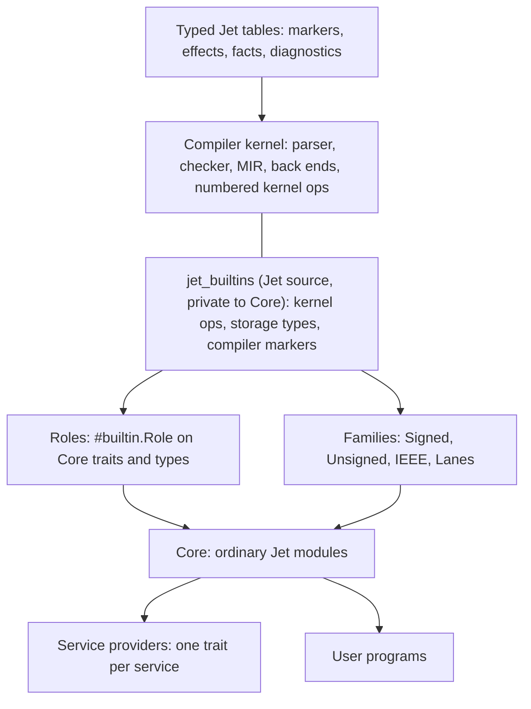

# Core foundations: a small set of mechanisms that Core and the compiler are built from (2026-10-04)

This dated research answers the owner direction on card #4570. It does not
ratify anything or own any work; Tower owns the plan. It builds on
`Docs/research/compiler-corelib-boundary-2026-10-04.md` (the boundary report
behind D-CORE-BOUNDARY1, which the owner ratified as A) and does not repeat its
evidence except where a proposal here depends on it.

Owner direction (2026-10-04, verbatim, after ratifying D-CORE-BOUNDARY1=A):
"i think we should consider more aligned foundational elements for libraries
and the compiler, like how rust has a "marker" for rustc intrinsics ( I want to
call jet version jet_builtins), and other ways we could use conventional jet,
metaprogramming in jet, optimizations, advanced features of jet, ways to
streamline things, like instead of having ten different classes for differnet
width ints, maybe we could have one with a comptime metaprogram that builds
whichever are needed/required by jet, ways to mark different effects,
abilities, requirements, features, constants/sigils/etc. this is just very
rough thought to try to make the compiler and corelibs as easy to read and
reason about as possible and for it to be very elegant, ingenius, and
beautifully strcutured".

Owner clarification relayed by Main the same day: the four named areas were
examples, not the scope. This report therefore surveys every axis and gives one
catalogue row per idea (section 3). Each idea that needs an owner choice has
its own ballot draft under `~/.cache/jet-dev/ballots/READY/`.

Method. Counts come from `git grep`, `wc` and file reads at the current
checkout on 2026-10-04. Decisions were read with the read-only Tower CLI
(`decision show`). Peer sources were downloaded or read on 2026-10-04 and are
cited with paths and line numbers in section 9. Nothing was built or run
against the Jet compiler. Statements not observed directly are marked
**[INFERENCE]**.

## Plain summary

1. Most of the owner's wish is already law. Ratified decisions say that Core is
   ordinary Jet over a small kernel (D-CORE-SOURCE-AUTHORITY1), that compile
   time is one Jet program (D-META-ONE1), that every compiler table is
   generated from one declared twin (D-OPENTABLE1), that a sized integer is
   "Int plus a proven range and a one-byte layout" (D-TYPE2-NUM1), that hardware
   knowledge is typed entries in Core (D-CORE-BOUNDARY1) and that derive
   providers become marker bodies (D-MARKER-LAW1). The code has not caught up.
2. The code shows one root problem in many forms: **compiler magic is
   invisible and repeated**. The standard traits `Equatable`, `Comparable`,
   `Add` and `Numeric` have no Jet declaration at all; their names and even
   `Numeric`'s supertraits are Rust constants, written twice
   (`crates/jet-foundation/src/Generics.rs:9-43`,
   `crates/jet-foundation/src/Syntax/effects_surface.rs:236-262`). Core calls
   1,757 hidden routing rows whose bodies are Rust expressions
   (`crates/jet-codegen/src/Prelude/Core.jet:253-446`). Fixed-width numbers are
   matched at 310 compiler sites (`Type::IntN`) plus 204 for `F32`, and the
   ratified `F16`, `BF16`, `I128` and `U128` still do not parse
   (`crates/jet-foundation/src/AST/types.rs:1100-1125`).
3. The proposal is **one visible door plus six ordinary-Jet foundations**:
   (1) the `jet_builtins` module, the only place compiler-provided operations,
   storage types and compiler markers are declared, each with an optional plain
   Jet body that defines its meaning; (2) roles, a builtin marker that binds a
   Core declaration to language syntax such as `+`, literals, `loop … in` and
   `?`; (3) generic type families built once by Core source, so `U8`…`U128`,
   `I8`…`I128`, `F16`…`F64` are aliases of two or three generic types; (4) one
   service-provider model shared by target profiles, `#Context` and tests;
   (5) chip-feature requirements inferred like effects; (6) traits that carry
   their own derivation; and (7) compiler tables that are typed Jet values
   generated from those declarations.
4. Eight owner choices came out of the catalogue, and each has a ballot draft
   (section 11). Four were ratified A on 2026-10-05; four are open
   (D-CORE-DERIVE-HOME1, D-CORE-FEATURE-FLOW1, D-CORE-LAWS1, D-CORE-HEADER1).
   Everything else is settled by a ratified decision or is implementation
   work, and the catalogue says which.
5. Compile time: every family instance, role table and builtin table is built
   when the Core bundle is built and shipped in the memory-mapped interface
   record (SP12). A user build pays a table lookup, never a compile-time
   evaluation, so the speed plan's 0.10 s comptime budget for 300k lines is not
   touched by these mechanisms.

## 1. The design on one page



Reading rule for the whole design: **a reader sees `builtin.` exactly where the
compiler does something that Jet source cannot**. Everything else is
ordinary Jet that a user could have written.

| Foundation | One sentence | Owner choice |
|---|---|---|
| `jet_builtins` | One private module declares every compiler-provided operation, storage type and compiler marker, in Jet, with an optional plain body as its meaning. | D-CORE-BUILTINS1 |
| Roles | A Core declaration takes on language meaning (`+`, literals, loops, `?`, interpolation) through one builtin marker at the declaration. | D-CORE-ROLE1 |
| Families | One generic Core type per numeric family; the familiar names are aliases; only standard sizes exist. | D-CORE-NUMFAMILY1 |
| Providers | Each replaceable Core service is one trait; target profiles, `#Context` and tests all choose a value of that trait. | D-CORE-PROVIDER1 |
| Feature flow | A function that uses a chip feature needs it, inferred and shown the way effects are. | D-CORE-FEATURE-FLOW1 |
| Derivation home | A trait carries its own derivation, so the trait, the request marker and the template are one declaration. | D-CORE-DERIVE-HOME1 |
| Typed tables | Compiler vocabularies are ordinary typed Jet declarations from which every table is generated. | Settled by D-META-ONE1, D-OPENTABLE1 |

## 2. Ratified law this design stands on

| Law | What it already says | Source |
|---|---|---|
| Core is Jet over a small audited kernel | "only unexpressible operations" stay in the kernel | D-CORE-SOURCE-AUTHORITY1=A |
| Chip knowledge in Core | typed instruction entries with feature, encoding, LLVM operation and plain body; kernel-only Core functions expand inline at every level | D-CORE-BOUNDARY1=A |
| One runtime, compile-once Core, comptime at O0 | Core compiled once; compile-time code runs on the O0 code generator | D-EXEC1=A |
| One lowering | one MIR read by every back end | D-TIER-ONEIR1=A |
| Compile time is one Jet program | marker rows, effect roots and the dimension table are Jet declarations | D-META-ONE1=A |
| One registration table, one declaring word | marker rule, plane, right and build fact are rows of one table; `marker` is the word; `fact` declares non-code rows | D-META-REG1=A, D-META-NAME1=A, D-FACTDECL1=A |
| Generate tables from declared twins | drift guard fails a hand row | D-OPENTABLE1=D |
| Markers in the registry, no drift | a marker exists if and only if it is a row | D-VERDICT-1455-1 (D-MARK-REG1) |
| Library markers are qualified | `#web.Get`; bare names are language rules | D-MARKER-MODULE1=A |
| Package markers add and reject; only Prelude rows change checking; derive providers become marker bodies | | D-MARKER-LAW1=A |
| Named marker groups | `marker Model = #[Codable, Equatable, Debug]` | D-MARKER-GROUP1=A |
| Compile-time mark | `prep { … }`, `prep if`, `prep loop`, `prep fn`, `<prep N: Int>` | D-PREP-SURFACE2=A, D-PREP-BRANCH1=A, D-PREP-FN1=A, D-CONSTGEN2=A |
| Compiler facts | `$` members: `T.$fields`, `f.$effects`, `$build.cpu` | D-COMPILER-NS1=A, D-META-ROOT3=A |
| Number grid | a sized width is Int plus range plus layout | D-TYPE2-NUM1=A |
| Exact Int default, fixed widths opt-in | | D-INTBIG1=A |
| Lexical overflow policy | `#Arithmetic(.Wrapping)` on function or block | D-WRAP-SCOPE1=A |
| Lossless widening | implicit for whole numbers and floats | D-INTLIT-WIDTH1=F, D-VERDICT-1304-1 |
| Destination names the conversion | `UserId.from_int(raw)` | D-SHAPE-CONVERT1=A |
| Literal capability | `impl Rational.Literal.Int { prep fn from_literal … }` | D-FOUND-LITERAL1=A |
| One numeric trait | `Numeric: [Add, Sub, Mul, Comparable]` with `zero()`, `one()` | D-TRAIT-OVERLOAD1=A |
| Low floats | `F16`, `BF16`; `F8E4M3`, `F8E5M2` storage only | D-LOWFLOAT1=A |
| One lane type | `Lanes<T, N>` and native `Lanes<T>` | D-LANES1=A |
| CPU levels | `#Multiversion(levels)`, `prep if $build.cpu.has(.AVX2)` | D-CPU-DISPATCH1=A, D-SIMD-NATIVE1=A |
| Private native tools | private to bundled Core; owner-admitted providers | D-RT-NATIVE-CAP1=A |
| Effects | `-[Net]>` rows, `effect` leaf declarations, short roots, `#FX` scopes | D-EFF1..5, D-EFFECT-DECL1=A, D-EFFECT-ROOT-WORDS1=A, D-ABILITY-NAME2=A |
| One effect list | `core.compiler.lang.Effect` generated from `Effects.jet` | D-EFFECT-ENUM1=A |
| One authority substrate | effects, caps, policy, budgets and trust read one rights tree | D-AUTHORITY-MODEL1=A |
| Gate law | every gate kind can be forbidden and explained | D-GATE-LAW1=A |
| Service replacement in scope | `#Context(http: Fake{})` | D-EFFECT-HANDLE1=A |
| Target facts name providers | `facts: { allocator: board.fixed, … }` | D-FREESTAND-FACTS1=A |
| Layers | inferred `core ⊂ alloc ⊂ std` with optional ceiling | D-RINGLAYER1=A, D-FREESTAND-PRELUDE1=A |
| Auto-derive | everything derivable is derived unless refused | D-META-AUTO1=A, D-AUTODERIVE1=E |
| Copies | the compiler chooses move, share or copy | D-COPY-DEFAULT1=A |
| One inliner | shared MIR inliner for every level | D-OPT-INLINE1=A |

## 3. The catalogue

One row per idea. "Ratified" means the owner has decided this card's ballot.
"Ballot" means an owner choice drafted for this card and still open.
"Settled" means ratified law already decides it and only implementation
remains. "Impl" means an implementation choice under an approved contract.
Every "Settled" claim was checked against the cited decision with the
read-only `decision show` on 2026-10-05.
Order follows dependency: a row depends only on rows above it.

| # | Idea | Problem today (evidence) | Proposal | Status | Depends on |
|---|---|---|---|---|---|
| 1 | Kernel door: `jet_builtins` | Core reaches compiler operations through 1,757 routing rows whose payload is Rust source (`Prelude/Core.jet:253-446`); Core functions call rows with their own module's name, 620 `core.x.y(…)` calls inside Core (for example `Core/mem/mem.jet:42-46` calls `core.mem.volatile_read` from `core.mem.volatile_read`); a hidden `__core_intrinsic` namespace (`Syntax.rs:60`); empty "compiler-owned nominal" structs (`Core/mem/mem.jet:20-31`) | One private Jet module declares every kernel operation, storage type and compiler marker; optional plain body is the meaning; only Core and admitted providers import it | **Ratified D-CORE-BUILTINS1=A** (2026-10-05) | D-CORE-BOUNDARY1 |
| 2 | Roles (lang items) | Standard traits have no Jet declaration; their names and `Numeric`'s supertraits are Rust constants written twice (`Generics.rs:9-43`, `effects_surface.rs:236-262`, `Policy.rs:1933-1937`); 23 built-in `Type` variants and 42 reserved names | `#builtin.Role(.Add)` on the Core declaration; closed role list in `jet_builtins`; `jet inspect roles` renders the page | **Ratified D-CORE-ROLE1=A** (2026-10-05; markers PascalCase) | 1 |
| 3 | Optimizer knowledge only from kernel ops, roles and declared rows | Risk of Swift-style string hints (`@_semantics("array.count")`, UnderscoredAttributes.md:1146) | No semantic-string hints; the optimizer knows kernel op meanings, role contracts and effect rows; it never assumes a trait law because a test passed (row 29) | Settled: follows from D-CORE-ROLE1=A (roles are the one typed hook; stated in its detail) and I8. Correction 2026-10-05: D-OPT-INLINE1 is about the inliner and does not address hints | 1, 2 |
| 4 | Numeric family | Per-width hand rows (`Registry/BuiltinStatics.jet:210-238`, 9 widths, no 128-bit); name parser hard-codes 8/16/32/64 (`types.rs:1100-1125`); 310 `Type::IntN` and 204 `Type::Float32` match sites; ratified `F16`/`BF16` absent everywhere | `Signed<prep bits: Int>`, `Unsigned<prep bits: Int>`, `IEEE<prep exponent: Int, prep fraction: Int>` declared once in Core over `builtin.Bits<bits>`; names are aliases; standard sizes only | **Ratified D-CORE-NUMFAMILY1=A** (2026-10-05) | 1, 2 |
| 5 | Conversions generated, not listed | 13 hand `from_<source>` rows per destination (`BuiltinStatics.jet:225-238`) | One `prep loop` over the family list writes the ratified `from_<source>` methods | Impl under D-SHAPE-CONVERT1=A (destination names the conversion) and D-STRUCT-ONCE1=A (a loop over a closed written type list); row 4 is now ratified | 4 |
| 6 | Literals through the literal capability | Literal fit checks in Rust (`types.rs:1127-1135`) | Each family implements `Literal.Int` with a `prep fn` range check | Settled by D-FOUND-LITERAL1=A (verified 2026-10-05) | 2, 4 |
| 7 | Lanes are a family member | Closed lane family in Rust (`Prelude/Core/SimdLanes.rs`) | `Lanes<T, N>` over `builtin.Vector<T, N>`; element `T` from row 4 | Settled by D-LANES1=A ("defined in Core over compiler lane intrinsics"), D-SIMD-NATIVE1=A, D-CORE-NUMFAMILY1=A | 1, 4 |
| 8 | Instruction entries spelled through the door | D-CORE-BOUNDARY1's `#Instruction` spelling is "illustrative until its marker row lands" | `#builtin.Instruction(needs:, encode:, llvm:)` declared in `jet_builtins` | Settled: part of D-CORE-BUILTINS1=A (its option A declares compiler markers such as `Instruction` in `jet_builtins`) | 1 |
| 9 | Chip-feature requirements | No way for a helper to say it needs AVX-512; `#Multiversion` and `core.arch` absent from code | Requirement inferred like an effect, shown in hover and docs, met at a `#Multiversion` copy or `prep if $build.cpu.has(…)` | **Ballot D-CORE-FEATURE-FLOW1** (open; being revised by BallotRevise) | 1, 8 |
| 10 | Service providers | Three ways to choose who implements a service: target facts (`Prelude/Facts.jet:54-67`), `#Context` with a fixed menu of three fields (`Prelude/Markers.jet:177`) beside the ratified provider form (D-EFFECT-HANDLE1), test fakes as separate calls (`Prelude/Core.jet:415-417`) and `#Test(faults:)` (`Markers.jet:187`) | One trait per service; all three places name a value of that trait; `#Test(faults:)` stays as a short spelling over it | **Ratified D-CORE-PROVIDER1=A** (2026-10-05) | — |
| 11 | Trait carries its derivation | Each derivable trait exists three times: a Rust name constant, a marker row (`Markers.jet:79-100`, 10 rows) and a `derive T.X` template (`Prelude/Derives.jet:13-108`) | `derive { … }` block inside the trait; the request marker and auto-derive read it | **Ballot D-CORE-DERIVE-HOME1** (open; being revised by BallotRevise) | 2 |
| 12 | Codable as a group | `#Codable` is a separate row beside `#Encode`, `#Decode` | `pub marker Codable = #[Encode, Decode]` | Settled by D-MARKER-GROUP1=A (impl; members are active markers, which `Encode` and `Decode` are) | 11 |
| 13 | Typed compiler tables | Prelude "Jet" files use seven row grammars that are not Jet: tab-separated `diagnostic` rows (`Prelude/Diagnostics.jet:3-7`), `bootstrap … depends_on`, `module … exports { … }`, `source_module … owns { … }`, `dispatcher_row … | <Rust>`, `format_row` (`Prelude/Core.jet:7-16,241-253`) | Every table is ordinary typed Jet: a `prep` list of typed values (as `Registry/BuiltinStatics.jet:210` already does) or a declaration with `$` facts (as `Markers.jet` and `Facts.jet` already do) | Settled by D-META-ONE1=A ("exactly one parse path"), D-OPENTABLE1=D, D-FACTDECL1=A (impl; the row grammar is internal) | — |
| 14 | Core is its own twin | `module X exports { … }` re-lists every `pub` name of each Core file; hand Rust signatures per Core call (`crates/jet-sema/src/Sema/CheckerCoreLib/`, 26,960 lines) | The interface record is generated from Core source; `Prelude/Core.jet` module and dispatcher rows retire as modules port | Settled by D-CORE-SOURCE-AUTHORITY1=A, D-OPENTABLE1=D (Core dispatcher and export classifier generated), SP12 | 1, 13 |
| 15 | One effect list | `Effects.jet` lists 15 roots and leaves; `core.compiler.lang.Effect` lists 12 different ones (`Random` vs `Rand`, `Proc`, `Crypto`; `Core/compiler/lang.jet:25-38`) | Generate the enum from `Effects.jet` | Settled by D-EFFECT-ENUM1=A (impl) | 13 |
| 16 | Effect scope marker | `#FX`, `#Abilities` and `#Caps` all exist as rows; the last two are retired teaching rows (`Markers.jet:163-167`) | Keep `#FX`; D-AUTHORITY-WORD2's `#Abilities` wording was superseded by D-ABILITY-NAME2 | Settled by D-ABILITY-NAME2=A (its option D, "confirm D-AUTHORITY-WORD2", was rejected). Record conflict with D-AUTHORITY-WORD2=E noted in `~/.cache/jet-dev/ballots/READY/NOTE-CORE-FOUNDATIONS-RECORDS.md` §1 | — |
| 17 | Marker argument menus | `core.compiler.lang` enums are hand-copied menus (`Core/compiler/lang.jet:1-176`) | Generated from the registry rows | Settled by D-RULEARG-TYPES1=A (impl) | 13 |
| 18 | Compile time runs compiled Core | `crates/jet-comptime/.../core_calls/` re-routes Core calls at compile time (6,443 lines, boundary report §2.1) | Comptime runs the O0 build of the same Core; the re-routes are deleted | Settled by D-EXEC1=A (compile-time code runs at O0 and calls the same compiled Core), D-META-ONE1=A; speed cards SP03, SP17 | 1 |
| 19 | Per-type helper copies | 36 Core functions differ only by a type suffix, for example `identity_int`, `identity_float`, `min_int`, `max_int` (`Core/prelude/prelude.jet:21-50`) beside generic `keep<T>` | One generic function per meaning over `Numeric` or `Comparable` | Settled by D-TRAIT-OVERLOAD1=A ("a generic definition is the only way one name serves many types"), D-CORE-DOCTRINE1=A (impl) | 2 |
| 20 | Kernel-only functions inline at every level | Every `Int` operation is an out-of-line call today (boundary report §4.3) | Transparent Core functions over `builtin.` calls expand at the call site | Settled by D-CORE-BOUNDARY1=A (kernel operations "expand inline at every level") | 1 |
| 21 | A plain body is the specification | Rust lets an intrinsic carry a "fallback body" that tools treat as the specification (`library/core/src/intrinsics/mod.rs:13-27`) | Every builtin with an expressible meaning carries its Jet body; generated tests compare body and compiled operation on every level | Settled: part of D-CORE-BUILTINS1=A | 1 |
| 22 | Layer is a declared fact of each Core package | Each Core module's layer is hard-coded in Rust (`RingLayer.rs:214-300`, boundary report §2.4) | The Core package header states `layer:`; the compiler reads it | Settled by D-RINGLAYER1=A (the `layer:` package field) (impl) | 14 |
| 23 | Core package headers state only what differs | 54 Core files repeat a 10-line `package { … }` block, all with `version: "0.0.1"`, `edition: "2026"`, `license: "MIT"` (`Core/math/math.jet:1-10`) | Members of a root take version, edition and license from the root unless they state their own; Core gets one root header | **Ballot D-CORE-HEADER1** (new 2026-10-05). Not impl: the fix changes the package model for every monorepo (D-ECO-MEMBERS1 members are independent today) | 14 |
| 24 | Kernel versioning | No kernel number today | One kernel number per Core bundle | Settled by D-CORE-BOUNDARY1=A ("a Core bundle names the kernel number it needs") | 1 |
| 25 | Platform adapters as Core data | `OSTarget` closed enum of three systems (`OSTarget.rs:12-17`) | Systems, CPU levels and features are Core rows over the target table | Settled by D-CORE-BOUNDARY1=A (a library change can add chip levels and operating-system adapters), D-OS-FLOOR1=A | 1 |
| 26 | Unsafe builtins stay gated | 53 `#Unsafe` blocks in Core | Raw-memory builtins are themselves `#Unsafe` functions, so calling them still needs a reasoned block | Settled by D-UNSAFE-EFFECT=A and D-CORE-BUILTINS1=A | 1 |
| 27 | No hand-listed error conversions | 13 hand-listed error names for `impl E -> Err` (D-STRUCT-ONCE1's example); `Prelude/Errors.jet:44-150` still ships the rows, citing D-FAIL-CONV2 | No conversion is declared or generated: an `#Error` value flows into `Err` by itself; delete the rows | Settled by D-ERR-TRAIT1=A (2026-09-29; amends D-FAIL-CONV2; "library errors use this same path") (impl: cleanup) | — |
| 28 | Infallible Core functions | 2,444 Core lines carry `Never!` (104 files), added 2026-09-30 (commit 853ebc2d1) | Keep: Core states every contract, and `Never!` is the stated "cannot fail" | Settled by owner ruling 2026-09-30 "Core must name its failures" (card #3708 log; ratified D-CALLBACK-ERR1 lesson; `syntax-decisions.md:7688-7689`). Inference (D-FAIL-INFER-UNION1=A) serves user code. Record note: NOTE-CORE-FOUNDATIONS-RECORDS.md §4 | — |
| 29 | Trait laws as tests | Nothing states that `Equatable` is reflexive or that `Add` on `Numeric` is associative; optimizer and readers must trust names. Property tests exist (D-TEST1) but generate only primitive, list and optional values (E0613, `BodyCheck.rs:1021-1039`) | `#Test` functions inside a trait run automatically under `jet test` for every implementing type; values built from fields; `#Waive(law, "reason")` for a knowing break | **Ballot D-CORE-LAWS1** (new 2026-10-05) | 2 |
| 30 | `state { … }` sections versus fact enums | Typestates have a struct-body `state { … }` section (D-STATE-HOME1, `effects_surface.rs:110-116`) while D-FACTMODEL1 says states are enums | Keep the `state { … }` section; one fact registry and matcher stay behind it | Settled by D-STATE-HOME1=A (2026-08-25, later than D-FACTMODEL1's 2026-07-28; it rejected the fact-enum form as its option C); tags settled by D-TAG-SURFACE1=A. Record note: NOTE-CORE-FOUNDATIONS-RECORDS.md §2 | — |
| 31 | Lower-case markers | `#allow` and `#wire` are lower-case among 110 PascalCase rows (`Markers.jet:207,211`) | Keep `#allow`; retire `#wire` | `#allow` settled by D-MARK-REPEAT1=A, D-GATE-LAW1=A. `#wire` impl: delete the row, its `Policy.rs:2044` test entry and its `tests/truthfulness.rs:609` zero-use triage line. No source uses it, no decision defines it, and it takes no arguments; it entered in commit 413ac90b6 without a ruling, and its triage card #1830 is done | — |

Rows 1, 2, 4 and 10 are ratified (2026-10-05); rows 9, 11, 23 and 29 are open
owner choices. The rest are settled by ratified law and are recorded so a
planner can open implementation cards without re-deriving them.

## 4. Foundation 1: the `jet_builtins` door (D-CORE-BUILTINS1)

### 4.1 Jet today

- **Routing rows with Rust payloads.** `Prelude/Core.jet` holds 1,757
  `dispatcher_row`s. The text after `|` is a Rust expression, for example
  `CoreCallRecord::new("core.mem", "volatile_read", "std::ptr::read_volatile", false, &[false]).without_direct_aot()`
  (`Prelude/Core.jet:255`). 599 rows carry a second JIT symbol (boundary
  report §2.2).
- **Same name, two routes.** `Core/mem/mem.jet:42-46` defines
  `pub fn volatile_read<T>` whose body calls `core.mem.volatile_read<T>`, which
  resolves to the routing row, not to itself. Core has 620 such
  `core.x.y(…)` calls (count of `\bcore\.[a-z_.]+\(` in `Core/`).
  `Core/math/math.jet:12,18` calls `core.math.round` and `core.math.fabs` the
  same way.
- **Fake declarations.** `Core/mem/mem.jet:20-31` declares `Arena {}`,
  `Bump {}`, `Fixed {}`, `Pool<T> {}`, `Pin<T> {}` as "compiler-owned nominal
  surfaces"; the real types live in the compiler.
- **A hidden namespace.** `__core_intrinsic` is a "compiler-only namespace"
  (`Syntax.rs:60`, D-CORE-CALL1) used as a reachability marker.
- **A ratified private door already exists for one slice.** D-RT-NATIVE-CAP1=A
  puts typed low-level runtime tools in `core.mem.native`, importable only by
  bundled Core and owner-admitted providers.

### 4.2 Peers

- **Rust.** Intrinsics are bodyless or fallback-bodied functions in one module,
  `core::intrinsics`, each tagged `#[rustc_intrinsic]`. The module comment
  says a fallback body "will be used by codegen backends that do not have a
  dedicated implementation" and may be marked
  `#[miri::intrinsic_fallback_is_spec]` when it is equivalent to the
  specification (`library/core/src/intrinsics/mod.rs:13-27`; `fabs` at
  3673-3679 has such a body). Lang items are a separate marker,
  `#[lang = "…"]`, "loaded lazily by the compiler" (Unstable Book,
  lang_items).
- **Swift.** The `Builtin` module is visible only to the standard library;
  `UInt8` is a struct over `Builtin.Int8`, and its operators call
  `Builtin.cmp_eq_Int${bits}` (`stdlib/public/core/IntegerTypes.swift.gyb:88-99,229-234`).
- **Zig.** About 121 `@builtin` calls with a sigil, no module; `std.meta`
  builds types with `@Type` (boundary report §3; `lib/std/meta.zig:942-955`).
- **Odin.** `base/intrinsics/intrinsics.odin` is a documentation-only package
  (`#+build ignore`, lines 1-3) that declares each intrinsic bodyless with
  `---`; the compiler supplies them.
- **Nim.** Each `system` procedure binds a compiler magic by pragma:
  ``proc `+`*(x, y: int): int {.magic: "AddI", noSideEffect.}``
  (`lib/system/arithmetics.nim:77`).
- **Carbon.** Library declarations bind a named builtin with `= "…"`:
  `private fn MakeInt(size: IntLiteral) -> type = "int.make_type_signed";`
  (`core/prelude/types/int.carbon:15`).
- **Julia.** Integer `+` is `add_int(x, y)`, a Core intrinsic, applied to all
  bit-integer types at once (`base/int.jl:87`).
- **Lean.** `@[extern "sym"]` binds a Lean declaration to a C symbol; the Lean
  type defines the meaning and the reference interpreter needs the compiled
  symbol (Lean reference §12.4).
- **Idris 2.** `%builtin` and `%foreign` pragmas bind declarations to
  primitives (Idris 2 reference, pragmas).

Two shapes recur: **one module** (Rust `core::intrinsics`, Swift `Builtin`,
Odin `intrinsics`) and **a marker on each public declaration** (Nim `magic`,
Carbon `= "…"`, Rust `#[lang]`). The module shape gives one auditable place;
the marker shape removes one call hop. Rust has both, for two jobs: the module
for operations, the marker for roles. Section 5 follows that split.

### 4.3 Proposal

`jet_builtins` is one compiler-provided module written in Jet and shipped in
the Core bundle. It declares three kinds of item and nothing else:

1. **Kernel operations**: the closed, numbered kernel table of
   D-CORE-BOUNDARY1 (about 150–300 operations, boundary report §4.1), each as
   a typed Jet function. A function whose meaning can be written in Jet carries
   that body; a function with no expressible meaning (volatile load, syscall,
   fence) has no body, which is legal only in this module.
2. **Storage types**: the machine value kinds the kernel owns, such as
   `Bits<prep n: Int>`, `Vector<T, prep n: Int>`, raw pointers and the exact-Int
   word. Core types wrap them; users never name them.
3. **Compiler markers**: the markers only the compiler can honour, such as
   `Role` and `Instruction`. Per D-MARKER-MODULE1 they are
   written qualified, `#builtin.Role(.Add)`, so the prefix itself shows the
   magic.

Visibility reuses D-RT-NATIVE-CAP1's rule verbatim: bundled Core and
owner-admitted providers may import `jet_builtins`; every other package gets a
registered diagnostic. `core.mem.native` becomes ordinary Core Jet over
`jet_builtins` and keeps its ratified name and admission rule, so there is
still one gate. Raw-memory builtins are declared `#Unsafe(…)` functions, so
calling one still needs a reasoned `#Unsafe` block (D-UNSAFE-EFFECT); typed,
total builtins such as `add_wrap` need no block.

Before (`Core/mem/mem.jet:42-46` and `Prelude/Core.jet:255`):

```jet
pub fn volatile_read<T>(pointer: *T) -> T Never! {
    #Unsafe("volatile access requires an audited typed pointer") {
        return core.mem.volatile_read<T>(pointer)   // a routing row, not this function
    }
}
// Prelude/Core.jet
dispatcher_row plain core.mem volatile_read | CoreCallRecord::new( "core.mem", "volatile_read", "std::ptr::read_volatile", false, &[false], ) .without_direct_aot()
```

After:

```jet
// Core/builtins/memory.jet, module jet_builtins: no body, the compiler emits one load
#Unsafe("reads memory the type system cannot see")
pub fn volatile_load<T>(pointer: *T) -> T Never!

// Core/mem/mem.jet
use jet_builtins as builtin
pub fn volatile_read<T>(pointer: *T) -> T Never! {
    #Unsafe("volatile access requires an audited typed pointer") {
        return builtin.volatile_load<T>(pointer)
    }
}
```

A builtin with a plain meaning:

```jet
// module jet_builtins: one machine add; the body is the meaning
pub fn add_wrap<prep n: Int>(a: Bits<n>, b: Bits<n>) -> Bits<n> Never! {
    Bits<n>.from_int((a.to_int() + b.to_int()) %% (1 << n))
}
```

### 4.4 Cost, diagnostics, paths, migration

- **Speed.** Builtin calls lower to kernel MIR operations at every level; Core
  wrappers made only of builtin calls expand inline (D-CORE-BOUNDARY1). The
  wrapper hop costs nothing at run time. The builtin table is part of the
  interface record, so startup reads it by ID (SP12).
- **Meaning.** A builtin's body is its specification. The bundle build
  generates one test per bodied builtin that compares the body with the
  compiled operation on every level, as D-SIMD-NATIVE1 already requires for
  instruction rows.
- **Diagnostics.** Three new registered codes: importing `jet_builtins` from
  an unadmitted package, a bodyless function outside `jet_builtins`, and a
  compiler marker used outside Core. Every diagnostic that names a Core
  operation now points at Jet source.
- **Beginner path.** Unchanged: beginners never see `jet_builtins`.
- **Expert path.** Reading Core shows exactly where the compiler acts:
  `jet inspect builtins` lists the table with each entry's body or "no body".
- **Migration.** Mechanical but large: the 1,757 rows retire as the #3690 port
  moves each module to Jet; the 620 self-named calls become `builtin.` calls
  or ordinary Core calls; `__core_intrinsic` retires; the five empty shells in
  `core.mem` become real Core types over builtin storage. Greenfield cutover
  per module.

## 5. Foundation 2: roles (D-CORE-ROLE1)

### 5.1 Jet today

The language gives some declarations special meaning: the target of a plain
whole-number literal, the traits behind `+ - * /`, `==` and `<`, the cursor
that `loop x in xs` walks, the carriers behind `T?` and `E!`, the trait that
`{value}` interpolation calls, the trait that `defer close(^r)` needs, indexing
and ranges. Today the compiler knows all of these by hard-coded names:

- `Generics.rs:9-43` and `effects_surface.rs:236-262` each list the standard
  trait names; `Policy.rs:1933-1937` lists the derivable ones again.
- `effects_surface.rs:261-262` defines `Numeric`'s supertraits and static
  members as Rust arrays, so `Numeric`'s shape exists only in the compiler.
- `Type` has 23 built-in variants and `RESERVED_TYPES` reserves 42 names
  (boundary report §2.3).

No Jet declaration exists for `Equatable`, `Comparable`, `Add` or `Numeric`
(a search of `Core/`, `Prelude/`, `crates/jet-foundation/src` and
`Compiler/JetFoundation/Source` for `trait Equatable`, `trait Comparable` or
`trait Numeric` finds nothing).

### 5.2 Peers

Rust's lang items are the model: `#[lang = "add"]` on `core::ops::Add`, loaded
lazily, "most of them can only be defined once" (Unstable Book). Swift ties
`ExpressibleByIntegerLiteral` and `_ExpressibleByBuiltinIntegerLiteral` to
literal syntax by protocol conformance (`IntegerTypes.swift.gyb:89-99`).
Carbon binds `ImplicitAs` and `EqWith` conversions to builtins in library
source (`int.carbon:31-36,93-96`).

### 5.3 Proposal

`jet_builtins` declares one closed enum, `Role`, and one compiler marker,
`Role(role: Role)`. A Core declaration takes a role by carrying
`#builtin.Role(.X)`. Each role is filled exactly once in the bundle; a missing
or duplicate role fails the bundle build. `jet inspect roles` renders the one
page that lists every role and its declaration, so the fact is said once and
the overview is generated (philosophy, "Say it once").

Before (`effects_surface.rs:255-262`):

```rust
pub const TRAIT_NUMERIC: &str = "Numeric";
pub const NUMERIC_SUPERTRAITS: &[&str] = &[TRAIT_ADD, TRAIT_SUB, TRAIT_MUL, TRAIT_COMPARABLE];
pub const NUMERIC_STATIC_MEMBERS: &[&str] = &["zero", "one"];
```

After (`Core/math/numeric.jet`, shape from D-TRAIT-OVERLOAD1):

```jet
use jet_builtins as builtin

#builtin.Role(.Add)
pub trait Add {
    fn add(self, rhs: Self) -> Self
}

pub trait Numeric: [Add, Sub, Mul, Comparable] {
    fn zero() -> Self
    fn one() -> Self
}
```

`Numeric` needs no role: it is an ordinary trait built from role traits. The
role list stays small: literal targets (whole, decimal, text), the operator
traits, equality, order, hashing, iteration, the two carriers, display, close,
index and range. **[INFERENCE]** about 25 roles, against Rust's roughly 150
lang items, because Jet's kernel operations cover what Rust needs lang items
for (allocation, panics, unwinding).

Optimizer knowledge follows from this: the optimizer may rely on kernel
operation meanings and on role contracts written in Core (for example that
`Comparable.compare` is used by `<`). It never relies on string tags such as
Swift's `@_semantics("array.count")` (UnderscoredAttributes.md:1146).

Cost: the role table is part of the interface record. Diagnostics improve: an
error about `+` on a type without `Add` points at the Core trait source.
Migration: the Rust constant lists retire; each standard trait gains a Jet
declaration in Core.

## 6. Foundation 3: one numeric family (D-CORE-NUMFAMILY1)

### 6.1 Jet today

- `Type::IntN { signed, bits }` already models every fixed width as one
  variant (`types.rs:1023-1028`), but `F32` is a separate variant
  (`Type::Float32`, line 1039) and `Float`/`F64` another.
- Names are parsed by hand: `numeric_type_from_name` accepts 8, 16 and 32 for
  both signs and 64 only unsigned plus the literal `I64`; 128-bit widths do not
  parse (`types.rs:1100-1125`).
- The Jet compiler's numeric table lists nine fixed widths by hand, with Rust
  type strings (`Registry/BuiltinStatics.jet:210-221`), and thirteen
  conversion sources (`:225-238`).
- 310 `Type::IntN` match sites and 204 `Type::Float32` sites in `crates/`.
  `F16` and `BF16` (ratified by D-LOWFLOAT1) appear nowhere in `crates/`,
  `Compiler/` or `Core/`. `I128` and `U128` appear only in 8 Rust and 3 Jet
  compiler files and never in Core.

### 6.2 Peers

| Language | How the widths exist | Source |
|---|---|---|
| Zig | `std.meta.Int(signedness, bit_count)` returns a type built by `@Type`; any width 0–65535 | `lib/std/meta.zig:942-955` |
| Julia | `primitive type Int8 <: Signed 8 end` per width; methods written once for `T <: BitInteger`; conversions generated by `for to in BitInteger_types, from in …  @eval …` | `base/boot.jl:270-288`, `base/int.jl:87,617-633` |
| Rust | one `int_impl!` macro call per width in `core` | `library/core/src/num/mod.rs:382-405` |
| Swift | one gyb template expanded per width over `Builtin.Int${bits}` | `IntegerTypes.swift.gyb:88-99` |
| Carbon | one generic `class Int(N: IntLiteral)` adapting a builtin-made type | `core/prelude/types/int.carbon:15-19` |
| Mojo | **[INFERENCE, not re-read this session]** `Int8` and friends are aliases of `Scalar[DType.int8]`, itself `SIMD[dtype, 1]`; the documentation page returned 404 on 2026-10-04 | — |
| Nim | one `magic` declaration per width and operator | `lib/system/arithmetics.nim:77-82` |

Two families of answer: **generate copies** (Rust macros, Swift templates,
Julia `@eval`, Nim) or **one generic type** (Zig, Carbon, Mojo). The generic
answer is the only one where adding a width is one line.

### 6.3 Proposal

Core declares each family once, over builtin storage, and names the standard
members with aliases. Only standard sizes exist (8, 16, 32, 64, 128 bits for
whole numbers; binary16, bfloat16, binary32 and binary64 for decimals; the two
8-bit storage formats of D-LOWFLOAT1). In-between value sets use the range
types that already exist (`Int(0..127)`), which is what D-TYPE2-NUM1 already
says a sized width is: Int plus a range plus a layout. Allowing arbitrary
widths would give two spellings for one meaning (`Unsigned<7>` and
`Int(0..127)`), which I8 forbids.

```jet
// Core/math/fixed.jet (illustrative)
use jet_builtins as builtin

pub struct Unsigned<prep bits: Int> { raw: builtin.Bits<bits> }
pub struct Signed<prep bits: Int> { raw: builtin.Bits<bits> }

alias U8 :: Unsigned<8>
alias U16 :: Unsigned<16>
alias I32 :: Signed<32>
alias I128 :: Signed<128>
```

Operators are written once per family. The `#Arithmetic` policy
(D-WRAP-SCOPE1) selects which builtin a body uses; checked arithmetic is the
default:

```jet
impl Unsigned<prep bits: Int>.Add {
    fn add(self, rhs: Self) -> Self {
        Self{raw: builtin.add_checked(self.raw, rhs.raw)}   // traps on overflow unless policy says otherwise
    }
}
```

Decimal family:

```jet
pub struct IEEE<prep exponent: Int, prep fraction: Int> { raw: builtin.Float<exponent, fraction> }
alias F16 :: IEEE<5, 10>
alias BF16 :: IEEE<8, 7>
alias F32 :: IEEE<8, 23>
alias F64 :: IEEE<11, 52>
```

What stays primitive: only `builtin.Bits<n>`, `builtin.Float<e, f>`,
`builtin.Vector<T, n>`, pointers, `Bool` and the exact-Int word. What the
optimizer knows: the kernel operations those bodies call, which are inlined at
every level, so constant folding, range analysis and vectorization see
`add_checked` on a 32-bit word exactly as they would see a hard-coded `I32`.
Literals use the literal capability (D-FOUND-LITERAL1) with a `prep fn` range
check, so `U8{300}` is still a compile error. Conversions keep their ratified
`from_<source>` names (D-SHAPE-CONVERT1); one `prep loop` over the family list
generates them. Lossless widening (D-INTLIT-WIDTH1=F) becomes one rule over
`bits` and sign instead of a table. Lanes use the same element types
(`Lanes<F32, 16>` is `Lanes<IEEE<8, 23>, 16>`).

Diagnostics must show `U8`, never `Unsigned<8>`: an alias of a family member
is its display name in every error, hover and document, with UI snapshots
proving it (I4).

### 6.4 Compile-time cost

The family is instantiated **when the Core bundle is built**, not per user
build. The interface record stores the eleven standard instances with their
methods' MIR, so a user build that writes `U8` reads a precomputed record. A
user program never runs a compile-time loop to build numeric types. Speed plan
budgets: startup ≤ 30 ms with the record (`SPEED-PLAN.md:245`), comptime
≤ 0.10 s wall for about 676 items at 300k lines (`SPEED-PLAN.md:137`). These
mechanisms add no comptime items to a user build. Generic instantiation inside
user code (for example a user generic over `Numeric`) uses the ordinary
`InstanceKey` path (`SPEED-PLAN.md:252`), not comptime.

### 6.5 Migration

Greenfield cutover: `Type::IntN` and `Type::Float32` collapse into ordinary
generic application of Core types; the 514 match sites shrink to the places
that genuinely need storage width (layout, ABI, kernel lowering), which read
`builtin.Bits<n>`. The hand tables in `BuiltinStatics.jet` and
`numeric_type_from_name` are deleted. `F16`, `BF16`, `I128` and `U128` arrive
as alias lines.

## 7. Foundations 4–6

### 7.1 Service providers (D-CORE-PROVIDER1)

Today there are four ways to choose who implements a Core service:

| Place | Spelling | Source |
|---|---|---|
| Target profile | `facts: { allocator: board.fixed, monotonic: board.systick }` | D-FREESTAND-FACTS1; `Prelude/Facts.jet:54-67` |
| Scope | `#Context(http: FakeWeather{})` | D-EFFECT-HANDLE1; the registry row still lists only `allocator`, `logger`, `deadline` (`Markers.jet:177`) |
| Test fault | `#Test(faults: [.FS])` | D-TESTFAULT1; `Markers.jet:187` |
| Test fake | `testing.fake_clock(…)`, `testing.fake_rng(…)` | `Prelude/Core.jet:415-417` |

All four answer one question, so I8 asks for one mechanism. Proposal: each
replaceable Core service is one trait (`core.time.Clock`, `core.files.Store`,
`core.net.Transport`, `core.mem.Allocator`, `core.log.Sink`, …). The target
profile, `#Context` and tests all name a value of that trait. `#Test(faults:)`
stays as the short test spelling and is defined as a failing provider over
the same trait. Effects stay separate: an effect says a function may use a
service; a provider says which code implements it (D-FREESTAND-FACTS1 keeps
these planes apart, and so does this proposal).

```jet
#Context(clock: testing.FixedClock{at: Instant.epoch()}) {
    assert_eq(report_header(), "1970-01-01")
}
```

Peers (**[INFERENCE]**, not re-read this session): Koka and OCaml 5 effect
handlers install an implementation for a scope, and Odin's implicit `context`
carries the allocator and logger the same way. Cost: provider choice is a
context read already paid by D-EFFECT-HANDLE1; target-profile providers are
bound at link time.

### 7.2 Chip-feature requirements inferred (D-CORE-FEATURE-FLOW1)

D-CPU-DISPATCH1 builds one copy of a `#Multiversion` function per chip level,
and D-CORE-BOUNDARY1 makes an instruction entry an error outside a copy that
has its feature. Nothing yet says what happens to a helper that such a copy
calls. Peers: Rust writes `#[target_feature(enable = "avx512f")]` on each
helper; Odin writes `@(enable_target_feature="avx512f,evex512")`
(boundary report, Odin `core/simd/x86/avx512f.odin:10-15`) and offers
`has_target_feature` and `require_target_feature`
(`base/intrinsics/intrinsics.odin:386-391,410-411`).

Proposal: a function that uses a featured entry outside a feature check
**needs** that feature. Jet infers it, as it infers effects, and shows it in
hover, docs and `jet inspect`. The need is met inside a `#Multiversion` copy
for a level that has the feature or inside `prep if $build.cpu.has(.X)`.
Calling a function that needs a feature anywhere else is a build error that
names the chain. Requirements stay a separate plane from effects, because an
effect is permission while a feature is machine provision
(D-FREESTAND-FACTS1).

```jet
#Multiversion(x86_64, x86_64_v4)
pub fn dot(a: [F32], b: [F32]) -> F32 {
    prep if $build.cpu.has(.AVX512F) { return dot16(a, b) }
    plain_dot(a, b)
}
fn dot16(a: [F32], b: [F32]) -> F32 { … }   // uses x86.fma16: needs AVX512F, inferred
```

Cost: one more bit set per function in the existing summary solve
(`SPEED-PLAN.md:251`, 0.05 s budget for all summary solves).

### 7.3 A trait carries its own derivation (D-CORE-DERIVE-HOME1)

Today a derivable capability exists in three places: a Rust name constant
(`Generics.rs:12`), a marker row (`marker Equatable($sites: [.Type])`,
`Markers.jet:92`) and a template (`derive T.Equatable { … }`,
`Prelude/Derives.jet:13-53`). D-MARKER-LAW1 already folds the template into a
marker body, which still leaves the trait and the marker as two declarations
with one name. Proposal: the trait holds a `derive { … }` block whose members
are generated from the type's shape. `#Equatable`, auto-derive
(D-META-AUTO1) and the refusal `#!Equatable` all read that block; there is no
separate marker row. A derivation-only capability with no trait, such as
`#Codable`, is a marker group (`pub marker Codable = #[Encode, Decode]`,
D-MARKER-GROUP1).

```jet
pub trait Equatable {
    fn equal(self, rhs: Self) -> Bool
    derive {
        fn equal(self, rhs: Self) -> Bool {
            prep loop field in Self.$fields {
                if self.$field != rhs.$field -> return false
            }
            true
        }
    }
}
```

Peers: D mixes template code into a type with `mixin template` (D
specification, template-mixin). **[INFERENCE]**, not re-read this session:
Rust keeps a derive macro beside the trait (`#[derive(PartialEq)]` names a
macro in `core::cmp`), Haskell's `DeriveAnyClass` uses a class's default
methods, and Swift synthesizes `Equatable` in the compiler. Cost: derivation
runs per type per program today and keeps
that cost; the speed plan computes the derive-capability table once in MIR
(`SPEED-PLAN.md:255`).

## 8. Markers, sigils and keywords: what merges and what stays distinct

The brief asks for one uniform way to mark effects, abilities, requirements,
features and constants, merging only where I8 is violated. The inventory
(`Syntax.rs:20-63`, `Syntax/*.rs` keyword constants, `Prelude/Markers.jet`
110 rows of which 28 are retired teaching rows) gives this result.

| Meaning | Today's spelling | Verdict |
|---|---|---|
| Effects a function may use | `-[Net]>` row; `effect` leaf declarations; `#FX(…)` scope | One mechanism already (D-EFF1..5, D-ABILITY-NAME2). Only the generated `lang.Effect` list drifts (catalogue row 15). |
| Who implements a service | target `facts:`, `#Context`, `#Test(faults:)`, `testing.fake_*` | **I8 violation → D-CORE-PROVIDER1** |
| Chip features | `#Multiversion`, `prep if $build.cpu.has`, instruction `needs:` | One mechanism once helpers have a rule → **D-CORE-FEATURE-FLOW1** |
| Compiler magic in Core | routing rows, `__core_intrinsic`, empty shells, Rust constants | **I8 violation → D-CORE-BUILTINS1, D-CORE-ROLE1** |
| Derivable capability | trait name + marker row + template | **I8 violation → D-CORE-DERIVE-HOME1** |
| Compile-time values | `prep { … }`, `<prep N: Int>`, `prep fn`, `prep if`, `prep loop` | One mark (D-PREP-SURFACE2). Keep. |
| Compiler facts | `$` members and roots | One sigil (D-COMPILER-NS1). Keep. |
| Constant storage | `#Static`, `#Inline` on constants | Distinct meanings (one address versus substituted value). Keep. |
| Escapes | `#Unsafe`, `#Impure`, `#Nondeterministic`, `#allow`, `#Scrub` | One gate law (D-GATE-LAW1). Keep distinct kinds; each guards a different check. |
| Requirements on values | `#Pre`, `#Post`, range types, trait bounds | Distinct: run-time contract, static range, static capability. Keep. |
| Declaring words | `marker`, `fact`, `effect`, `trait`, `tag` | Ratified separately (D-META-NAME1, D-FACTDECL1, D-EFFECT-DECL1, D-QUAL2). `tag` versus fact enums is an open question in D-FACTMODEL1; catalogue row 30. |

What must stay distinct and why: **effects versus machine provision**
(permission versus hardware; D-FREESTAND-FACTS1), **effects versus
providers** (may-use versus who-implements), **`prep` versus `$`** (computing a
value before the run versus reading what the compiler knows), and **gate kinds**
(each is a different safety check that a team may forbid separately).

## 9. Compile-time cost, diagnostics and paths across the design

- **Cost.** Every table this design introduces (builtins, roles, family
  instances, provider traits, derive blocks) is Core source compiled when the
  bundle is built and read from the memory-mapped interface record at startup
  (`SPEED-PLAN.md:245,355`). No mechanism here adds compile-time evaluation to
  a user build. Derivation and generic instantiation keep their existing
  per-program costs, which the speed plan already budgets.
- **Diagnostics.** Because Core declarations become real Jet, every error
  about a Core type, operator, role or provider points at Jet source. New
  diagnostics: unadmitted `jet_builtins` import; bodyless function outside
  `jet_builtins`; compiler marker outside Core; missing or duplicate role;
  unmet chip-feature need with the call chain; family member shown by its
  alias name.
- **Beginner path.** Nothing new to learn. `U8`, `+`, `#Equatable`, `#Context`
  and `print` read as before.
- **Expert path.** Reading Core explains the language: `builtin.` marks every
  compiler action, `#builtin.Role` every syntax hook, and `jet inspect builtins`
  and `jet inspect roles` render the one-page views.

## 10. Recommended decision order and migration

1. **D-CORE-BUILTINS1** (the door). Everything else names `builtin.`.
2. **D-CORE-ROLE1** (roles). Needs the door's marker spelling.
3. **D-CORE-NUMFAMILY1** (numeric family). Needs builtin storage and the
   literal and operator roles.
4. **D-CORE-DERIVE-HOME1** (trait-held derivation). Needs traits declared in
   Core, which roles provide.
5. **D-CORE-PROVIDER1** (service providers). Independent; decide any time.
6. **D-CORE-FEATURE-FLOW1** (feature needs). Needs instruction entries.

Migration after ratification, as Tower cards: (a) declare `jet_builtins` and
the role list, with Jet declarations for the standard traits; (b) port the
numeric families and delete `Type::IntN`, `Type::Float32` and the hand tables;
(c) convert Prelude row grammars to typed Jet (catalogue row 13); (d) retire
routing rows module by module inside the #3690 port; (e) providers and
feature needs; (f) trait-held derivations, which retire `Derives.jet` and the
derive-request marker rows. Each step is one greenfield cutover with its
goldens and UI snapshots.

## 11. Ballot drafts and remaining follow-ups

Drafts in `~/.cache/jet-dev/ballots/READY/`, each a short ballot with at most
three options and the recommendation listed first as A. Status on 2026-10-05,
read from Tower:

| Order | Ballot | Recommended | Status |
|---|---|---|---|
| 1 | `D-CORE-BUILTINS1.json` | A: one module, `jet_builtins` | Ratified A |
| 2 | `D-CORE-ROLE1.json` | A: `#builtin.Role` on the declaration | Ratified A |
| 3 | `D-CORE-NUMFAMILY1.json` | A: one generic family per number kind, standard sizes | Ratified A |
| 4 | `D-CORE-DERIVE-HOME1.json` | A: the trait holds a `derive` block | Open, being revised |
| 5 | `D-CORE-PROVIDER1.json` | A: one interface per service; short test faults stay | Ratified A |
| 6 | `D-CORE-FEATURE-FLOW1.json` | A: chip-feature needs inferred and shown | Open, being revised |
| 7 | `D-CORE-LAWS1.json` (row 29) | A: `#Test` laws inside a trait run automatically for every implementing type; `#Waive(law, "reason")` for a knowing break | New draft, not posted |
| 8 | `D-CORE-HEADER1.json` (row 23) | A: members of a root take version, edition and license from the root unless they state their own | New draft, not posted |

Both new drafts pass `validate.mjs` offline against card #4570 (`c0s7shwh`)
with no gaps. They follow the owner direction relayed 2026-10-05: beginner
magic is implicit, expert control is explicit, and markers are PascalCase.

Results of the follow-ups listed by the first pass:

- **Trait laws as tests (row 29).** Property tests exist (D-TEST1). They
  generate only primitives, lists and optionals; any other parameter type is
  E0613 (`crates/jet-sema/src/Sema/Bundle/Validation/BodyCheck.rs:1021-1039`).
  D-CORE-LAWS1 therefore includes generation from a type's fields. Balloted.
- **`Never!` on 2,444 Core lines (row 28).** These lines carry the owner ruling
  of 2026-09-30 that Core names its failures. The ruling is in the card #3708
  log and in the ratified D-CALLBACK-ERR1 lesson. They were added in commit
  853ebc2d1. Settled; no ballot.
- **`state { … }` sections versus fact enums (row 30).** D-STATE-HOME1=A
  (2026-08-25) is later than D-FACTMODEL1=A (2026-07-28) and rejected the
  fact-enum form. Settled; record note only.
- **`#wire` marker (row 31).** It has no use, no decision and no arguments.
  It is listed only in zero-use triage. Implementation: retire it.
- **Record conflicts.** D-AUTHORITY-WORD2=E against D-ABILITY-NAME2=A, and
  three smaller items: rows 27, 28 and 30. All are written up in
  `~/.cache/jet-dev/ballots/READY/NOTE-CORE-FOUNDATIONS-RECORDS.md`.

## 12. Sources

Read or downloaded 2026-10-04.

Jet (this checkout): `AGENTS.md`; `Docs/spec/philosophy.md`;
`Docs/research/compiler-corelib-boundary-2026-10-04.md`;
`~/.cache/jet-dev/speed/SPEED-PLAN.md`; `crates/jet-foundation/src/Syntax.rs`
and `Syntax/*.rs`; `crates/jet-foundation/src/AST/types.rs`;
`crates/jet-foundation/src/Generics.rs`; `crates/jet-codegen/src/Prelude/{Core,Markers,Effects,Facts,Derives,Diagnostics}.jet`;
`Compiler/JetFoundation/Source/Registry/BuiltinStatics.jet`;
`Core/{compiler/lang,mem/mem,math/math,prelude/prelude}.jet`; Tower
decisions listed in section 2 (read-only `decision show`).

Peers:

- Rust: `library/core/src/intrinsics/mod.rs` (rust-lang/rust master),
  lines 13-27, 2147-2150, 3673-3679; `library/core/src/num/mod.rs` lines
  382-405; The Rust Unstable Book, "lang_items",
  https://doc.rust-lang.org/unstable-book/language-features/lang-items.html.
- Swift: `stdlib/public/core/IntegerTypes.swift.gyb` lines 88-99, 229-234;
  `docs/ReferenceGuides/UnderscoredAttributes.md` lines 1146 (`@_semantics`),
  1299 (`@_transparent`) (swiftlang/swift main).
- Zig: `lib/std/meta.zig` at tag 0.14.0, lines 942-955.
- Julia: `base/boot.jl` lines 270-288; `base/int.jl` lines 87, 617-633
  (JuliaLang/julia master).
- Nim: `lib/system/arithmetics.nim` lines 77-82 (nim-lang/Nim devel).
- Carbon: `core/prelude/types/int.carbon` lines 15-36, 93-96
  (carbon-language/carbon-lang trunk).
- Odin: `base/intrinsics/intrinsics.odin` lines 1-3, 273, 386-391, 410-411
  (odin-lang/Odin master).
- Lean 4: Lean Language Reference §12.4, "Foreign Function Interface",
  https://lean-lang.org/doc/reference/latest/Run-Time-Code/Foreign-Function-Interface/.
- Idris 2: reference, "Pragmas" (`%builtin`, `%foreign`, `%spec`),
  https://idris2.readthedocs.io/en/latest/reference/pragmas.html.
- D: language specification, "Template Mixins",
  https://dlang.org/spec/template-mixin.html.
- Mojo: `std/_gpu/intrinsics.mojo:348-376` as cited by the boundary report;
  the SIMD documentation page returned HTTP 404 on 2026-10-04, so Mojo's
  numeric aliasing is marked **[INFERENCE]** above.
- Jai: no public compiler source (boundary report §3).
