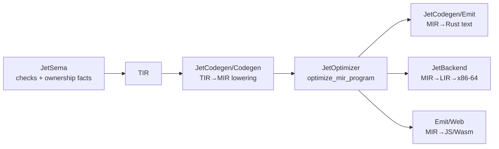

# Function-boundary performance: baseline, losses, and compiler design (2026-10-04)

Card #4566. This is dated research. It owns no work and ratifies nothing. The
owner's goal (2026-10-04, after D-OUTPUT-RETURNS1=A): "ensure we HIGHLY
optimize the entire process around functions at the lowest possible level,
optimizing allocation and buffers etc at the compiler level so we beat c/rust
performance if physically possible."

**Target while rustc is still in the toolchain** (owner clarification through
Main, 2026-10-04): on every cell, Jet/Rust must be at most **1.05** (the AGENTS
Rust parity band), and Jet must be strictly faster than C (Jet/C < 1.00)
wherever that is physically possible. Beating Rust comes after the native
backend removes rustc. The slices below are therefore ordered to remove first
every loss that puts Jet above 1.05× Rust on the Rust tier. Wins that only the
native backend can deliver form a later phase.

## Plain summary

1. Fifteen paired cells now live in `Tools/perf/function-boundary/`. Each cell
   has a Jet, a C and a Rust program computing the same output, a manifest row
   in `cells.tsv`, and one runner, `run.sh`.
2. Jet loses every cell by a wide margin: from 3.0× (`temp-collection`) to
   110× (`fixed-return-4k`) Rust at `--release`, and 3.6× to 173× at O1. No
   cell is near the 1.05 parity band.
3. **Calling conventions and copies at the call boundary cause only a minority of
   the loss.** Most of the time goes to how values and loops are lowered: the
   exact `Int` checks every operation and calls out of line to convert indexes;
   a loop over a fixed array boxes every element as a `Box<dyn Any>`; `s += t`
   copies the whole string; an eager `map` clones its source list and calls a
   boxed callback through `Rc<RefCell<…>>`; `split` copies the whole source text.
4. The function-boundary losses are real but second order. Every non-scalar
   value travels through an `Option<T>` slot with `take().expect(..)`. Scalar
   read parameters are passed as `&JetInt`. Results move through two or three
   slots. A destructured returned tuple clones each field (#4567). Every
   `[Int]`/`[Int#N]` carries per-element drop glue.
5. In these cells, rustc inlines small Jet callees (`fill`, `split`) into the
   caller. The Rust peers use `#[inline(never)]` and the C peers use
   `noinline`. So for small callees, the cost of the call itself does not
   explain Jet's loss.
6. The design adds one fact producer per loss. Sema keeps owning checks (I3);
   the facts come from MIR analysis in `JetOptimizer` and its Rust twin. Each
   fact is lowered by every tier: Rust text (Emit), the native backend
   (`JetBackend`) and the Rust reference.
7. Slice 0 (#4567, destructure moves instead of cloning) is patched in both
   halves in `.agent-worktrees/retperf`. Its proof needs a release rebuild of
   `jet` in that worktree, scheduled for after stage 2 releases memory.

## 1. Cells and how they are run

Layout: `Tools/perf/function-boundary/<cell>/{main.jet,main.c,main.rs,expected.out}`.
The manifest is `Tools/perf/function-boundary/cells.tsv`, with columns `cell`,
`pair`, `n` and `workload`. It follows `Tools/perf/construct-scale.tsv` (one TSV
row per cell, with checked-in source and golden). The per-language
`main.<ext>` layout follows the `Tools/gauntlet/entries/*` peers. Each program
takes its iteration count `n` as its only argument, so no compiler can
constant-fold the workload. It prints one checksum, which `run.sh` compares
byte for byte with `expected.out` before timing.

| Cell | What it isolates | Pair |
|---|---|---|
| `multi-return` | two `Int` results returned as one small struct (D-OUTPUT-RETURNS1 A shape) | – |
| `fixed-return-64/512/4k/64k` | `[Int#8/64/512/8192]` built and returned by value per call, then summed | – |
| `list-fresh` / `list-reuse` | fresh 256-element `[Int]` returned per call vs caller buffer refilled through `&` | each other |
| `string-fresh` / `string-reuse` | fresh `String` (32–63 appends) per call vs caller buffer | each other |
| `destructure-move` | two owned lists returned as a tuple and destructured (#4567) | – |
| `map-filter-collect` | eager `map → filter → map` over 100 000 Ints, collected per round | – |
| `split-join` | split a 20 000-word comma text and join with `;` per round | – |
| `temp-collection` | 16-element list that never leaves its function | – |
| `recursion-aggregate` | divide-and-conquer recursion returning a 4-`Int` struct | – |

Peers are written in the plain style of each language. The C and Rust callee
in every boundary cell is marked `noinline` / `#[inline(never)]`, so the call
boundary really exists in the peers. Jet has no no-inline marker; where rustc
inlined the Jet callee, this document says so.

`string-reuse` has no Jet program. Jet's `String` has no capacity-preserving
`clear` (`jet check` reports E0311 "`clear` isn't a method on this value"), so
the caller-buffer spelling cannot be written. The runner reports that row as
`unavailable`.

Command (one cell or all cells):

```sh
FB_MEM_GATE_GB=14 FB_LANE_MEM=6G Tools/perf/function-boundary/run.sh --runs 5 [cell ...]
```

- Jet O1 is `jet build` (opt-level=2, lto=off, target-cpu=native). Jet O2 is
  `jet build --release` (opt-level=3, ThinLTO, `--cfg jet_release`,
  target-cpu=native). Both use the Rust-host `jet` at `target-rel4/release/jet`
  (build of 2026-10-03). These flags are read from `Source/main.rs`
  `ProfileConfig::rustc_args_for_target` and `BuildProfile::config`.
- Rust: `rustc --edition 2021 -C opt-level=3 -C codegen-units=1 -C target-cpu=native` (rustc 1.97.1).
- C: `clang -O2 -march=native` (clang 21.1.8). The devshell's cc wrapper drops
  `-march=native` unless `NIX_ENFORCE_NO_NATIVE=0` is set; `run.sh` now sets it.
  The C rows in the baseline table below were built **without** it (see 2).
- Timing: wall clock of the whole process, pinned with `taskset -c 31`. Each
  binary gets 5 runs after one output-checking run; the table gives the median
  and the min–max range.

**Jet backend O0 (native x86-64, `Compiler/JetBackend`) was not run, because
it cannot run these cells.** It has no source-to-binary entry point. Its only
driver is the stage-one fixture unit
(`Compiler/JetBackend/Tests/run-lower-fixtures.mjs` → `LowerFixtures.jet`),
which lowers hand-built MIR for four fixtures. Its `lower_repr`
(`Lower/Lower.jet:230`) also returns `Unsupported` for lists and fixed arrays,
and boxes every struct, Option and Result on the heap (`LowerRepr.Boxed`, with
the `jet_rt_alloc` call at `Lower.jet:1256`). Section 3.9 covers what that
tier needs.

## 2. Baseline (2026-10-04, loaded machine)

Machine: AMD Ryzen 9 7950X3D (32 threads), Linux 7.0.11-cachyos. The stage-2
bootstrap and other agents' builds were running throughout: load average
9–12, and MemAvailable 8–40 GB. Pinning removes most noise; the min–max
ranges show what remains. Treat ratios above about 3× as decisive and small
differences as indicative.

Measured rows (median ms, min–max over 5 pinned runs; ratios are Jet median /
peer median; C built without `-march=native`):

| Cell | n | C | Rust | Jet O1 | Jet O2 | O1/Rust | O2/Rust | O2/C |
|---|---|---|---|---|---|---|---|---|
| `multi-return` | 50 000 000 | 60.8 (60.7–61.2) | 70.2 (69.8–72.5) | 1068.7 (1060–1084) | 636.7 (632–640) | 15.2 | **9.1** | 10.5 |
| `fixed-return-64` | 50 000 000 | 336.2 (331–347) | 379.4 (373–382) | 10908 (10851–11075) | 9048 (8825–9371) | 28.8 | **23.9** | 26.9 |
| `fixed-return-512` | 10 000 000 | 97.4 (97–100) | 131.6 (130–190) | 13802 (13511–15329) | 10538 (10495–11027) | 104.9 | **80.1** | 108.2 |
| `fixed-return-4k` | 2 000 000 | 228.7 (222–230) | 152.6 (127–171) | 26342 (23225–26549) | 16849 (16766–17883) | 172.6 | **110.4** | 73.7 |
| `fixed-return-64k` | 100 000 | 198.1 (196–200) | 150.1 (131–152) | 16878 (16810–17373) | 13182 (13017–13350) | 112.4 | **87.8** | 66.5 |
| `list-fresh` | 2 000 000 | 95.3 (95–100) | 417.9 (410–422) | 7179 (7113–7368) | 4179 (4175–4186) | 17.2 | **10.0** | 43.9 |
| `list-reuse` | 2 000 000 | 232.2 (230–234) | 223.7 (222–224) | 6152 (6141–6335) | 3951 (3941–3959) | 27.5 | **17.7** | 17.0 |
| `string-fresh` | 1 000 000 | 63.5 (63–64) | 115.7 (114–117) | 2110 (2107–2121) | 1342 (1327–1348) | 18.2 | **11.6** | 21.1 |
| `string-reuse` | 1 000 000 | 63.1 (63–63) | 30.2 (28–40) | unavailable | unavailable | – | – | – |
| `destructure-move` | 2 000 000 | 52.4 (52–53) | 369.4 (364–372) | 1442 (1432–1452) | 1415 (1408–1426) | 3.9 | **3.8** | 27.0 |
| `map-filter-collect` | 1 000 | 39.2 (38–41) | 56.9 (56–59) | 3286 (3211–3318) | 2111 (2082–2124) | 57.7 | **37.1** | 53.9 |
| `split-join` | 2 000 | 133.8 (132–136) | 370.2 (362–371) | 1325 (1318–1327) | 1133 (1126–1153) | 3.6 | **3.1** | 8.5 |
| `temp-collection` | 10 000 000 | 156.3 (155–158) | 828.0 (812–832) | 3640 (3572–3731) | 2500 (2485–2525) | 4.4 | **3.0** | 16.0 |
| `recursion-aggregate` | 1 000 | 212.1 (210–213) | 199.0 (197–203) | 3267 (3236–3320) | 2105 (2095–2113) | 16.4 | **10.6** | 9.9 |

No cell is inside the 1.05 Rust band; the closest are `split-join` (3.1×),
`temp-collection` (3.0×) and `destructure-move` (3.8×). Peer observations the
slices should exploit: Rust's plain fresh-`Vec` spelling (`list-fresh`, 418
ms) is 1.9× slower than its reuse spelling (224 ms) and 4.4× slower than C's
exact-size `malloc`; Rust's `temp-collection` (heap `Vec`, 828 ms) is 5.3× C's
stack array (156 ms). Those are the places where Jet can beat Rust on the Rust
tier once slices 7 and 8 land. Raw rows:
`~/.cache/jet-dev/scratch/function-boundary/results-1.tsv` (not committed).

## 3. Where Jet loses (per cell, from emitted Rust and profiles)

Evidence sources:

- **Emitted Rust.** `jet emit --rust <cell>/main.jet`. It is byte-identical to
  the `main.rs` that `jet build` compiles (checked on `multi-return`).
- **Profiles.** `perf record -g` of `--release` builds that carry debug info
  through a scratch `package.jet` (`release: Build{ optimize: full,
  debug_info: true }`), run pinned to `taskset -c 12`.
- **Disassembly.** `objdump -d -C` of those binaries.

The profiled `n` values were smaller than the timed ones.

### 3.1 Losses common to every cell

**L1. Exact `Int` on every operation.** Every `Int` is a
`jet_foundation::Numeric::JetInt`: a tagged `u64` with a heap big-integer
escape. It has a `Clone` (retain) and a `Drop` (release). Every `+ - * /% %`
expands through `jet_int_*_hot!` into an inline small-integer path that tests
the tag and overflow. The `--release` disassembly of `fixed-return-64` has 46
out-of-line call sites to `jet_int_release` and 27 to `jet_int_retain` in
`run` alone. Every read of an `Int` local clones it
(`_l0.as_ref().expect("MIR local").clone()`). Every index and range bound
converts through `jet_std::jet_int_owned_to_i64(..).unwrap_or_else(..)`, and
`jet_int_to_i64` is **not inlined across the runtime crate**: it takes 12.4%
of `list-fresh` and 7.2% of `temp-collection`.

`multi-return` is a pure case. Everything inlines into `main` (99.8% of
samples). The hot instructions are tag tests (`movabs $0x4000000000000000`,
`$0xc000000000000000`) and overflow branches; there is no call left to
optimize.

**L2. Range loops through a runtime cursor.** `loop i in 0..<n` lowers to
`jet_loop_range_init/has_next/value/advance` on a `JetLoopRangeCursor`
(`MIROperation.LoopRange*`). At O2 these inline, but the bounds pass through
`JetInt` → i64 → `JetInt` (`jet_int_owned_from_native_result`) on every
iteration.

**L3. Non-scalar values live in `Option<T>` slots.** Every MIR local and every
non-scalar value is declared `let mut _lN: Option<T> = None;`, written with
`Some(..)`, and read with `.as_ref().expect("MIR local")` or
`.take().expect(..)`. The Rust emitter's `localize_value_slots`
(`crates/jet-codegen/src/Codegen/MIRRust.rs:1811`) and `unwrap_value_slots`
(`:2451`), and the Jet twins in `Compiler/JetCodegen/Source/Emit/Functions.jet`
(`jet_rust_emit_localize_value_slots` and friends), turn only scalar and
`String` slots with no observable drop into plain `let` bindings
(`jet_rust_emit_value_slot_localizable`: Bool, Int, IntN, Float, Float32, Char,
String). Arrays, lists, structs and tuples keep the `Option` wrapper. Each
hand-off is a move into a new `Option` (a copy of the payload plus a
discriminant) followed by an `expect` panic branch.

**L4. Read parameters of scalar type are references.** `fn split(n: Int, d:
Int)` is emitted as `fn …split(__jet_n: &JetInt, __jet_d: &JetInt)`. The caller
first copies the argument into a local slot so it can take its address, and the
callee clones it back out.

**L5. Stack-frame bookkeeping in fallible functions.** `run` is fallible
(`JetOutcome`), so it keeps `jet_stack_enter` even under `jet_release`
(`MIRRust.rs:13684`, `retain_stack_frame`). This is minor in these cells.

### 3.2 `multi-return` (O2 9.1× Rust)

Rustc inlined `split` into `run`, so the struct return itself costs nothing.
The loss is L1 (floor-division and modulo on exact `Int` through
`jet_int_floor_div_hot!` / `jet_int_mod_hot!`, plus clones of `n` and `d` for
each use), L2, and L4. The `Parts` struct is 16 bytes and would be returned in
registers.

### 3.3 `fixed-return-*` (O2 24× to 110× Rust; O1 up to 173×)

In `fill`, the literal is built into `_v0: Option<[JetInt; N]>`, moved into
`_l3` (the user's `out`), written element by element through
`jet_index_vec_set` (bounds check plus a checked index conversion), then moved
into `_l1` and returned as `_l1.take()`. That is three moves of the whole
array. In the caller, the call result lands in `_v3`, moves into `_l3`, and then
`_v1 = Some(_l3.as_ref().clone())` **clones the whole array** element by
element (a retain per element) just to iterate it.

The loop over the array then runs through
`jet_loop_iter_init::<&mut [JetInt; N]>`. Its cursor is
`JetLoopIterCursor<Box<dyn Any>, Box<dyn Iterator<Item = Box<dyn Any>>>>`,
which **heap-allocates every element as `Box<dyn Any>`** and checks it with
`type_id`. In the `--release` profile of `fixed-return-64`, `free` takes 8.0%,
`jet_loop_iter_advance` 7.2%, `jet_loop_iter_init` 6.1%, `malloc` 5.6%,
`type_id` 4.0% and the boxing `Map<IntoIter>::next` 3.6%. That is about 36%
spent only on iterating 8 elements. Finally, dropping `[JetInt; N]` runs
per-element drop glue (`drop_glue::<[JetInt; 8]>`, 6 call sites).

`fill` itself was inlined into `run`, so rustc's own sret return cost is not
what separates Jet from the peers here.

### 3.4 `list-fresh` / `list-reuse` (pair)

The fresh-list callee builds with `jet_list_push` into an `Option<Vec<JetInt>>`
slot. The loop over the result is lowered as an index loop with
`jet_index_vec_ref` (bounds check plus checked conversion per element). Out-of-line
`jet_int_to_i64` takes 12.4% and `drop_glue::<Vec<JetInt>>` 3.2% (a tag test
per element at drop). The fresh and reuse rows differ by
the allocation per call, as in the peers. Jet's loss to the peers on both rows
is L1 to L3, not the allocation.

### 3.5 `string-fresh`

`out += "ab"` lowers (`Compiler/JetCodegen/Source/Codegen/Statements.jet:2275`,
`.Assign` with an operator) to `ReadPlace` (a **clone of the whole string**),
then `Binary(Add)`, then `WritePlace`. In Rust that is
`_l3 = Some(_l3.as_ref().expect(..).clone() + &_v15)`, and every literal is
built as a fresh `String` (`String::new(); push_str("ab")`). Building an
`n`-byte string therefore costs O(n²) bytes copied and two allocations per
append. The profile is 80% allocator: `realloc` 20%, `_int_malloc` 15%,
`_int_realloc` 9%, `RawVec::reserve` 6%, `memmove` 5%, and so on.

### 3.6 `destructure-move` (#4567)

`(evens, odds) :: partition(i)` emits `_v2 = Some((_v5…).0.clone())` and
`_v4 = Some((_v5…).1.clone())`, a full `Vec` clone for each field. In the
profile, `Vec<JetInt>::clone` is 3.6%, plus extra `malloc` and `realloc`.
Cause: sema sets `move_fields` only for shared or cell guards
(`Compiler/JetSema/Source/Sema/Statements.jet`
`sema_stmt_destructure_moves_field`). The Rust reference has the same rule
(`crates/jet-codegen/src/Codegen/TIR/lower/statements.rs`, the struct and tuple
`Stmt::Val` arms). Codegen then projects each field and materializes a copy
(`Compiler/JetCodegen/Source/Codegen/Bindings.jet`
`jet_codegen_lower_field_destructure`, and `tir_to_mir_stmt.rs`
`lower_tuple_destructure` / `lower_struct_destructure`).

### 3.7 `map-filter-collect`

`xs.map(f)` lowers to `jet_list_map(_l2.as_ref().clone(), …)`. It **clones the
100 000-element source** because `jet_list_map(xs: Vec<T>, …)`
(`crates/jet-codegen/src/Prelude/Core/Collections.rs:2407`) takes the list by
value, even though it only calls `xs.iter()`. Each lambda is wrapped as
`Rc<RefCell<Option<Box<dyn FnMut(&JetInt) -> _>>>>`, and the callback adapter
does `borrow_mut().take()` and restores the slot on **every element**. Each
adapter allocates a full intermediate `Vec` (three per round), and nothing
fuses the chain. In the profile, the boxed-closure `Map::next` and closures
take 45%, the `IntoIter::try_fold` of the filter 17.5%, `Vec::clone` 3.7% and
drop glue 3.0%.

### 3.8 `split-join`

`text.split(",")` is `jet_iter_string_split`
(`Collections.rs:2045`). It **copies the whole source** (`s.to_owned()`) into
a boxed `dyn Iterator` and allocates an owned `String` per piece.
`jet_iter_join` (`:2780`) then calls `item.jet_show()` per piece, which
formats or copies each piece again before `push_str`. `joined.len()` is
`jet_char_len`, a full Unicode scalar count (`s.chars().count()`, Core.rs:3341)
where the peers read a byte length. In the profile, `CharSearcher::next_match`
takes 22%, `memcmp` 15.5%, `JetStringSplitIter::next` 15.2%,
`jet_iter_join` 12.3%, `memmove` 10.8%, and `free` plus `malloc` 16%.

### 3.9 `temp-collection`

The 16-element local list is a heap `Vec` (as in the Rust peer; the C peer
uses a stack array). Its loop is an index loop with out-of-line
`jet_int_to_i64` (7.2%). Allocator calls (`realloc`, `_int_realloc`,
`_int_malloc`, free paths) take about 25%, and the four growth steps 1→2→4→8→16
each call `realloc`, because nothing reserves the known length 16.

### 3.10 `recursion-aggregate`

The recursion cannot be inlined, so this cell does exercise the call
boundary. `stats` takes 92.6% (L1 arithmetic and clones),
`drop_glue::<Stats>` 4.7% (a `Stats` of four `JetInt`s is not trivially
droppable, so every merged half runs drop glue), and `jet_int_to_i64` 2.6%.
The 32-byte `Stats` is returned through rustc's sret slot, with the `Option`
slot hand-offs of L3 on both sides.

### 3.11 Native backend (`Compiler/JetBackend`)

The native backend does not run these cells (see 1). By construction, its
`LowerRepr.Boxed` heap-allocates every struct, Option and Result
(`jet_rt_alloc`) and frees it through generated drop glue. A struct return is
therefore a heap allocation per call, and a field read is a load through the
box. Lists and fixed arrays are `Unsupported`.

## 4. Design: compiler-level program on Jet's real pipeline

### 4.1 Pipeline and where each fact lives



The Rust reference has the same stages. TIR lowering lives in
`crates/jet-codegen/src/Codegen/TIR/lower/*`, MIR lowering in
`TIR/tir_to_mir_*.rs`, the MIR schema in `crates/jet-foundation/src/MIR.rs`,
and Rust text emission in `Codegen/MIRRust.rs`.

I3 split: **sema owns checks.** It already proves what makes a move legal: the
ownership state, last use (`SemaOwnershipState`, `sema_stmt_move_direct`), view
provenance (`MIRFunction.return_view_provenance`) and capture escape
(`MIRCaptureFacts.escapes`). Every transformation below consumes those facts
or a **derived optimization fact computed on MIR** in `JetOptimizer`. Such a
fact is recorded on `MIROptimizationFacts` (the existing home of
`loop_facts`, `bounds_facts`, `vector_facts`, `fusion_facts` and
`acceleration_facts`). It is validated by
`Verification/Legality.jet` and listed in `MIROptimizationPassID`. Emitters
only lower facts. None of them re-derives a language rule or asks rustc about
user errors.

New derived facts (all on `MIROptimizationFacts`, schema in
`Compiler/JetFoundation/Source/MIR/MIR.jet` and
`crates/jet-foundation/src/MIR.rs`):

| Fact | Content | Producer | Consumers |
|---|---|---|---|
| `MIRReturnPlaceFact` | the local that every `Return` moves out (named return value), the returned type's static size, whether the body ever reads the local after a move | new pass `ReturnPlace` | Emit (return slot), JetBackend (sret), capacity reuse |
| `MIRCallDestinationFact` | per call: the local the result is moved into immediately (single use), or `None` | `ReturnPlace` | Emit / JetBackend: pass that local as the destination |
| `MIRValueSlotFact` | per value: single definition, single consuming use, no observable drop between | new pass `ValueSlots` (generalizes the Emit text passes) | Emit: plain `let` instead of `Option<T>` for every type |
| `MIRIntRangeFact` | per Int value: proven range fits i64 without overflow, from constants, loop trip counts (`MIRLoopFact`), `MIRBoundsFact` and widening of `+ - * % /%` on bounded operands | new pass `IntRanges` | Emit: native `i64` arithmetic and no `JetInt`; JetBackend: one word, no tag test |
| `MIRIterationFact` | loop over list, fixed list or view: borrow vs consume, element type, whether the source is dead after the loop | extend `CanonicalLoopFacts` | Emit: `for x in src.iter()` / `into_iter()`; no clone, no cursor, no boxing |
| `MIRAppendFact` | `place = place + rhs` on String or List where the old value is dead after the read | `ValueSlots` | Emit: `place.push_str(rhs)` / `extend`; JetBackend: runtime append in place |
| `MIRCallbackFact` | lambda argument to an eager Core adapter with `captures.escapes == false` | `ValueSlots` (reads sema's `MIRCaptureFacts`) | Emit: plain monomorphic Rust closure, no `Rc<RefCell<Option<Box<dyn>>>>` |
| `MIRFusionFact` (exists; extend) | chain of eager adapters whose intermediates are dead | new pass `AdapterFusion` | Emit / JetBackend: one loop, one result allocation |
| `MIRAllocationFact` | per list/string/struct allocation: escapes (`No`, `ByReturn`, `Heap`, `Unknown`), maximum length if bounded | new pass `Escape` (reads view provenance, `MIRCaptureFacts`, call ownership modes) | Emit: inline small storage or stack array; JetBackend: stack slot or scalar replacement |
| `MIRCapacityReuseFact` | a binding re-bound every iteration from a call whose `MIRReturnPlaceFact` starts from an empty collection, and dead before the next iteration | `ReturnPlace` + `Escape` | Emit / JetBackend: pass the dying buffer as a reuse slot |

### 4.2 Return-slot (destination-passing) lowering, every tier

Goal: a returned aggregate is constructed exactly once, in its final
location, on every tier. Then returning is never slower than an output
parameter, which is the condition D-OUTPUT-RETURNS1=A needs.

- **MIR (`JetOptimizer`, new pass `ReturnPlace`; Rust twin in the Rust-host
  MIR optimizer).** Find the named return value: a local `L` such that every
  `Return` terminator returns `MovePlace(L)` (directly, or through the
  lowering's tail local `ret := move L; return move ret`). `L` must not be
  moved elsewhere, borrowed past a return, or captured. Record
  `MIRReturnPlaceFact`. Rewrite `ret := move L; return move ret` to
  `return move L`. For each call `v := f(..); W := move v` with a single use,
  record `MIRCallDestinationFact{local: W}`.
- **Rust text (Emit, `jet_rust_emit_function_signature` /
  `jet_rust_emit_function` in `Emit/Functions.jet`, the `.Return` arm in
  `Emit/ControlFlow.jet:661`, call emission in `Emit/Operations.jet`; Rust
  twin `MIRRust.rs` `emit_callable_named:13520` and
  `emit_terminator:19140`).** Two forms:
  1. **Default (all sizes).** Bind values and locals as plain `let` (from
     `MIRValueSlotFact`, so no `Option` chain). Return `L` directly with
     `return L;`, and write the call result straight into the destination local
     (`let block = fill(seed);`). Rustc then places a returned aggregate in the
     caller's slot through its own sret. The peers' assembly shows rustc does
     this without a `memcpy` for `let mut out = [0; N]; …; out` (the Rust
     peers of `fixed-return-4k` and `fixed-return-64k` contain one `memset`
     and no `memcpy`).
  2. **Large aggregates (static size ≥ 256 B, from
     `MIRType.layout.size == Static(bytes)`).** The callee gets a hidden last
     parameter `__jet_ret: &mut Option<T>`. `L` is declared as `let L: &mut T =
     __jet_ret.insert(init);` and every use of `L` goes through that reference.
     `Return` becomes `return;`. The caller passes `&mut W_slot` and reads `W`
     through it. This is **safe Rust**: `Option::insert` constructs in place
     and returns `&mut T`, so I1 needs no generated `unsafe`. It also
     sidesteps rustc's missed RVO cases (rust-lang/rust #116541, #62446, and
     the 116–128 ns vs 51 ns measurement in
     `output-parameters-vs-returns-2026-10-04.md`). The emitter chooses form 2
     only from the size fact, never by probing rustc.
- **Native (`JetBackend`).** `Lower.jet` `.Return` (`:945`) and `lower_repr`
  (`:230`). Replace `LowerRepr.Boxed` for structs, fixed arrays and tuples with
  a `LowerRepr.Frame{layout}` stack slot. Aggregates of 16 bytes or less return
  in `rax:rdx` (SysV). Larger ones return through a hidden pointer argument
  that the callee writes directly when `MIRReturnPlaceFact` names `L`, so `L`
  *is* the caller's slot. `X64/Select.jet` and `X64/RegAlloc.jet` need block
  copy and hidden-argument support. Boxing remains only for recursive types
  and values that escape to the heap (`MIRAllocationFact.Heap`).
- **Web.** `Emit/Web/JavaScriptOperations.jet` returns objects by reference
  already. Wasm-exported aggregates follow the native rule (linear-memory
  destination pointer).

### 4.3 Automatic capacity reuse for returned collections

Covers `list-fresh` vs `list-reuse` and `string-fresh` vs `string-reuse`.
When `xs :: build(i)` re-binds every iteration and `xs` is dead before the
next call (`MIRCapacityReuseFact`), the caller keeps the dying buffer instead of
dropping it. It passes the buffer as the destination slot from 4.2, and the
callee's `out := [Int]{}` (the `MIRReturnPlaceFact` local, starting empty)
lowers to "clear the slot's buffer and keep its capacity"
(`jet_list_clear_into(slot)`, `String::clear`). Observable behavior is
unchanged: the value is still a fresh empty list. The runtime routes are
one vetted helper per collection kind in `Core`/the prelude, shared by every
tier (I9). Expected result: Jet `list-fresh` within the 1.05 band of Rust
`list-reuse`, which is faster than Rust's own plain spelling.

### 4.4 Escape analysis, stack placement, scalar replacement

`MIRAllocationFact` (pass `Escape`) marks a collection or struct that never
leaves its function: it is not returned, stored into an escaping place,
captured by an escaping closure, or passed as `^T`. Sema's view provenance and
`MIRCaptureFacts` already carry every input. Lowering:

- Rust text: a non-escaping list with a proven maximum length `N` becomes a
  vetted `JetInlineList<T, N>` (stack array plus length; one runtime type, safe
  API). An unknown length gets `Vec::with_capacity(hint)` when the push count is
  a loop trip count (`MIRLoopFact.trip_count`). For `temp-collection` this
  removes all four `realloc`s and the heap allocation.
- Native: non-escaping structs and tuples are scalar-replaced (one virtual
  register per field). Non-escaping fixed arrays get a frame slot.
- Allocation sinking: an allocation used on only one branch moves into that
  branch. An allocation whose only use is a dead store is deleted.

### 4.5 Producer/consumer fusion and text pipelines

- Eager adapters: the receiver is borrowed. `jet_list_map(xs: &[T], f)`; the
  filter clones only kept elements. Callbacks with `MIRCallbackFact` are
  emitted as plain Rust closures. `AdapterFusion` turns
  `map → filter → map → collect` with dead intermediates into one loop with
  one `Vec::with_capacity(len)`. Fusion and observable side effects: each
  callback is still called once per element in source order, which is the
  existing D-LOOPMAP1 meaning.
- Text: `split` yields views into the source (`View<String>`, already a Jet
  type) instead of owned copies. The source is borrowed, not `to_owned()`.
  `join` over views computes the exact length first, then writes with
  `push_str` and no `jet_show` copy. `String.len()` keeps its meaning
  (character count). A per-string ASCII flag or cached count can make it O(1)
  **[INFERENCE: not prototyped]**.
- `place += rhs` on String or List with `MIRAppendFact` lowers to an in-place
  append (`MovePlace` plus an append route). String literals passed by
  reference lower to `&'static str`, not a fresh `String`.

### 4.6 Small inline storage

`JetInlineList<T, N>` and `JetInlineString<N>` are runtime types selected only
by `MIRAllocationFact`. They are invisible at the language level, so no new
syntax is needed. Spill to the heap happens on overflow when the bound is a
hint rather than a proof.

## 5. Ordered slices

The order removes the largest Rust-tier parity losses first. "Moves" lists the
cells a slice is expected to improve, with an estimated factor taken from the
profile shares above **[INFERENCE: estimates from profile shares, not
measured]**. Every slice lands in both halves (Jet `Compiler/` and Rust
reference) in separate hunks, and keeps I9 (same meaning on O0, O1, O2 and
web).

| # | Slice | Stages and files | Moves (estimate) | Ballot? |
|---|---|---|---|---|
| 0 | **#4567 destructure of an owned temporary moves its fields** | JetSema `Statements.jet` `sema_stmt_destructure_init_is_temporary`; Rust `TIR/lower/statements.rs` `destructure_init_is_temporary` | `destructure-move` (removes 2 `Vec` clones per call); every `(a, b) :: f()` in the compiler | no |
| 1 | **Int range facts → native i64** (L1, L2) | `JetOptimizer` new `IntRanges` pass; Emit `Operations.jet`/`Values.jet`; `MIRRust.rs` binary and loop emission; inline `jet_int_to_i64` | all cells; `multi-return` from 9× toward parity | no |
| 2 | **Collection iteration lowering** (`MIRIterationFact`: borrow, no clone, no `Box<dyn Any>` cursor) | `CanonicalLoopFacts`; Emit `ControlFlow.jet`; `tir_to_mir_stmt.rs` `lower_for_in`; runtime `jet_loop_iter_*` retires for lists and fixed arrays | `fixed-return-*` (about 36% of time at 64 B is the cursor), `list-*`, `map-filter-collect` | no |
| 3 | **Value slots and return slots** (`MIRValueSlotFact`, `MIRReturnPlaceFact`, `MIRCallDestinationFact`; 4.2 forms 1 and 2; scalar read params by value) | new `ValueSlots`/`ReturnPlace` passes; Emit `Functions.jet`; `MIRRust.rs` | `fixed-return-*`, `recursion-aggregate`, `list-*`, `destructure-move`; the D-OUTPUT-RETURNS1 guarantee "return ≤ out-param" | no |
| 4 | **In-place append and static literals** (`MIRAppendFact`) | Codegen `Statements.jet:2275`; Emit; `MIRRust.rs` | `string-fresh` (O(n²) → O(n)) | no |
| 5 | **Eager adapters: borrow receiver, static closures, fusion** | Prelude `Collections.rs` `jet_list_map/filter` signatures; `MIRCallbackFact`; `AdapterFusion` | `map-filter-collect` | no |
| 6 | **Text pipelines on views** | `jet_iter_string_split` → view pieces; `jet_iter_join`; `len` ASCII fast path | `split-join` | no (same API and meaning) |
| 7 | **Capacity reuse** (`MIRCapacityReuseFact`) | `ReturnPlace` + `Escape`; runtime clear-into routes | `list-fresh`, `string-fresh` | no for lists; text reuse also needs slice 7b |
| 7b | `String.clear()` (capacity-keeping) so `string-reuse` exists in Jet | Core `String` method | `string-reuse` | **yes**: new public API; needs the paired cell `string-reuse` vs `string-fresh` (AGENTS: the surface must strictly beat the plain form) |
| 8 | **Escape analysis, stack placement, inline small storage** | new `Escape` pass; `JetInlineList`; JetBackend frame slots | `temp-collection` (Jet < C needs the stack array) | no (no surface) |
| 9 | **Native backend boundary ABI** (unboxed aggregates, SysV register and sret returns, scalar replacement) | `JetBackend/Lower/Lower.jet` `lower_repr`, `.Return`; `X64/Select.jet`, `RegAlloc.jet` | all cells on the native tier; this phase is where Jet can beat Rust | no |

Slices 0–8 are Rust-tier parity work. Slice 9 begins the phase after rustc.
None of slices 0–8 adds syntax or a public API except 7b, which needs an owner
ballot with same-program alternatives and the `string-reuse` / `string-fresh`
cell pair as evidence. The gate for each slice is that cell's row in
`cells.tsv`, run by `run.sh`: Jet/Rust ≤ 1.05 at O1 and at O2, and Jet/C < 1.00
where the C peer does not use a capability Jet lacks.

## 6. Status of slice 0 and pending work

- Slice 0 patch: worktree `.agent-worktrees/retperf` (branch
  `retperf-slices`).
  - Jet half: `Compiler/JetSema/Source/Sema/Statements.jet`. New
    `sema_stmt_destructure_init_is_temporary`; `sema_stmt_check_destructure`
    starts `move_fields` from it.
  - Rust half, a separate hunk:
    `crates/jet-codegen/src/Codegen/TIR/lower/statements.rs`. New
    `destructure_init_is_temporary`, ORed into both struct and tuple
    `move_fields`.
  - A call, method call, value call, tuple or struct literal, `^take`, `~copy`,
    or a `?` / `??` over one of these now moves every field. A name, field,
    index or view still copies, which keeps the place intact.
- Repro: `Tools/perf/function-boundary/destructure-move/main.jet`. Before the
  patch, its emitted Rust contains `(_v5…).0.clone()` and `(_v5…).1.clone()`.
- Pending: release rebuild of `jet` from the worktree (after stage 2 frees
  memory). Then `jet emit --rust destructure-move/main.jet` must show
  `MovePlace` moves and no field `.clone()`, and the `destructure-move` row is
  re-run. Stage-2 bootstrap of the Jet half follows the normal landing path.
