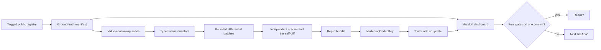
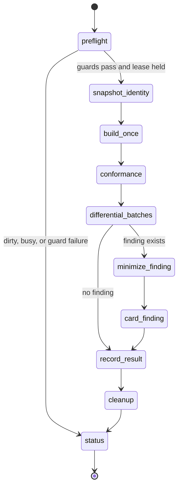
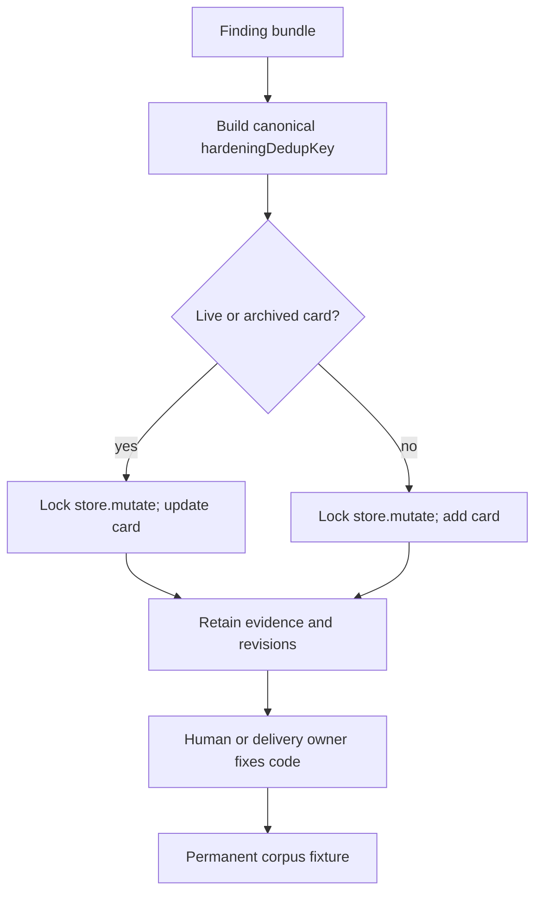

# Hardening Rig

## Exsum

Jet becomes professional-ready only when one clean commit proves four facts: registry-driven, value-consuming Core conformance is green on every applicable tier with a ground-truth denominator and visible owner-ratified counted exclusions; sustained differential fuzzing has a defined clean window with zero silent-data findings; a fresh-context adversarial red-team session finds no P0; and Tower reports zero known open P0s.

This proposal adds one bounded background rig with one registry, one result contract, tier-vs-tier differential oracles, typed value mutators, deduplicated Tower findings, and a handoff dashboard; it does not add compiler or tooling implementation here.

The ratified handoff law is D-HARDENING-GATE1=A, recorded 2026-08-29 with owner quote `Balanced 14d / 10M / 100 / 8`: 14 consecutive clean calendar days, 10,000,000 valid differential cases, 100 valid mutations per fuzz-eligible public callable, eight fresh Luna-max lanes in four waves of two, and owner-ratified counted exclusions.

| Gate | Same-commit proof | Failure |
|---|---|---|
| Core conformance | Every applicable tagged surface/tier row passes a value-consuming check; counted exclusions are visible and owner-ratified. | Missing, skipped, refused, unreadable, or mismatched rows make the gate red. |
| Differential fuzzing | The clean window meets its time, case, and per-row mutation floors with zero silent-data findings. | Any silent wrong value or default `jet run` divergence breaks the window. |
| Red team | Eight fresh-context Luna-max lanes complete the fixed quota with zero new P0s. | An early stop, stale target, new P0, or semantic change invalidates the session. |
| Tower | Known open P0 count is zero. | Any known open P0 keeps the overall result not ready. |

## Shape



The rig has one source of membership, one source of observed result rules, and one bounded cycle; adapters construct values, oracles compare values, and Tower records findings.

## Existing machinery

| Existing item | Use | Boundary |
|---|---|---|
| #2285 | Reconcile actual ambient arm sets with Core-call claims. | Reuse its reconciliation; do not create another ambient-arm checker. |
| #2286 | Active owner of the checked-in Core conformance corpus and the value-consuming denominator law. | Complete and consume its contract; do not edit or duplicate its corpus or denominator. |
| #2287 | Own the Display/Debug admitted-shape matrix. | Use its admitted shapes as input; do not reproduce the matrix. |
| `dev_corpus_gate` | Discover examples and byte-diff optimized AOT, default `jet run`, and forced interpreter. | Treat unsupported, refused, and filtered paths as visible holes, not passes. |
| `golden.rs` | Prove AOT example output. | Do not treat AOT-only output as runtime parity. |
| `diagnostic_snapshots.rs` | Prove I4 diagnostic copy. | Do not treat diagnostic snapshots as runtime behavior proof. |
| `suite_membership.rs` | Model a filesystem and ledger denominator. | Reuse the membership pattern for the hardening manifest. |
| `proof-parallel.sh` | Build named suites once and run them with bounded parallelism. | Named targets are proof; omitted targets remain omitted proof. |
| `tests/fuzz_sema.rs` | Supply deterministic `FUZZ_SEED`, `FUZZ_VARIANTS`, and seven mutation arms. | Add structured results, arm identity, stable failure order, and durable mutated source around it. |
| `tests/fuzz/sema/differential` | Supply 65 Jet files, 64 outputs, and pairing exceptions. | Put pairings in an explicit manifest; never infer pairs. |

The rig treats examples as extra whole-program mutation seeds, not as a replacement for the registry denominator.

## Denominator and identity

No current table is complete. The denominator uses tagged stable identities and a single host resolver.

```text
Public surface
  = module functions
  ∪ receiver methods
  ∪ fields
  ∪ nominal types

Rig projections
  = each public callable identity × each applicable tier
  ∪ actual dispatcher-arm identities

Constructors ⊆ module calls ∪ receiver calls
```

| Evidence source | Current shape | Why it cannot be the denominator |
|---|---|---|
| `module_items` | Mixes callable items, types, and namespaces. | Kinds do not map one-to-one to callable membership. |
| `core_calls` | 613 plain module rows and 151 expanded receiver keys. | It omits fields and cannot by itself state tier applicability. |
| `fixed_sigs` | 747 expanded pattern keys, with 226 fixed-only keys. | Pattern ordinals and helper shapes are not public identities. |
| Field data | No denominator in these files. | Field coverage needs explicit tagged identities. |

The resolver emits `module:<module>.<member>` for module calls, `receiver:<type>.<member>` for receiver methods, `field:<type>.<field>` for fields, and `type:<module>.<name>` for nominal types.

The rig never uses table ordinals, raw helper symbols, or self-declared coverage flags as identities.

The resolver owns the union and emits the manifest. Adapter recipe tables may construct values for manifest rows, but they never add a membership list.

The manifest records stable identity, kind, owner, applicable tiers, dispatcher arms, domain, seed status, exclusion status, and exclusion owner decision.

```json
{
  "schema": 1,
  "stable_id": "module:core.crypto.uuid.v4",
  "kind": "module_call",
  "domain": "rng_uuid",
  "applicable_tiers": ["aot", "jet_run", "interpreter"],
  "dispatcher_arms": ["ambient:uuid.v4"],
  "seed": "uuid-v4-shape-001",
  "value_consuming": true,
  "exclusion": null
}
```

A missing row, an extra row, an unowned exclusion, a duplicate stable ID, or a recipe without a manifest identity is a manifest error before conformance runs.

## Value-consuming contract

Every checked-in conformance seed and every generated mutation binds its result and sends it to a type-aware observable sink.

Deterministic values produce raw stdout, stderr, and exit bytes. Nondeterministic values produce stable laws, such as UUID length and hyphen presence, instead of random bytes.

An opaque handle must drive a second operation that emits a primitive or a documented error. A sink must reference the result in a branch, assertion, or emitted primitive.

Bind-and-discard, compile-only, and observerless entries fail manifest validation and cannot count as covered.

### Worked UUID seed

This worked seed shows the contract shape; the checked-in corpus owns the exact Jet spelling.

```jet
use core.crypto.uuid as uuid

fn run() {
    result :: uuid.v4()
    print(result.len() == 36)
    print(result.contains("-"))
}
```

The random identifier stays out of the comparison. A tier result passes when the raw boolean output satisfies the same shape laws and all applicable tiers agree on those laws.

```text
seed uuid-v4-shape-001
  call       module:core.crypto.uuid.v4
  bind       result
  observe    branch/assert length=true, contains-hyphen=true; emit true|true
  relation   all applicable tiers satisfy laws; no random-byte equality
  failure    wrong shape, missing sink, or tier disagreement
```

### Structured result record

```json
{
  "schema_version": 1,
  "run_id": "2026-08-28T14:00:00Z-cycle-0042",
  "stable_surface_id": "module:core.crypto.uuid.v4",
  "tier": "jet_run",
  "tier_command": "scripts/agent/jet-env jet run <batch.jet>",
  "seed": "uuid-v4-shape-001",
  "mutation_arm": "boundary-length",
  "mutator_version": "value-mutator-1",
  "source": "use core.crypto.uuid as uuid\\n\\nfn run() {\\n    result :: uuid.v4()\\n    print(result.len() == 36)\\n    print(result.contains(\"-\"))\\n}",
  "expected_relation": "length=true; contains-hyphen=true",
  "actual_relation": "length=true; contains-hyphen=true",
  "stdout_bytes": "true\\ntrue\\n",
  "stderr_bytes": "",
  "exit": 0,
  "normalization": [],
  "oracle": {
    "name": "uuid-shape-laws",
    "version": "1",
    "input_digest": "sha256:...",
    "independence_class": "law-only"
  }
}
```

The line protocol carries case ID, surface ID, relation, stdout bytes, stderr bytes, exit or signal, and timeout status without merging the raw channels.

## Oracle matrix

Every deterministic applicable domain uses tier-vs-tier self-diff. Independent references add a second relation where they can stay independent of Jet's implementation.

| Domain | Oracle | Relation and limit |
|---|---|---|
| Exact integers, decimal, rational | Python or Rust reference protocol plus algebraic laws and tier self-diff. | Exact values, identities, bounds, and collection-independent results. |
| Collection transforms | Python or Rust reference protocol plus algebraic laws and tier self-diff. | Length, membership, order, map/filter/fold laws, and exact bytes where deterministic. |
| Float and math | Independent high-precision oracle or published vectors plus ULP rules and tier self-diff. | Use named ULP limits, signed-zero rules, NaN rules, and domain vectors. |
| Text and Unicode | Pinned Unicode data, Python, and roundtrip laws plus tier self-diff. | Normalize only named volatile fields; preserve text bytes otherwise. |
| Bytes, encoding, JSON, Codable | RFC vectors, Python or reference tools, and roundtrips plus tier self-diff. | Compare exact bytes and structured roundtrips. |
| Regex | Human-blessed Jet semantics plus algebraic laws; independent engine only on the documented common subset. | Do not let another engine define Jet-only behavior. |
| Time | Existing #2288 pinned tzdata, Python `zoneinfo`, RFC 3339, and calendar laws plus tier self-diff. | Pin zone data and record its version. |
| Crypto | NIST and RFC known-answer vectors plus roundtrips and tier self-diff. | Never wrap Jet's same library as an independent oracle. |
| RNG and UUID | Seeded cross-tier output when promised; distribution, range, and shape laws otherwise. | Compare seeded bytes only when the API promises them. |
| Files, path, stdin, argv, env, process | Python or POSIX reference processes in the same isolated fixture plus exact bytes and exits. | Keep fixture state, channels, exits, and signals explicit. |
| Network, DB, services | Deterministic local protocol peers, RFC vectors, and state-machine laws plus tier self-diff. | No live service or wall-clock result counts as an oracle. |
| Concurrency and tasks | Deterministic model traces plus association, order, and cancellation laws. | Do not compare scheduling noise. |
| Memory, views, iterators | Small state-machine model plus safety and copy/freeze laws. | Check transitions and ownership-visible effects. |
| Compiler, reflection, testing | Source-to-structured-output goldens plus roundtrip and idempotence laws. | Compare structured output, not incidental formatting. |
| UI, game, web, real host capabilities | Counted exclusions until a deterministic harness exists. | No invisible skips; every excluded row shows scope, reason, owner, and decision. |

Each oracle record stores its name, version, input digest, independence class, and normalization list. The independence class states whether the oracle is a second implementation, a published vector set, a law, a peer process, or a tier self-diff.

## Generation

```text
Layer 1: registry seed ──> typed value mutation ──> batch line protocol ──> tier diff
             │                    │
             └────────────── exact source + relation record

Layer 2: domain property law ────────────────────────────────────────────┘

Layer 3: grammar construct ──> parser/sema/TIR ──> AOT/JIT/interpreter agreement

Layer 4: named compiler seam mutant ──> rig relation ──> mutant killed or survives
```

The first layer starts with checked-in registry seeds from #2286 and typed value mutators around each valid seed.

Mutators change values and boundary partitions, not syntax shape, so the observable sink survives every mutation.

The runner batches many cases into one typed Jet program and one line protocol to amortize AOT builds.

Existing examples seed additional whole-program mutations, but they never substitute for the registry denominator.

Grammar-based construct generation comes later because it creates typed language programs and checks parser, sema, TIR, and tier agreement.

Every generated case records the seed, mutation arm, mutator version, stable surface ID, exact source, and expected relation.

The seven existing `tests/fuzz_sema.rs` mutation arms gain structured result fields, stable arm identity, stable failure order, and durable mutated source; the change keeps deterministic `FUZZ_SEED` and `FUZZ_VARIANTS`.

The differential corpus uses an explicit manifest for its 65 Jet files, 64 outputs, and pairing exceptions. Pairing inference is not allowed.

## Bounded runner

The rig uses one bounded cycle command and one native systemd user timer and service. The timer retries fifteen minutes after every exit.

One cycle takes an exclusive rig lease and stands down when the checkout is dirty, another Jet delivery or build owns the shared target, or a guard fails.

It rebuilds `target/debug/jet` once per clean commit through `scripts/agent/jet-env` and never creates another target directory.

It runs `tmp-guard` before work, uses `proof-parallel.sh` only for named suites, and assigns one process group to each shard.

The result bundle lives under `~/.cache/jet-hardening/v1`.



Every state transition is journaled atomically. A stale lease recovery kills no unverified PID, marks the interrupted cycle, deletes only cycle-owned scratch, and resumes at the next deterministic shard.

### Resource envelope

| Scope | Setting | Value |
|---|---|---|
| systemd cgroup | `CPUQuota` | `200%` |
| systemd cgroup | `MemoryHigh` | `6G` |
| systemd cgroup | `MemoryMax` | `8G` |
| systemd cgroup | `MemorySwapMax` | `2G` |
| systemd cgroup | `TasksMax` | `64` |
| systemd cgroup | `IOWeight` | `10` |
| systemd cgroup | `Nice` | `10` |
| systemd cgroup | `RuntimeMaxSec` | `95m` |
| rig | suite concurrency | `2` |
| rig | `CARGO_BUILD_JOBS` | `4` |
| rig | `JET_MIN_FREE_GB` | `16` |
| rig | `JET_TARGET_CAP_GB` | `80` |
| rig | `CARGO_INCREMENTAL` | `0` |
| rig | scratch | disk-backed `TMPDIR` and `JET_TEST_SCRATCH` |
| rig | total cache cap | `4GiB` |
| rig | minimized interesting corpus cap | `512MiB` |
| rig | logs | rotate at `1MiB`; retain one failure set |

Passing raw cases delete after their summary. Active finding repros stay until a permanent corpus fixture lands.

The rig checks the target and hardening cache before and after each cycle. Any overage makes status red and stops later cycles.

The rig never runs `cargo clean` and never deletes another task's artifacts.

Traps kill the full process group and clean only cycle-owned paths on success, failure, signal, or timeout.

Current project controls make `tmp-guard` clean at `/tmp` 70% and block at 85% or critical memory. `proof-parallel.sh` has looser defaults: `j4`, rustc `j8`, a `10G` free-memory floor, and a `120G` target cap. The rig sets tighter values because background work must leave room for delivery work.

Existing cleanup runs only on the normal path. The rig adds trap cleanup for every exit path while keeping ownership markers on each scratch path.

## Repro bundles

| Field | Rule |
|---|---|
| `schema_version` | Version the bundle contract. |
| `run_id` | Identify one cycle and shard. |
| `started`, `finished` | Record UTC times. |
| Jet commit | Record the frozen commit. |
| binary SHA-256 | Record the exact `target/debug/jet` bytes. |
| host, target | Record machine and execution target. |
| registry snapshot hash | Bind coverage to one manifest. |
| config hash | Bind limits and oracle settings to one config. |
| oracle name/version/digest/independence | Identify the comparison source. |
| stable surface ID | Identify the public seam. |
| tier commands | Preserve exact commands for each tier. |
| seed | Reconstruct the case. |
| mutation arm/version | Reconstruct the value change. |
| exact minimized source | Store inline or by content address. |
| raw stdout/stderr bytes | Preserve channels without merging. |
| exit/signal/timeout | Preserve loud failure mode. |
| expected relation | State the law or reference result. |
| actual relation | State the observed result. |
| normalization list | Name every removed volatile field. |
| finding classification | State P0, P1, duplicate, false positive, or pass. |
| Tower action/card ID/revisions | Link the bundle to card history. |

Passing cases need only a summary and a reconstructible seed. Findings retain the full minimized bundle.

## Auto-carding

Tower gains a first-class `hardeningDedupKey`. Add-or-update runs under `store.mutate`'s cross-process lock across live and archived cards.

The rig never relies on fuzzy title or body checks and never uses `--force` to bypass duplicate control.

```text
schema version
  + semantic primitive or seam
  + violated relation
  + wrong tier mask
  + input partition
  = hardeningDedupKey
```

The key starts at the root seam, not the symptom. Valid seam values include a Prelude semantic function, TIR place lowering, interpreter equality, packed-Int representation, AOT emit, and input transport.

Surface IDs and individual symptoms attach as evidence, not as the primary identity. One packed-Int card can collect map, JSON, and Codable manifestations.

Unknown seams route to one unclassified semantic-primitive cluster. Triage assigns a canonical seam and records the old key as an alias.

Any silent wrong data is P0. Any default `jet run` divergence is P0 by default. A loud non-default failure starts at P1.

The card body embeds the minimized program, exact commands, expected and actual relations, seed, commit, and bundle digest.

A fixed card gains a permanent corpus fixture tagged with its finding ID. A recurrence reopens or updates the same card. The runner never closes implementation cards.



## Red-team session

The session freezes one clean target commit, config, and denominator. It gives eight fresh-context Luna-max lanes the public mission and attack surface, but not current defect cards before discovery.

```text
Wave 1: lane 1 + lane 2
Wave 2: lane 3 + lane 4
Wave 3: lane 5 + lane 6
Wave 4: lane 7 + lane 8
Active execution lanes: 2 maximum
```

| Lane | Attack surface |
|---|---|
| 1 | Tier seams and nested places. |
| 2 | Numeric and representation extremes. |
| 3 | Dev, release, forced-interpreter, and optimization paths. |
| 4 | stdin, argv, env, files, exit, and resource limits. |
| 5 | Core host/effect surfaces and exclusions. |
| 6 | Concurrency and cancellation. |
| 7 | Parser, sema, TIR, and construct boundaries. |
| 8 | Cross-domain compositions. |

Each lane uses value-consuming programs and records attempts, valid cases, duplicates, false positives, and unique findings.

The orchestrator replays every load-bearing finding on the frozen binary, then deduplicates and cards it.

Pass means the fixed quota completes with zero new P0s. Agents stopping early does not pass the session.

Any P0 or semantic change invalidates the result and requires a new session on the new target commit.

Research-only work does not lift the two-lane execution cap.

## Handoff gate

The handoff gate uses ratified law D-HARDENING-GATE1=A, recorded 2026-08-29 with owner quote `Balanced 14d / 10M / 100 / 8`.

| Current design | Clean window | Volume floor | Mutation floor | Red team |
|---|---:|---:|---:|---:|
| D-HARDENING-GATE1=A | 14 consecutive clean calendar days | 10,000,000 valid differential cases | 100 valid mutations per fuzz-eligible public callable | eight fresh Luna-max lanes in four waves of two |

Every counted exclusion stays visible and is owner-ratified. Tower keeps rejected alternatives and decision history.

## Dashboard

The dashboard has one command: `scripts/agent/hardening-rig.mjs status --json`, or the same command without `--json` for human output.

It derives status from manifests, bundles, target identity, resource checks, and Tower. It never accepts checkmarks as input.

| Dashboard field | Required view |
|---|---|
| Target | Commit and binary SHA-256. |
| Conformance | Total, covered, excluded, and missing by tagged kind and tier. |
| Fuzz | Clean-window dates, case count, per-row floor, domain distribution, and new silent findings. |
| Red team | Latest target, quota, findings, and staleness. |
| Tower | Open P0 count. |
| Resources | Target and cache size, free space, memory, and cap state. |
| Overall | `READY` only when all four ratified gates are true on the same commit. |

### Illustrative dashboard view

Live totals come from the resolver; sample values are not current inventory claims.

| Check | Derived value | Status |
|---|---|---|
| Target | `commit abc123`, binary `sha256:...` | green |
| Conformance | `2,104 total / 2,016 covered / 88 excluded / 0 missing`; exclusions owner-ratified | green |
| Differential window | `14 days`, `10,482,311 valid cases`, `100+ mutations per eligible callable`, `0 silent findings` | green |
| Red team | `commit abc123`, `8/8 lanes`, quota complete, `0 new P0`, fresh | green |
| Tower | `0 open P0` | green |
| Resources | target `61G/80G`, cache `2.1GiB/4GiB`, free `24G`, no overage | green |
| Overall | all four facts hold on `abc123` | `READY` |

If one source is missing, stale, unreadable, skipped, or tied to another commit, the dashboard shows red and reports `NOT READY`.

## Roadmap

| Layer | Scope | New defect class caught |
|---|---|---|
| 0 | Existing #2285 and #2287 ratchets. | Ambient-arm drift and admitted Display/Debug shape drift. |
| 1 | Complete #2286; add manifest/result contract, bounded runner, oracle adapters, value mutators, auto-carding, regression assimilation, dashboard, and red-team session. | Coverage lies, observerless false greens, value mismatches, tier divergence, duplicate findings, stale target claims, and resource blowups. |
| 2 | Add domain property laws on the same runner. | Algebraic regressions that fixed examples miss. |
| 3 | Add grammar-based generation for parser, sema, TIR, and tier agreement. | Construct-boundary, parser, lowering, and cross-tier bugs. |
| 4 | Add compiler mutation testing over named critical seams. | Surviving plausible wrong-answer compiler changes and weak oracle gaps. |

No merge gate is proposed. The rig runs in the background and supplies the handoff dashboard.

## Failure modes

| Failure mode | How the rig defeats it | Evidence that stays visible |
|---|---|---|
| Coverage lies | One host resolver emits tagged identities from the public union; constructors remain subsets; fields and types count. | Manifest hash, kind counts, exclusions, missing rows, and dispatcher arms. |
| Bind-and-discard false-green | Every seed and mutation must bind a value and reach a branch, assertion, or primitive sink. | Manifest validation error and sink description. |
| Invisible surface | Applicability, refusals, unsupported paths, filters, and exclusions are counted by stable ID and tier. | Owner, reason, decision, and row status. |
| Tier seams | Deterministic domains self-diff every applicable tier; batches cover AOT, default `jet run`, and forced interpreter where applicable. | Per-tier command, raw channels, relation, and target identity. |
| Resource blowups | Native cgroup caps, tighter rig limits, pre/post checks, process groups, atomic leases, and trap cleanup bound the cycle. | Resource readings, interrupted state, owned paths, and red status. |

The rig treats crashes as evidence of a loud failure, not as sufficient proof of semantic safety. It must still inspect output, relation, tier, and data loss.

## Non-goals

- Onboarding or documentation polish.
- Compiler or tooling implementation in this proposal.
- Merge gating.
- Compatibility shims, legacy readers, or parallel mechanisms.
- A second test runner.
- Treating crashes as sufficient proof.

## Sources

The prior art supports narrow claims: SQLite uses independent harnesses, differential engines, and mutation testing; LLVM libFuzzer records seeds and corpora and supports bounded memory; systemd cgroups supply hard process resource caps.

- [SQLite testing](https://www.sqlite.org/testing.html)
- [LLVM libFuzzer](https://llvm.org/docs/LibFuzzer.html)
- [systemd resource controls](https://www.freedesktop.org/software/systemd/man/latest/systemd.resource-control.html)

## Strongest unverified assumption

The tagged public-surface resolver can enumerate fields and host-only capabilities without a second hand-maintained membership list.
