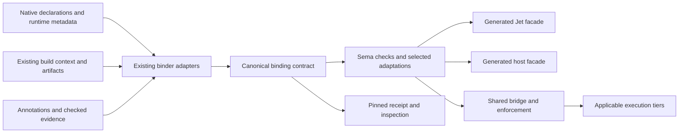

# A native experience across language boundaries

Status: proposal for owner review, 2026-09-05. No compiler behavior, syntax, or dependency in this document is approved by its presence here. Tower #2933 owns the proposal and its adoption gate. [Visual walkthrough](ffi-owned-source-and-boundaries.html).

## Executive summary

Reader routes: [the four project arrangements](#four-project-arrangements-four-complete-experiences), [owner choices](#owner-decisions), [formal contract](#technical-annex-a-requirements-and-the-semantic-contract), [equivalence](#technical-annex-b-exactly-what-proven-equal-means), [architecture](#technical-annex-c-binding-generation-architecture), [enterprise migration](#technical-annex-f-enterprise-operation-and-migration), and [validation](#technical-annex-g-validation-performance-and-research-exit-criteria).

Sometimes Jet calls code written in another language, or that code calls Jet. This is foreign function interface, or FFI. A binding is generated glue for that call. Source is the text a programmer writes. A compiled library is the executable data produced from that text. Having one does not necessarily establish facts about the other.

Yes: Jet can generate wrappers that preserve useful types, ownership, lifetimes, and effect information. Ownership says who must keep a value alive and release it. A lifetime says when access remains valid. Effects say what an operation may do, such as read a file. Checking the wrapper alone cannot stop unseen C code from writing outside valid memory.

Think of a binding as a translator with a checked instruction sheet: what each value means, who may use it, when it expires, what the call may do, and how it can fail. Jet should generate the translation and check the sheet against the code and artifact it actually uses. Missing facts must remain visible. A promise from a library author is useful evidence, but it is not proof that the library obeys it.

**Recommendation: extend Jet's existing binding descriptor into that single contract. Generate both language faces from it. Make every automatic adaptation explainable and reproducible. Keep the existing build system.** Source access enables stronger checking; compiler integration enables stronger enforcement. Neither requires moving the project to Jet's build system.

The beginner writes an ordinary import and call. Jet fills in facts it can establish, such as a buffer's length. The expert can inspect the generated plan, select the native API shape, pin the result, or refuse unapproved changes project-wide. Automatic changes require a rule that establishes equal behavior under stated conditions. Tests alone do not establish that equality.

The target covers C, C++, Rust, Zig, Go, Python, and JavaScript/Node in both directions. The first delivery should exercise each language on the same small vertical slice, then deepen each language's native types. Existing CMake, Cargo, Python, Node, Go, and Zig projects remain the host during migration.

## Four project arrangements, four complete experiences

The ambition is to make a foreign module participate in Jet's language guarantees, and to make a Jet module fit naturally into an existing native application. Fewer arguments are a small consequence. The larger change is that types, resource lifetimes, effect information, and implementation evidence cross the language boundary together.

All commands and generated APIs in these four journeys are proposed UX. They are presented for acceptance before implementation. Existing capabilities and source evidence are documented separately below.

| Your project | Who owns the foreign source? | Who owns the build? | The proposed experience |
|---|---|---|---|
| **1. Jet application with owned foreign code** | Your team | Jet for this dependency | Import the original API; check source-derived lifetimes and effects; diagnose covered faults at the foreign source line. |
| **2. Jet application with external packages** | Another team or vendor | The package producer; optionally your existing native build | Install a generated Jet API and checkable evidence matched to the actual package. Source vendoring is unnecessary. |
| **3. Jet module inside a foreign project** | Your team owns a mixed codebase | Existing CMake, Cargo, Python, Node, Go, or Zig build | Replace an eligible module with Jet while preserving native callers and the team's tools. |
| **4. Foreign project using Jet's compiler/build driver** | Your team owns a mixed codebase | Jet owns selected compilation or build execution | Keep foreign source languages, use their native front ends, and make Jet responsible for the selected shared build and checking path. |

### 1. A Jet application, with C++ source you own

You have a renderer written in Jet and a useful C++ module in the same repository. Today, declaration generation can describe its API, but that alone does not establish the implementation's safety. Unsupported native views and their lifetime rules still need explicit binding work.

The target is a source-aware generated module. Your C++ stays C++. Jet reads its actual compilation context, derives supported contracts, and checks or enforces the foreign operations needed for the selected guarantee. Jet can own compilation of this dependency without requiring that every future foreign dependency follow the same route.

```cpp
// native/frame/frame.hpp — the C++ API remains ordinary C++.
#include <cstdint>
#include <span>
#include <vector>

struct Frame {
    std::vector<uint8_t> data;
    std::span<const uint8_t> pixels() const { return data; }
};
inline Frame make_frame() { return {{255, 0, 0, 255}}; }
```

```sh
# PROPOSED: add owned source to this Jet project's binding/build inputs.
jet bind frames --source native/frame --language cpp --std c++20
jet run
```

```jet
// PROPOSED generated module and owning/view API.
use cpp.frames as frames

fn run() {
    frame :: frames.make_frame()
    pixels :: frame.pixels()
    print(pixels[0])
}
// Expected fixture output: 255
```

**What changes:** the generated `Frame` is an ordinary usable resource in Jet, and `pixels` is a view tied to that resource. The user does not write a C shim, invent a pointer wrapper, or explain the same lifetime at every call. The proposed checker must reject returning that view beyond its owner's lifetime. A mutating operation that reallocates `data` must invalidate or conflict with outstanding views.

This is more than checking the call arguments. With a complete checked compilation path, an invalid foreign access must be stopped before the access and attributed to the C++ line plus the Jet call. Effect analysis must also include reachable callbacks, allocation, destruction, and external operations. The existing C++ standard library and every unchecked edge retain their stated proof or trust basis.

The important scope distinction is coverage: owning the source makes analysis and instrumentation possible; it does not itself prove the result. If an assembly routine or external object escapes coverage, Jet must name that edge. It cannot award whole-module safety because most of the source was available.

### 2. A Jet application, with a library you do not own

You want to use an external image library. You may receive its headers, a package, or only a supported binary distribution. You should not need to fork it, port its build, or maintain a private wrapper project just to use it naturally from Jet.

The proposed package experience combines three deliverables: the native artifact, its generated Jet interface, and evidence for the interface's claims. A checkable evidence package is stronger than a handwritten assertion or a signed download. It tells the consumer exactly which obligations a checker can validate against that artifact.

```sh
# PROPOSED: use the existing package resolver and lock system.
jet bind png --package c@nixpkgs:libpng
jet run
```

The native PNG protocol includes initializing a decoder, selecting a format, allocating output, decoding, interpreting native failure state, and releasing decoder state. The simplified API documents this sequence. A header parser can expose those calls individually. [libpng manual](https://www.libpng.org/pub/png/libpng-manual.txt). The proposed generator can also project an established protocol as an owning Jet operation.

```jet
// PROPOSED generated protocol API; logo.png is a project input.
use c.png as png

fn run() {
    image :: png.Image.open("logo.png", format: .RGBA)
        ?? panic("could not decode logo.png")
    print("{image.width} × {image.height}")
}
```

**What changes:** a checked operation protocol becomes a familiar constructor or method, with its failure and cleanup paths generated once. This is an extension beyond removing a redundant count. The `Image.open` name and protocol are proposed binding-package API, not a claim that libpng already exports that symbol or that Jet currently generates it.

The generator may lift a multi-call protocol only when its prescribed operation sequence, error paths, partial effects, ownership, cleanup, and selected format are established. It executes the existing decoder rather than inventing a replacement decoding algorithm. Domain policy, such as choosing RGBA, stays visible in the call. Unrecognized protocols retain their lower-level interface; guessed names cannot establish a protocol.

An external package can provide source-derived or compiler-produced evidence even when the application team does not own its source or build. If only a contract assertion is available, the implementation remains trusted, not proved. For a suitable value-oriented decoder, isolation can protect Jet memory when its interface and failure contract permit that placement. For a process-dependent vendor library, it may not. The default outcome must follow the explicit admission rules in annex A.

### 3. A Jet module, inside an existing foreign build

Your company already has a large C++ application. Hundreds of callers use a small module. You want to replace that module with Jet without first changing the build system or rewriting those callers.

Here is the existing C++ call:

```cpp
#include "rules.hpp"
int next_tick(int tick) { return rules::on_tick(tick); }
```

The first migration is an eligible function boundary whose native argument, result, symbol, error, and execution contracts can be preserved. The existing guest example supplies a small, real Jet export shape:

```jet
#Export(c)
pub fn on_tick(dt: Int) Int -> dt + 1
```

```cmake
# Existing host-build design; CMake remains in charge.
find_package(Jet REQUIRED)
jet_library(rules_jet ENTRY library.jet OUTPUT core LIBRARY rules LOADABLE)
target_link_libraries(game PRIVATE rules_jet)
```

The proposed native projection supplies the existing `rules::on_tick` interface through a generated C++ facade and a selected C-compatible bridge. The C++ call site above stays the same. The binding contract checks any native-width conversion and preserves the original valid-input and failure behavior. The small fixture uses input 41 and produces 42; wider behavior requires the same contract checks.

**What changes:** adopting Jet becomes a module replacement, rather than a repository migration. The host gets native headers, types, package outputs, debug locations, and errors. A later resource-owning module gets generated RAII in C++, ownership wrappers in Rust, and checked host objects in dynamic languages, all from an eligible export contract.

“Existing callers stay unchanged” is conditional on the exported interface being preservable. A C++ class whose layout, public fields, address identity, or compiler ABI is part of the caller contract cannot be replaced arbitrarily. Jet must prove the selected compatibility or explain the required adaptation. It must not generate a plausible header that changes the running program.

Cargo, Python, Node, Go, and Zig remain equally valid hosts. Annex E and the guest ballot specify their generated artifacts and bridge choices. The host retains its scheduler, package manager, tests, and release process. Jet's backend compiler remains hidden from Jet authors.

### 4. A foreign project, with Jet driving compilation or the build

This is a separate choice from adding a Jet module. A team may keep most of its code in C/C++ and choose Jet's compiler driver to gain a shared checked boundary and better integration. Later, it may choose Jet to execute its build graph as well.

The compiler-driver route already has an existing design: `jet-cc` and `jet-c++` let a native build invoke Jet's compiler entry points. The proposed improvement is to attach the same binding contracts, source checks, diagnostics, and artifact receipts to those compilations.

```sh
# Existing driver concept; stronger checking is PROPOSED.
cmake -S . -B build \
  -DCMAKE_C_COMPILER=jet-cc \
  -DCMAKE_CXX_COMPILER=jet-c++
cmake --build build
```

CMake still owns that build. Jet acts as the selected compiler driver and uses the appropriate native front end. This does not promise to reinterpret arbitrary C++ as Jet or replace every language's compiler implementation.

Full build ownership is an additional proposed route:

```sh
# PROPOSED: inspect the imported build before changing execution ownership.
jet build --import cmake:build --preview
jet build --import cmake:build --accept <plan-digest>
jet build
```

**What changes:** the team can place the mixed project under one execution graph, with shared caching, diagnostics, target selection, and foreign/Jet contract checking. Original source files and supported native build descriptions remain inputs. Jet does not require a second manually maintained description of the same actions.

The preview must show action dependencies, toolchains, inputs, outputs, environment assumptions, custom commands, and any unsupported edge. Jet can assume execution ownership only for an established action model. The CMake file API supplies structured project/build metadata, but does not by itself prove that every custom action is modeled. [CMake file API](https://cmake.org/cmake/help/latest/manual/cmake-file-api.7.html). A compilation database is not a full build graph. An opaque script cannot be declared equivalent merely because one observed run produced the expected files.

For unsupported build logic, the plan may keep the original foreign build as an explicit action with declared inputs and outputs. The preview must say that this preserves an inner foreign build owner. It must not call that partial arrangement a complete build-system replacement. Acceptance is explicit and digest-bound, just like binding updates.

### The capabilities worth building the system around

| Capability | Why it changes the development experience | What must justify it |
|---|---|---|
| **Cross-language lifetime checking** | A foreign view cannot quietly outlive its resource in safe Jet. The compiler explains the relationship at the user call. | Established ownership, invalidation, and retention contracts; enforcement for dynamic hosts. |
| **Native APIs generated from operation protocols** | A resource protocol becomes a constructor, method, or fallible operation instead of repeated manual setup/status/cleanup glue. | A verified or enforced protocol mapping, with implementation trust stated separately. |
| **Native packages with checkable safety evidence** | A team can consume stronger guarantees without owning or rebuilding the package's source. | Evidence checked against exact artifacts and their reachable implementation boundary. |
| **Effect-aware foreign operations** | Foreign file access, callbacks, and destruction participate in Jet's ability model instead of becoming an unexplained hole. | Body analysis or real enforcement; annotations alone remain declared claims. |
| **Module replacement without caller churn** | Teams can adopt Jet inside an established application one eligible boundary at a time. | Preserved native interface, ownership, failure, and execution observations. |
| **One checking path across four project arrangements** | Binding quality does not disappear when another team owns the build, and it improves when Jet gains more evidence or compilation control. | One descriptor, explicit inputs, consistent admission rules, and tested host integration. |

These are the product targets. The rest of the report specifies the laws, architecture, experiments, and acceptance evidence that would make them credible. They are not claims that every native type, library, or build script can already receive these guarantees.

## Automatic by default, explicit when you choose

The normal path adds no new language keyword. Each higher rung exposes the same binding plan. The CLI additions below are proposals, not commands available today.

```jet
// AUTOMATIC: same complete caller as above.
use "sum.h" as sums
fn run() {
    bytes := [U8]{10, 20, 30}
    print(sums.sum_bytes(&bytes))
}
```

```sh
# INSPECT: proposed extension of the existing binding inspection surface.
jet inspect bind sums --explain
```

```text
PROPOSED output:
sum_bytes(&bytes) -> uint64_t
  count = bytes.len(); unit bytes; native size_t range checked
  loan ends on return; retaining this pointer is forbidden
  call and cleanup effects: listed from the binding contract
  implementation coverage: [exact checked artifact and assumptions]
  placement: native, same thread; no copy; no retry
  unresolved obligations: none for the selected covered implementation
```

```sh
# EXPLICIT: proposed options; choose native arity, then record this plan.
jet bind sums --shape native
jet bind sums --freeze
```

```jet
// PROPOSED caller after selecting native arity.
use "sum.h" as sums
fn run() {
    bytes := [U8]{10, 20, 30}
    print(sums.sum_bytes(&bytes, bytes.len()))
}
```

Selecting native arity retains memory checks and length validation. It does not authorize raw pointer access. The selection lives in the existing package's binding configuration; the resolved facts and artifact identities live in its existing lock/receipt system. There is one selected public shape for a binding, not two competing APIs emitted everywhere.

```sh
# REFUSE: proposed persistent project policy, recorded in package.jet.
jet bind --policy frozen
```

In frozen mode, ordinary builds use the recorded plan and reject a new shape, placement, contract, or unmatched artifact. They do not silently regenerate a different interface. An explicit update prepares a reviewable change; it does not run as a side effect of calling a function. A fresh clone receives the same policy through version control. Single-file use can request the same refusal policy through the command line.

```sh
# PROPOSED explicit update; inspection itself remains read-only.
jet bind sums --update --preview
# Prints the candidate digest and its semantic diff; changes no project file.
jet bind sums --update --accept <candidate-digest>
# Validates unchanged inputs, then atomically publishes the approved plan.
```

Configuration changes belong in `package.jet`; the resolved plan belongs in the existing `.jet/lock` system. The accepted digest identifies exact candidate content, including source and artifact evidence. Preview uses the existing generated cache. Failed validation leaves the prior project files usable together. Success returns exit 0; contract rejection or frozen drift returns exit 1. Internal compiler failure retains exit 101.

```text
PROPOSED diagnostic content; production codes and snapshots are required.
Binding update refused: sums changed after its plan was frozen.
Artifact identity changed; the previous bounds claim no longer applies.
Run: jet bind sums --update --preview
Review: API shape, evidence, errors, copies, placement, effects, and cleanup.
```

Automatic mode is deterministic for pinned inputs. A solver timeout cannot silently choose a weaker guarantee or another runtime. It reports an unresolved proof obligation. Native shape, execution placement, safety requirement, and update policy are independent controls in the same binding configuration.

## What the whole system preserves

| Concern | One canonical obligation | Beginner behavior | Expert control |
|---|---|---|---|
| Scalars and layouts | Target ABI, signedness, width, valid enum values, padding, alignment | Use ordinary types; reject invalid values. | Select exact native representation. |
| Buffers and strings | Extent, capacity, encoding, mutability, retention, aliasing | Derive only established lengths; reject invalid encoding when a text API requires it. | Keep bytes, native counts, or explicit conversion. |
| Owned resources | Allocation identity, matching release, move, thread affinity | Generated owning handle; use after close rejected. | Explicit release; fallible close stays observable. |
| Borrowed views | Owner, invalidation event, exclusive access, expiry | Prevent escape; runtime generation checks when host types lack lifetimes. | Request an owned copy explicitly. |
| Callbacks and async | Captures, lifetime, thread, reentrancy, cancellation, error path | Generate a managed trampoline only for a complete supported contract. | Explicit registration, scheduling, and lifetime scope. |
| Effects and authority | Call, callbacks, cleanup, host services, unknown native operations | Track known effects; unknown foreign behavior never becomes pure. | Restrict grants or explicitly accept a named trust boundary. |
| Failures | Native status, error payload, partial mutation, panic/unwind, worker death | Preserve the native failure distinction in Jet or the host's typed result. | Choose documented mapping; no silent retry or swallowed close error. |
| Reproducibility | Declarations, flags, target, generator, policy, artifact closure | Stable plan for fixed inputs. | Inspect, freeze, review a diff, refuse drift. |

Effects mean “what this operation may do,” such as access files or call a foreign service. Ownership means “who must keep this thing alive and eventually release it.” Both belong to the contract. Effects attach to callable operations, including destruction and callbacks; wrapping an integer does not make arbitrary C actions visible to Jet's effect checker.

The current pure, capture-free callback rule remains in force until an explicit amendment is ratified. The full vision includes captured and asynchronous callbacks, but the adapter must account for retained state, concurrent calls, shutdown, and late callbacks. C++ exceptions and Rust panics cannot unwind through a boundary that lacks a compatible unwind contract. Conversion to an error must also preserve cleanup and partial effects.

## Every requested language, both directions

Gauntlet's standing peer set includes Rust, Python, C, Zig, JavaScript/Node, and Go. C++ is included because the owner explicitly requested it. Domain incumbents with additional runtimes use the same adapter contract; they do not justify another semantic system.

| Language | Jet calls it | It calls Jet during migration | Principal native concern |
|---|---|---|---|
| C | Headers plus external annotations, source analysis where available, generated C ABI facade | Generated headers, library artifacts, owning-handle helpers | No built-in lifetime or effect metadata; variadics, unions, macros, and platform layouts need precise coverage. |
| C++ | Existing Clang AST/shim path, selected templates, classes and native containers where supported | Generated RAII facade over exported operations; host retains CMake or other build | Object identity, nontrivial moves, pinning, exceptions, inheritance, custom allocators, compiler ABI. |
| Rust | Compiler-supported type information for supported crates; monomorphized public operations | Generated crate around Jet exports, Cargo build integration | Rust has no general stable native ABI; trait objects, generics, lifetimes, panics, and unsafe internals require explicit treatment. |
| Zig | Headers/C ABI and Zig compiler metadata for selected public operations | Generated Zig module and build integration around the same exports | Comptime selection, sentinel pointers, error unions, allocator ownership, target-dependent layout. |
| Go | Existing C-archive path, typed values and opaque retained handles | Generated Go package, cgo handle discipline, host Go scheduler | Garbage collector roots, pointer retention, goroutines, thread attachment, cancellation. |
| Python | Typed stubs/annotations plus checked dynamic values, existing sidecar or approved embedding | Generated installable module and type stubs | Reference ownership, interpreter state, threads, exceptions, mutable identity; native extensions retain native trust risks. |
| JavaScript / Node | Typed declarations, checked dynamic values, existing target-aware host path | Generated Node package and browser/Wasm projections where applicable | Event loop, promises, roots, buffers, native addon ABI, browser restrictions. |

“Support” must have a published shape matrix. A passing scalar example is not support for every template, Python metaclass, Rust trait object, or Go channel. Unsupported constructs need a Jet diagnostic with a concrete supported adaptation, and an expert native route where that route is valid. No pretend bindings that fail later inside a hidden compiler.

## Why this improves the extremes

| Workload | Useful default | What must remain explicit |
|---|---|---|
| CLI or data script | Import a typed Python helper or C parser; checked values and actionable exceptions | Python environment and interpreter identity. |
| Game or GUI | Borrow native buffers; call existing C++ engine objects without copying when the contract permits | Main-thread affinity, frame deadlines, identity, callback timing. |
| Web and backend | Generate typed host packages; preserve async result and cancellation distinctions | Network authority and calls that may already have committed. |
| AI/ML | Native tensor handles, shared buffers when lifetime and device rules allow | Device placement, streams, synchronization, shape/stride validity; no implicit device transfer. |
| Embedded | Fixed layouts, allocation-free facades, static proof or bounded inline checks | Hardware access, interrupt rules, absence of processes or virtual memory. |
| Large mixed repository | One Jet module in the current build, native diagnostics, coherent debug symbols | Export stability, toolchain identity, team update policy. |

The performance target remains the repository's strict Gauntlet gate, per peer, cell, and metric. This FFI program additionally requires C++ in its matched conformance and performance matrix, alongside all six standing peers. Measure generation, incremental builds, latency, throughput, allocations, copies, startup, and artifact size. Compare equal behavior and equal guarantees. A faster unsafe call is not evidence that a safe boundary won. Rust permits the existing narrow noise band; every other required peer, including C++, requires a strict win. No new win is claimed here.

## Where the limits come from, and how we attack them

| Apparent downside | Design it away where possible | Remaining limit and why |
|---|---|---|
| “Users must rewrite C or change builds.” | Consume native declarations and external contract annotations; integrate with existing compiler invocations optionally. | Code outside the observed build cannot inherit that build's proof. |
| “Safe wrappers add ceremony.” | Generate one selected idiomatic shape and attach ordinary Jet ownership facts. | A genuinely ambiguous contract needs information; guessing can change the program. |
| “Safety always copies.” | Use loans, identity handles, static discharge, and checked shared memory where valid. | Isolation or incompatible runtimes sometimes require transport. Pointer identity cannot be copied. |
| “Automation is unpredictable.” | Pin inputs and the plan; expose every adaptation; provide native shape and frozen policy. | New inputs can invalidate old evidence. Rejecting drift is more predictable than silently changing the plan. |
| “Instrumentation solves all C bugs.” | Check complete relevant operations, with allocation and lifetime metadata, before invalid accesses. | Untouched code, hostile assembly, races, and optimizer assumptions require separate coverage. No compiler flag proves arbitrary semantics. |
| “Isolation preserves everything.” | Select it automatically only under a supported equivalence rule; batch only when ordering and failures remain equal. | Shared address space, timing, host identity, and failures can be observable. Not every API can be moved. |
| “Effect annotations guarantee purity.” | Verify bodies or mediate operations with actual runtime authority controls. | Arbitrary native code can bypass a wrapper and invoke the OS unless the environment prevents it. |
| “Tests prove equal behavior.” | Prove local adaptation rules; validate artifacts; use differential tests to catch implementation mistakes. | Tests sample executions. Arbitrary program equivalence is not generally decidable. |

This is a best-in-class target because it removes avoidable work while refusing false guarantees. It does not promise universal safety, perfect native compatibility, and zero overhead simultaneously for arbitrary unmodified binaries. Those goals conflict for some programs. The system should identify the exact conflict, offer the strongest valid path, and make the choice understandable.

## Owner decisions

[Complete decision dossier](ffi-binding-ballots.md). Four full drafts are filed in Tower. Independent beginner review passed after repairs. The owner authorized the Anthropic review, but both direct Claude attempts timed out without returning reviewer analysis. That required review remains incomplete, so the ballots are not marked ready or ratified.

The owner has already selected binding generation, both directions, existing-build compatibility, automatic behavior when proven equal, expert opt-out, and all seven languages. Those are requirements, not questions being reopened.

| Ballot | Remaining design choice | Recommendation | Existing law preserved or amended |
|---|---|---|---|
| D-FFI-CONTRACT1 | What is the common semantic unit and how are its claims justified? | Extend the existing descriptor with per-obligation evidence and artifact coverage. | Preserves D-FFI-UNIFY1, D-FACT-LAW1, D-ONCE-LAW1; clarifies D-MEM-GUARANTEE1 and D-HARDENED1. |
| D-FFI-AUTO1 | Which evidence permits a generated ergonomic API, and how is it controlled? | Established local adaptation rules plus enforced preconditions; inspect/native/freeze/refuse ladder. | Extends the public tooling surface; preserves D-FFI-CAP1 and raw C restrictions in D-CABI-RESULT1. |
| D-FFI-GUEST1 | Which common boundary should host-language facades share? | Native ABI plus runtime adapters, all driven by the same export contract; use components where appropriate. | Extends D-ADOPT-GUEST1 and D-LIB-EXPORT1 projections; preserves D-FFI-CPP1, D-FFI-PY1, D-FFI-JS1, D-FFI-GO1 defaults. |
| D-FFI-CALLBACK2 | How do retained, captured, and asynchronous callbacks cross the boundary? | Managed registration with explicit lifetime, scheduling, cleanup, and effect obligations. | Explicit amendment to D-CABI-CALLBACK1; no relaxation before ratification. |

Exact proposed CLI spelling and generated API behavior are part of the ballots. No new parser syntax is needed for ordinary imports or calls. New language roots, manifest target names, public APIs, commands, dependencies, and any tier exception still need their applicable owner gate. No new external dependency or tier exception is approved by this proposal.

## Delivery after the UX is accepted

### A. Reuse and strengthen internal machinery

Consolidate each existing obligation in the descriptor and expose its source. Connect existing cache/provenance validation to the exact artifact closure. Remove duplicate policy decisions from binders and marshaling. Document today's true safety coverage. This is internal work only when it preserves all approved behavior; user-visible guarantee changes stay gated.

### B. Complete already-ratified behavior

Exercise existing C/C++/Rust/Go/Python/JavaScript bindings and guest outputs through the same focused conformance programs. Repair observed failures under their existing owners. Prove current CMake and other host integration and mixed-repository diagnostics through #1347 and #1348. Do not reopen C++ as if no binder exists; #2901 must begin with the current Clang implementation.

### C. Cut over accepted improvements

Implement the accepted evidence contract, automatic adaptation rules and control ladder, complete peer projections including Zig, and managed callbacks. Add compiler integration and isolation coverage as concrete enforcement backends with explicit unsupported edges. Prototype the hardest safety and equivalence claims before assigning them a product guarantee. Reuse the compiler-assurance work on #2925 for artifact-bound proof methods.

Each feature needs a full program and golden output, registered Jet diagnostics and snapshots, and the same behavior on AOT, default `jet run`, interpreter, and applicable web paths. A native OS library is not made available in a browser by renaming its tier. Any inapplicable tier requires an owner-ratified exception naming the feature and reason; no “JIT later” parking.

The acceptance corpus must include empty and oversized buffers, partial reads, null returns, wrong allocator release, retained loans, late callbacks, concurrent callbacks, reentrancy, cancellation after a committed effect, stale artifacts, dynamic-library replacement, worker death, and forged or incomplete contracts. It must also exercise a real host project for each language and collect matched performance evidence. Evidence absence stays an open criterion.

## Technical annex A: requirements and the semantic contract

This annex specifies the target architecture more precisely. It is a design, not a claim of a completed proof or implementation. The executive summary and examples explain the same design without assuming compiler expertise.

### A.1 Requirements that determine the architecture

| ID | Requirement | Observable acceptance condition |
|---|---|---|
| R1 | Safe beginner use | An ordinary import cannot silently create a weaker memory or type guarantee than its displayed contract. Uncovered native trust is explicit. |
| R2 | Existing builds remain first-class | A host build can generate and consume bindings without surrendering dependency resolution, compilation, linking, test execution, or release ownership. |
| R3 | Bidirectional adoption | Each required language can consume a Jet module and supply a module to Jet, with generated native-facing types and diagnostics. |
| R4 | Automation preserves meaning | Every automatic adaptation names an established rule, its checked conditions, and the observations it preserves. |
| R5 | Deterministic expert control | Fixed inputs and policy select the same plan; a frozen project rejects unreviewed changes. Native API shape remains selectable independently of safety. |
| R6 | One semantic authority | The same ownership, effect, and failure obligations reach all adapters and execution tiers. |
| R7 | Evidence follows artifacts | Replacing a library, runtime, plugin, compiler option, or relevant dependency invalidates the affected claim before execution. |
| R8 | Honest partial coverage | Supported shape and guarantee matrices distinguish absent metadata, unsupported implementation, failed proof, and deliberately trusted code. |
| R9 | Enterprise integration | Hermetic and offline builds, reproducible generation, native debug information, generated-package ownership, and reviewable updates have exercised workflows. |
| R10 | Measurable excellence | Matched conformance and performance cells cover each peer and applicable tier. No average or narrower test substitutes for an unpassed cell. |

The design optimizes simultaneously for semantic fidelity, safety, familiar native integration, and performance. Engineering effort is not a reason to reject a better design. Where two desired outcomes conflict for a particular program, the compiler must exhibit that conflict as an unmet obligation, rather than choosing secretly.

### A.2 The contract is richer than a function signature

A signature tells us the shape of a call. A contract also tells us what makes the call valid. The following is a conceptual record, not proposed user-written syntax or a new manifest format:

```text
Binding contract
  identity: language, package, symbol, overload/instantiation, target ABI
  values: representation, valid range, encoding, nullability, layout
  memory: owner, extent, initialization, alias permission, retention, expiry
  operations: invocation, callback, completion, cancellation, cleanup
  effects: inferred/declared upper bound, granted authority, enforcement scope
  failures: native outcome, translated outcome, partial effects, unwind policy
  execution: process, thread, runtime attachment, reentrancy, ordering
  adaptations: selected rule, conditions, generated public shape
  evidence: origin, checker, assumptions, exact artifact closure, validity
```

This record extends the existing descriptor conceptually. It does not justify parallel copies of Jet's type or effect systems. A static proof fact lives in sema and its descriptor representation. A changing runtime fact, such as a handle's current generation or an allocation's liveness, lives in the existing runtime mechanism that enforces it.

The contract must distinguish the allocation base from a borrowed subrange, length from capacity, and a byte count from an element count. It must express relational facts: this result borrows from argument one; this mutation invalidates prior views; this release consumes the resource; this callback may run concurrently with another call. Independent scalar annotations cannot represent those relationships adequately.

### A.2.1 Deterministic admission and fallback

The proposed generator first honors the project's pinned runtime and policy. It then checks each obligation for the requested safe interface. Proof or complete enforcement may establish a native obligation. Isolation may establish protection of the host when the API permits that boundary. Vetted standard-library implementations retain their approved trust scope. Other native trust requires a user-authored audited `#Unsafe("reason")` use; generated code cannot create that approval.

If a missing fact affects only an ergonomic adaptation, Jet may keep a native-shaped interface whose remaining safety obligations are already satisfied. If retention, lifetime, valid representation, thread safety, or required authority coverage is unknown, it rejects the safe projection. It may still emit a clearly unsafe expert binding. It neither runs the foreign call nor silently changes placement to resolve that error.

For example, an unknown count unit prevents automatic count removal. An unknown retention contract prevents passing an ordinary call-scoped loan. An unmatched artifact prevents reusing the old implementation evidence. A missing proof does not become an author-approved exception merely because a beginner wants the import to succeed.

### A.3 Evidence has a basis, a subject, and a scope

“Proved” is incomplete without saying what was proved and under which assumptions. Use per-obligation evidence, rather than a total ordering in which one label supposedly subsumes all others.

| Basis | Example claim | What it does not establish |
|---|---|---|
| Static proof | This generated count equals the supplied buffer's extent and fits `size_t`. | The native implementation never reads another pointer. |
| Runtime enforcement | Every covered load checks a live allocation and its permitted range before access. | Untouched assembly or a separately loaded object performs the same check. |
| Isolation | This worker cannot address the host's private memory under the selected platform boundary. | Worker-internal memory correctness, output correctness, or restricted file access. |
| Audited trust | This identified native implementation promises not to retain a call-scoped pointer. | A machine-checked guarantee that it obeys that promise. |
| Unknown | The generator has no evidence for callback thread affinity. | Permission to assume the callback runs on the main thread. |

An artifact signature establishes who vouched for an artifact, not whether its memory accesses are correct. A hash binds a statement to bytes, not to truth. A proof checker, compiler, runtime, loader, and operating system each have a stated role in the trusted computing base: the machinery whose correctness the guarantee assumes.

### A.4 Composition across a complete call

For an operation `f`, let `Requires(f)` be the obligations needed for its advertised contract. Let `Covered(f)` contain obligations established by checked evidence for its reachable execution boundary. A safe exposed facade requires every relevant obligation to be covered by an accepted basis. A trust edge cannot be silently relabeled as proof while computing that coverage.

Composition includes callbacks, virtual dispatch, destructors, allocator hooks, lazy initialization, plugins, and the foreign runtime. A proof of `f` that calls an unchecked `g` must retain the assumptions about `g`. Recursive calls and mutually dependent modules need a consistent contract solution, not an arbitrary traversal order.

Dynamic loading requires a load-time compatibility check against the pinned contract. A replacement artifact cannot inherit an old certificate solely because its exported symbol names match. Loading must avoid a check/use race: the verified artifact must be the artifact actually loaded. Already-loaded modules, symbol interposition, and loader search paths belong to that identity check.

## Technical annex B: exactly what “proven equal” means

### B.1 Preserve program observations, not just return values

Let `P` be the original contracted foreign operation and `G(P)` its generated interface. Let `A` be the established assumptions about inputs, implementation, and environment. Let `Obs` be the observable behavior promised by the API. The target theorem is:

```text
For every related valid initial state satisfying A:
    Obs(executions of P) = Obs(executions of G(P))
```

For deterministic calls, this means matching the one permitted behavior. For concurrent or nondeterministic calls, compare the permitted behaviors and ordering constraints. Do not prove equality by selecting one convenient run. If a proposed transformation intentionally narrows nondeterminism, that refinement must itself be authorized by the API contract or an explicit choice.

Relevant observations include return bits, valid value ranges, error identity, partial output mutation, resource release, callback order and count, shared identity, visible state, and external effects. Timing and thread identity belong to the set when the API makes them observable. Performance measurements are separate obligations; a proof that omits time cannot establish a real-time deadline.

New failure opportunities count. An invisible copy may allocate and fail where the native loan did not. A process boundary introduces transport and worker-death failures. A change from a native error code to an exception may change control flow and cleanup. These are not automatically equal because successful output looks the same.

### B.2 The generator uses a finite library of justified rules

Do not make a general theorem prover responsible for understanding arbitrary application intent at import time. Use explicit, reusable adaptation rules with checkable conditions. A stronger analysis may discharge more conditions, but uncertainty never weakens the required rule.

| Adaptation rule | Required facts | Preserved outcome | Counterexample that must block it |
|---|---|---|---|
| Derive count | Count identifies the entire supplied view; units and native width agree. | Same pointer range and requested work. | Caller intended a smaller prefix or count includes a terminator. |
| Attach ownership | Constructor, failure state, allocator, release operation, and transfer semantics are established. | Exactly the required releases with the same observable ordering. | Two aliases both receive owning wrappers; the wrong allocator frees the object. |
| Return a borrowed view | Owner and all invalidation events are known; host can enforce expiry. | Same referent and valid lifetime. | Container mutation invalidates the pointer before owner destruction. |
| Translate status/out | Success and failure states, output initialization, payload retrieval, and partial effects are established. | Same successful value and equivalent failure distinction. | A nonzero status is partial success rather than failure. |
| Map text | Encoding, length, embedded-null policy, ownership, and normalization policy match. | Same text or the contract's defined invalid-input result. | Arbitrary bytes are silently decoded with replacement characters. |
| Elide a copy | Aliasing, mutation, lifetime, identity, and memory visibility permit a shared view. | Same permitted reads and writes. | The foreign side retains or mutates a buffer assumed immutable by Jet. |
| Move execution | State, authority, ordering, callback, thread, and failure observations are preserved. | Same contract across placement. | The function reads thread-local state or synchronously calls the host. |
| Narrow effects | All relevant operations are proved within a bound or an actual environment enforces it. | No unaccounted operation exceeds the bound. | Native code performs a direct syscall outside the wrapper's knowledge. |

Contract annotations may establish what an API promises. Proof of the adaptation remains conditional on those promises unless implementation proof or enforcement discharges them. The inspection output must make that distinction visible. A verified wrapper over a trusted library is not a verified library.

A plain sum facade returns `U64`. A statically known count violation is a Jet compile-time diagnostic. A dynamic extent or native-width violation follows the existing checked-boundary panic policy before entering C. This is a violated caller precondition, not a native library error or an extra implicit result layer. The valid-input equality theorem remains conditional on those preconditions.

### B.3 Undefined behavior and enforced safety

C and C++ leave some invalid operations without defined language behavior. The preservation target applies to defined executions satisfying the foreign contract. A proposed checked compilation mode may turn a forbidden operation into a defined Jet boundary fault. That is an explicit strengthening of the selected execution contract, not a claim that undefined behavior had a useful result worth preserving.

The compiler integration must protect against invalid assumptions before optimization, including assumptions introduced by pointer aliasing and object lifetime. Instrumenting only a final binary or optimized intermediate representation can miss operations whose undefined behavior already influenced optimization. The chosen compiler pipeline and its residual assumptions require an experiment and review before a product claim.

A regression corpus and differential testing are essential validation of implementation. They remain different from a proof of the rule. Generated translations should also be checked against native ABI declarations and target layout, reducing the trusted generator's opportunity to emit an incompatible call.

### B.4 A complete source-backed preservation example

Here is a complete small foreign API for the proposed experience:

```c
/* sum.h */
#include <stddef.h>
#include <stdint.h>
uint64_t sum_bytes(const uint8_t *bytes, size_t count);
```

```c
/* sum.c */
#include "sum.h"
uint64_t sum_bytes(const uint8_t *bytes, size_t count) {
    uint64_t total = 0;
    for (size_t i = 0; i < count; ++i) total += bytes[i];
    return total;
}
```

```jet
// PROPOSED complete Jet caller; foreign artifact resolution is below.
use "sum.h" as sums

fn run() {
    bytes := [U8]{10, 20, 30}
    print(sums.sum_bytes(&bytes))
}
// Output: 60
```

The current-shaped call would pass `&bytes, bytes.len()`. In the proposed contract, the proposed generator must establish that the second argument is the number of readable bytes. It passes the correct native width after checking that the length fits. Empty buffers are valid because this implementation never dereferences them. It neither copies the buffer nor changes the foreign function.

The user's existing build still compiles `sum.c`. Jet can read a compilation database to understand flags, includes, and targets. A separate artifact receipt must link that context to the actual library. For stronger safety, an optional compiler integration inserts checks during that existing build. A compilation database alone is insufficient evidence of either instrumentation or artifact identity. [Clang compilation database](https://clang.llvm.org/docs/JSONCompilationDatabase.html).

If a later edit changes `< count` to `<= count`, a proof for the old artifact cannot be reused. A complete checking path either rejects the new access statically or stops it before the invalid memory access. The diagnostic should point to `sum.c`, show the Jet call, and explain the accessed index and valid range. A wrapper that notices corruption after the return is too late.

```text
PROPOSED diagnostic content; production needs a registered code and snapshot.
sum.c:5: read exceeds the borrowed buffer
The call supplied 3 bytes. This access uses index 3.
Called from run.jet:6 through sums.sum_bytes.
Fix: stop the loop before count, or pass a larger valid buffer.
```

For C and C++, full enforcement needs bounds, allocation lifetime, initialization, pointer provenance, alias rules, and thread rules where applicable. It must cover assembly, callbacks, dynamically loaded code, allocator changes, and linked objects—or mark those edges as uncovered. Checks must enter before compiler optimizations can assume the forbidden behavior never occurs. This is a compiler and runtime integration project, not a promise made by a header generator.


## Technical annex C: binding-generation architecture



### C.1 Discovery and extraction

Reuse native compiler front ends and ecosystem metadata where available. C/C++ need the actual target, defines, includes, packing, language standard, and selected overloads or template instantiations. Parsing a header in a different compilation context can describe a different program. Python annotations and TypeScript declarations supply shapes that still need runtime validation. Rust and Zig generics require a supported selection of concrete operations rather than a promise to export every possible instantiation.

A generator can consume an external contract file without changing vendor source. Conflicting metadata is an error with both origins shown. Naming heuristics may suggest an annotation for review; they cannot establish ownership or purity. An AI-generated contract has the same status as another unverified candidate. The checker, not the text generator's confidence, decides which claims are established.

### C.2 Normalization and semantic checking

Normalize native declarations into existing Jet types and relational boundary obligations. Keep native names and locations for diagnostic explanations. Represent opaque objects as identity-preserving resources, and represent bounded loans using the existing borrowing law. Do not expose a universal unchecked pointer disguised as a generic safe wrapper.

Sema validates adaptations before code generation. Code generation lowers known facts. Hidden rustc failures remain internal compiler errors under I2. Generated Rust `unsafe` must stay inside an approved audited implementation boundary, such as the vetted shared bridge, or a user-authored unsafe region. A generator must not manufacture an unsafe authorization because a missing contract is inconvenient.

For foreign pointers, check validity before constructing a Rust reference or other host value whose existence asserts invariants. A bounds check after forming an invalid reference is not a valid repair. Returned enum tags, booleans, alignment, and initialization must be validated before creating values that assume them.

### C.3 Emission and package integration

Emit only the projections the package requests. A C++ facade may be a thin RAII wrapper; a Rust facade may encode loans; a dynamic host facade may carry checked handles and runtime roots. All consume the same normalized contract. Generated files are reproducible build outputs. User customizations belong in the existing overlay or configuration mechanism, not in files overwritten by the next build.

The ordinary dependency resolver supplies most library identities. When a standalone header and binary are ambiguous, the proposed explicit binding command makes the pairing concrete:

```sh
# PROPOSED one-time pairing inside an existing CMake repository.
jet bind sums --header sum.h --library build/libsum.a \
  --compile-commands build/compile_commands.json
```

This records the binding's inputs in the existing package configuration. It does not prove that `libsum.a` came from `sum.c`. A matching build receipt, certificate, checked compiler integration, or explicit trust basis must establish the relevant artifact claim. Subsequent imports reuse the recorded pairing. The command does not rerun or replace CMake as an implicit side effect.

### C.4 Loading, execution, and diagnostics

Validate the selected target and artifact before publishing a callable binding. Keep active resources alive across calls; reject library unload while live code pointers, handles, or callbacks depend on it. Resolve runtime attachment and thread obligations at the actual entry point. A loader or worker failure must never leave a valid-looking partially initialized facade.

Diagnostic chains should start at the user's Jet or host call, show the foreign declaration or implementation location, name the missing fact, and give a concrete repair. Inspection should explain copies, allocations, checks, placement, grants, error mappings, cleanup, and unresolved assumptions. Normal successful calls should not flood beginner output with compiler internals.

## Technical annex D: memory, effects, and execution boundaries

### D.1 Three complementary enforcement paths

| Path | Appropriate evidence | Guarantee target | Deployment condition |
|---|---|---|---|
| Native contracted call | Checked facade plus approved implementation proof, enforcement, or audited trust | Type and lifetime correctness at the interface; implementation coverage stated separately. | Native ABI and runtime compatibility. |
| Native checked implementation | Compiler integration plus complete relevant access and operation coverage | Covered invalid accesses stop before execution; covered effects stay within their bound. | Rebuild the relevant code through the checked path, within the existing or Jet-owned build. |
| Isolated implementation | Checked transport, verified loading, restricted authority, validated outputs | Foreign memory faults cannot corrupt the protected host boundary under the platform model. | API permits the chosen isolation semantics and the target supplies the boundary. |

These are execution choices on a shared contract, not three unrelated FFI systems. A module may contain several boundaries, but a claim must account for every path it traverses. Automatic selection is allowed only under the equivalence rule. A trusted in-process fallback is never the silent recovery from failed enforcement.

### D.2 Safety concerns that require separate treatment

Spatial safety prevents access outside the permitted object or subrange. Temporal safety prevents access after that object dies or moves. Type validity prevents invalid representations from being interpreted as valid values. Aliasing rules control simultaneous access that could invalidate compiler assumptions. Thread rules prevent unsafe concurrent use. None follows automatically from the other four.

Object-level guarantees need allocation identity and invalidation information, not only a process-wide address range. A read can remain inside a live heap page and still refer to the wrong, freed, or reallocated object. Generation-tagged handles help prevent stale identity reuse, but they do not repair a raw pointer retained by unseen native code.

Cross-language reference cycles need a specified ownership model. Two garbage collectors or a garbage collector and reference counting do not automatically agree on reachability. Prefer explicit owning resources and weak edges at the boundary. If automatic cycle collection is offered, it requires a real cross-runtime tracing protocol and its own acceptance evidence.

Allocator pairing includes custom allocators, allocator state lifetime, alignment, and thread affinity. C++ nontrivial objects may require pinned storage and native construction/destruction; copying their bytes is not a move. Destructors can execute code, acquire locks, and fail through the library's defined close operation. Their effects belong in the same contract.

### D.3 Effects are descriptive until a mechanism enforces them

Jet's effect row is the static upper bound of operations accounted for by the language. Its authority system governs which operations are granted. A foreign descriptor can supply a declared bound, but a native implementation can bypass ordinary generated wrappers. The report must say whether the bound is inferred, trusted, or enforced.

An enforced foreign effect bound needs a complete route through controlled host functions, verified code, or operating-system restrictions. Dynamic library loading, environment access, clocks, entropy, signals, threads, files, and network access may all matter. A build-time sandbox constrains the compiler process; it does not constrain the resulting program after loading.

Callbacks contribute their effects to the invoking operation or retained registration as appropriate. Cleanup and asynchronous completion do too. A foreign caller without an effect type system can receive generated documentation and runtime grant checks, but Jet cannot statically check unrelated caller code it never analyzes. Exporting a pure Jet function does not make its entire native host pure.

### D.4 Threat model and scope of claims

| Situation | Required response |
|---|---|
| Safe Jet caller passes malformed ordinary input | Generated checks return the contracted error before creating invalid native or Jet values. |
| Buggy native implementation violates a loan | Native complete enforcement stops the access, or isolation protects the host; a wrapper-only path retains explicit implementation trust. |
| Malicious native library tries arbitrary process writes | Do not rely on same-process wrappers. Require a boundary that can withstand that adversary, or reject the requested guarantee. |
| Foreign host writes arbitrary memory around a Jet guest | In-process Jet cannot defend its private state against unrestricted host writes. Use isolation when the integration permits it. |
| Foreign code loops forever or exhausts resources | Memory safety alone is insufficient. Resource budgets and termination policy need actual enforcement and defined failure behavior. |
| Foreign code returns a plausible but incorrect result | Type and memory checks cannot establish application correctness. A domain proof or application validation is a separate obligation. |

Hardware capabilities, stronger compiler proofs, or future runtime facilities can discharge more obligations without changing the user's import. Their assumptions must remain target-specific. A future backend is not a present guarantee, and a hardware boundary alone does not prove application-level correctness.

## Technical annex E: native experience for every language

The scalar migration example gives a small common baseline. The following are proposed generated-facing calls to the same Jet `on_tick` export, which returns its input plus one. They are snippets within ordinary host projects; the package/import declarations belong to the generated projection. The JavaScript facade uses `bigint` for a full-width Jet integer, avoiding an implicit loss through JavaScript `number`.

| Host | Proposed generated use | Result |
|---|---|---|
| C | `int64_t answer = rules_on_tick(41);` | `42` |
| C++ | `auto answer = rules::on_tick(41);` | `42` |
| Rust | `let answer = game_rules::on_tick(41);` | `42` |
| Zig | `const answer = rules.on_tick(41);` | `42` |
| Go | `answer := rules.OnTick(41)` | `42` |
| Python | `answer = game_rules.on_tick(41)` | `42` |
| JavaScript / Node | `const answer = gameRules.onTick(41n);` | `42n` |

Naming conventions are generated host projections, not alternative Jet function names. Full native width and failure behavior must be checked for every target. A scalar smoke is the first shared test, not the completion criterion.

### E.1 C and C++

C discovery must handle actual preprocessing context, typedefs, target layouts, calling conventions, and selected macro constants. Function-like macros and variadics require a generated concrete shim or explicit supported expansion; no guessed signature. Unions need an established discriminant protocol before a safe typed projection. Packed fields and unaligned data cannot become ordinary aligned references by assertion.

C++ requires real compiler understanding of overloads, template instantiations, class layout, access control, exception behavior, and object lifetime. Prefer a C-compatible generated shim for the selected concrete operations while preserving idiomatic C++ on the host side. Do not impose a universal stable C++ ABI. A borrowed `std::string_view` or `std::span` needs the owner's invalidation contract; its convenient native type is not that proof.

### E.2 Rust and Zig

Rust's type system can contribute real lifetime and ownership facts for supported safe code. Unsafe blocks, foreign dependencies, trait-object implementations, custom allocators, and runtime conventions remain relevant trust edges. Emit a selected stable boundary and generated Rust facade; do not expose arbitrary Rust object layout or promise a compiler-independent Rust native ABI.

Zig's compile-time execution can instantiate a useful native interface, but the selected specialization, target, and allocator must be recorded. Distinguish ordinary pointers, many-item pointers, slices, and sentinel-terminated values. Preserve error unions and allocator failure meaning. C ABI compatibility provides a transport path; the generated Zig module and build experience are still required work.

### E.3 Go

Use supported cgo exports and retained handles. Pinning and garbage collector roots must follow Go's actual rules; a Jet owning wrapper cannot authorize retaining an arbitrary Go pointer in C. Preserve goroutine and operating-system-thread assumptions, and make cancellation an operation with a defined acknowledgment. A Go error value needs a stable cross-boundary representation; arbitrary interface identity cannot be guessed from a string message.

### E.4 Python and JavaScript

Dynamic APIs need a typed declared view and validation at the crossing. Unknown values remain checked dynamic values or opaque objects, not an unchecked universal type. Exceptions need their type, message, and supported payload preserved through a documented mapping. Reference ownership, interpreter shutdown, event-loop attachment, finalizers, and native extensions belong to the runtime contract.

Python embedding and sidecars have different identity and runtime behavior. Node's native addon route and browser execution likewise differ. Existing ratified placement defaults remain in force unless the owner changes them. A library that mutates a Python object in the caller's interpreter cannot silently move into a separate interpreter. A synchronous native callback cannot silently become a later promise continuation.

### E.5 Rich-type and callback acceptance

For each language, the next shared vertical slice must include an owned resource, a borrowed buffer, a tagged result, a callback, and an error with partial work. The host facade should use its familiar idioms, while the contract remains identical. Documentation must distinguish compile-time lifetime checks from runtime handle checks and explicit copies.

The proposed retained-callback experience is:

```jet
// PROPOSED complete caller for a contracted notification fixture.
use c.source as source

fn run() {
    prefix :: "byte"
    sub :: source.on_data(event -> print("{prefix}: {event.value}"))
    source.emit(7)
    stopped :: source.unsubscribe(^sub)
    stopped.join() ?? panic("unsubscribe failed")
}
// Output: byte: 7
```

The proposed registration retains the captured prefix. The final callback ballot below makes completion explicit using Jet's existing task mechanism. A native API with different behavior needs a different established contract. A library that can call arbitrary stale function pointers after unregistration cannot receive this safe facade merely by returning a handle.

### E.6 Retained and asynchronous callback state machine

The recommended callback facade gives each invocation a borrowed event object. `event.value` carries the notification; `event.stop()` requests that its own registration stop. The event cannot escape the invocation. This contextual wrapper supports self-stop without capturing the owning registration or waiting on itself. These are proposed generated library APIs, not new language keywords.

```jet
// PROPOSED asynchronous fixture; output byte: 7, then stopped.
use c.source as source

fn run() {
    prefix :: "byte"
    sub :: source.on_data(event -> {
        print("{prefix}: {event.value}")
        event.stop()
    })
    emitted :: source.emit_async(7)
    emitted.join() ?? panic("emission failed")
    stopped :: source.unsubscribe(^sub)
    stopped.join() ?? panic("unsubscribe failed")
    print("stopped")
}
```

| State or operation | Exact proposed meaning |
|---|---|
| Active | The registration can accept a callback. Acceptance atomically records an in-flight reference while the state is Active. |
| Stopping | A stop request closes admission. Already accepted callbacks retain their captures and may finish. No subsequently rejected callback runs user code. |
| `event.stop()` | A nonblocking request to enter Stopping. It returns immediately and never waits for the current callback. Native deregistration follows its established protocol. |
| `unsubscribe(^sub)` | Consumes the owning registration, requests stop if needed, and returns a task. It is idempotent with an earlier event stop, not with reuse of the consumed handle. |
| Stop task completion | Native acknowledgment guarantees no future trampoline entries, and the in-flight count is zero. Only then may the retained captures and trampoline storage be released. |
| Close from callback | Request stop through the event. A callback must not join a task whose completion depends on that invocation; known cases are rejected, dynamic cases return a defined task failure. |
| Failed native acknowledgment | The stop task reports a boundary failure and the module is quarantined. New calls and registrations are refused. Existing wrapper state remains retained until the protected worker or host exits; it cannot grow through new admitted registrations. |
| Callback failure | For a supported failure channel, record the failure and stop admission. Correlated emission and stop tasks report it; an uncorrelated notification reports through the stop task. Do not unwind across an incompatible boundary. |

Foreign threads enter through a vetted runtime attachment path. The contract must establish which captures may run there and whether callbacks can overlap. An incompatible thread-affine capture is rejected at binding or call checking. No automatic main-thread dispatch hides a scheduling change. Unrecoverable native faults do not become ordinary callback errors merely because the wrapper has an error result.

Quarantine recovery is an explicit isolated-worker restart or host termination/restart. Jet does not automatically retry, restart, or claim rollback. An adapter may expose retry only when its native stop protocol establishes idempotence. If recoverable shutdown is required, the selected execution boundary must provide it.

The fixture defines `emit_async(7)` as completing after its one accepted notification finishes. If stop wins before admission, completion returns the defined stopped outcome and no notification runs. If admission wins, the event may run once and its effects are retained. Cancellation never claims to erase a print, write, or other effect already performed.

The ballot's queue alternative uses a capacity of one owned event, FIFO order, and explicit rejection on overflow for a source that supports backpressure. It never blocks this fixture's synchronous producer and never silently drops an event. Stop closes admission, acknowledges native shutdown, then allows accepted events to drain before end-of-stream. Sources unable to support that policy require another explicit contract; the queue cannot be substituted automatically.

## Technical annex F: enterprise operation and migration

### F.1 A migration sequence with useful stopping points

| Stage | Team action | Acceptance evidence | Rollback boundary |
|---|---|---|---|
| Inventory | Generate a report of supported shapes and missing facts for one existing module. | No production behavior changes; exact native build context captured. | Remove the generated report. |
| Bind inward | Add a Jet caller of the existing module. | Existing host tests plus Jet conformance show the contracted behavior. | Remove the Jet caller and its generated outputs. |
| Replace one export | Implement one existing operation in Jet and generate a native host facade. | Same-program differential tests include errors, ownership, and effects. | Relink the prior implementation with the same approved contract. |
| Expand module ownership | Move related resources and callbacks into Jet. | Lifecycle and mixed-runtime tests cover the whole boundary. | Roll back as a coherent resource/ABI unit, never while live objects cross incompatible versions. |
| Harden evidence | Add checked compilation or semantically valid isolation where needed. | Actual artifact coverage and matched performance receipts. | Restore the previous explicitly approved plan, preserving its stated trust level. |

This proposal does not authorize a new internal compatibility layer against Jet's retired syntax. Repository greenfield cutovers remain atomic. Enterprise-facing artifact compatibility is a product contract to ratify explicitly: generated package versions, ABI identity, supported host targets, and removal conditions need defined policy before release.

### F.2 Reproducibility, distribution, and ownership

The binding plan must include native and Jet toolchain identities, target triples, runtime versions where relevant, source/declaration hashes, selected adaptations, contract assumptions, and artifact identity. Reproducibility does not require a network connection during every build. A prepared offline cache must contain the same validated inputs and receipts, without silently substituting a different library.

Generated package publication and code signing remain the host team's release actions. Jet produces reviewable artifacts and machine-readable provenance; it does not publish automatically. Project policy controls allowed proof bases and approved trust boundaries through the existing configuration home. No secrets belong in generated headers, stubs, or public inspection output.

Binding regeneration must be atomic. A failed native compiler, cancelled build, or invalid contract must not leave a new header paired with an old library. Cache keys include the semantic inputs that matter, not only timestamps. Contract diffs should explain a changed lifetime, failure mapping, copy, thread requirement, authority grant, or placement in reviewable terms.

### F.3 Observability without an FFI-specific maze

Use one cross-language call correlation and source/provenance model for diagnostics, debugger frames, profiling, coverage, and traces. Preserve native function names and Jet source locations. A missing foreign frame is shown as unavailable, never reconstructed from guesses. Optimized and stripped artifacts need an explicit symbol path and matching identity.

Normal success stays quiet. Inspection and build review reveal costs and guarantees. A runtime boundary fault shows the user call, foreign operation, violated obligation, and possible partial effect. It must distinguish a library error, an enforcement violation, a worker failure, and a Jet compiler bug.

## Technical annex G: validation, performance, and research exit criteria

### G.1 A proof claim needs a checkable artifact

| Claim class | Required artifact | Independent check |
|---|---|---|
| ABI agreement | Native declarations, target layout facts, generated shim, selected compiler context | Native compiler checks and hostile-layout fixtures. |
| Adaptation preservation | Rule statement, preconditions, proof or verified translation argument, generated instance | A separate checker or bounded proof review plus differential counterexample corpus. |
| Lifetime safety | Ownership graph, invalidation rules, runtime handle protocol where used | Use-after-release, double-release, retained-loan, alias, and reentrancy tests. |
| Native enforcement coverage | Instrumented artifact closure and compiler/runtime assumptions | Adversarial faults before access, including uninstrumented edges that must be rejected. |
| Effect bound | Static effect evidence or actual enforcement policy | Attempted forbidden operations, callbacks, destructors, runtime escapes, and direct native operations. |
| Isolation | Platform boundary configuration and validated transport | Host-corruption attempts, malformed replies, shared-memory races, authority denial, and resource exhaustion. |
| Reproducibility | Input closure, selected plan, artifact identity, atomic output receipt | Offline clean build, no-op build, input changes, parallel builds, cancellation, and loader replacement. |

The first safety experiment should be deliberately small and hostile. Use the `sum_bytes` API, then introduce an off-by-one read, retained pointer, stale allocation, wrong allocator, concurrent mutation, and an unchecked helper object. Each failure must be prevented or explicitly leave the claimed coverage. A successful bounds test cannot close temporal safety or effect enforcement criteria.

The first enterprise experiment should be one existing host project per required language, with no generated file edited manually. Exercise clean build, incremental edit, API change, failure, debug, package installation, and rollback. Record maintained integration lines and time-to-first-success as usability evidence, not as universal productivity claims.

### G.2 Performance methodology

Measure distributions over repeated matched runs on controlled hardware and toolchain versions. Record warm and cold states, process startup, steady state, input size, concurrency, optimization flags, runtime placement, and the safety contract. Use identical libraries and algorithms where the cell compares crossing overhead. Use matched end-to-end applications where the cell compares developer-visible performance.

Report medians and variability with the full receipts. Include call latency, throughput, allocations, peak memory, bytes copied, startup, incremental build time, full generation time, binary size, and failure-path cost where required. Latency-sensitive workloads also need tail behavior and their explicit deadline constraints. Avoid subtracting overhead from another run to manufacture a win.

The strict repository comparator remains binding. These measurements may expose a conflict that demands a better design. They do not authorize weakening safety, deleting a required peer, changing the workload, or accepting an inconclusive result. The design remains open until every required cell is supported by valid evidence.

### G.3 Research gates before product guarantees

| Open research question | Proposed experiment | Exit criterion |
|---|---|---|
| Can source-aware enforcement preserve defined C/C++ behavior under optimization? | Instrument before relevant optimizer assumptions; compare defined programs and attack invalid cases. | A documented supported subset, validated pipeline, complete named coverage, and explicit rejected edges. |
| Can lifetime/effect evidence compose across foreign dependencies? | Mixed checked and unchecked libraries, callbacks, allocators, and dynamic plugins. | No claim survives an uncovered reachable edge; incremental invalidation is demonstrated. |
| Which placement changes are automatically equivalent? | Pure value API, identity API, thread-local API, callback API, and effectful API. | Automatic selection succeeds only for the established rules; counterexamples are rejected with clear explanations. |
| Can rich native projections share one contract without becoming a lowest-common-denominator API? | The same resource/buffer/result/callback module across all seven hosts. | Idiomatic facades preserve the same ownership and failure obligations with explicit unavoidable conversions. |
| Can safety costs meet required workloads? | Bounds-heavy loops, tiny calls, batched buffers, callbacks, real host application cells. | Required per-cell performance gates pass without semantic or guarantee mismatches. |

These gates identify the proof burden and stopping conditions. They are not a reason to postpone binding UX. The ordinary import, inspection, explicit control, and refusal experience can be designed and reviewed before the hardest enforcement backend is promoted from experiment to guarantee.

## Current implementation evidence

Current observations below come from source and checked-in examples. A fresh compiler build failed before FFI smoke tests: `CanonicalAST.rs:71` accesses the missing `LoadedModule.html_path` field. The existing integration-repair card #2919 owns that observed failure. This audit does not claim current runtime conformance or new performance results.

| Fragment today | Evidence | Consequence | Proposed disposition |
|---|---|---|---|
| One descriptor and provider registry already exist. | [Descriptor](../../crates/jet-foundation/src/AST/ffi.rs), [driver](../../crates/jet-driver/src/Foreign.rs) | A second interop type system would duplicate ownership and routing facts. | Extend these existing homes. |
| C already generates safe-looking calls and owning handles. | [Simple C example](../../examples/features/lowlevel/cbind/run.jet), [opaque handles](../../examples/features/lowlevel/opaque_handles/run.jet) | We should improve real remaining ceremony, not sell imports as new. | Derive redundant arguments and richer returns when justified. |
| C++, Python, JavaScript, and Go binders already exist. Rust has a separate extern path. | [C++ binder](../../crates/jet-pkg-model/src/CppBind.rs), [Python binder](../../crates/jet-pkg-model/src/PythonBind.rs), [JavaScript binder](../../crates/jet-pkg-model/src/JavaScriptBind.rs), [Go binder](../../crates/jet-pkg-model/src/GoBind.rs) | Language adapters have different ceilings. Registry membership does not prove arbitrary APIs work. | Publish and test supported shapes per adapter. |
| Zig is a Gauntlet peer but lacks a corresponding binding root in the inspected registry. | [Import registry](../../crates/jet-foundation/src/AST/program_imports.rs), Gauntlet skill and corpus | The requested language set is not complete. | Add Zig through the same contract; do not equate C ABI compatibility with a finished Zig experience. |
| Foreign calls contribute effect information; callbacks have strict limits. | [Sema FFI](../../crates/jet-sema/src/Sema/FFI.rs), [effects](../../crates/jet-sema/src/Sema/Effects.rs), [callback tests](../../tests/ffi_callbacks_tasks.rs) | An effect label describes a call. It cannot police arbitrary native system calls by itself. | Separate inferred, declared, and enforced effect claims. |
| Pointer sentries check known ranges, liveness, and alignment. | [Memory sentries](../../crates/jet-foundation/src/MemSentry.rs), D-HARDENED1 | Writes through foreign pointers unseen by Jet remain outside those checks. | State the exact coverage; add complete coverage only with an actual enforcement path. |
| Build receipts and foreign caches already record provenance. | [FFI preparation](../../crates/jet-pkg-model/src/FFI.rs), [bridge](../../crates/jet-pkg-model/src/ForeignBridge.rs) | A source file beside a binary does not prove that binary came from that source. | Attach each claim to the actual artifact and its transitive boundary. |
| Jet already exports guest libraries and has foreign build-host designs. | [Guest example](../../examples/interop/guest_library/library.jet), [host builds](../spec/reference/foreign-build-hosts.md) | Incremental adoption needs richer generated host APIs and a coherent debugging experience. | Build on the existing library output; reuse #1345, #1347, and #1348. |

### The underlying idea

**A foreign call is a typed contract between two execution environments. Build ownership and call direction do not change that law.** The contract covers arguments, returns, callbacks, cleanup, and every reachable foreign operation relevant to its claims.

Today, pieces of that law live in binder heuristics, overlays, sema, generated shims, runtime marshaling, and build receipts. Keep one canonical fact for each obligation. A language adapter reads native declarations and emits a native facade. It must not invent its own ownership, authority, or error policy.

Four independent questions replace the misleading split between “source owned” and “binary unsafe.”

| Question | Choices | What it actually enables |
|---|---|---|
| What can Jet inspect? | Declaration, source, intermediate representation, binary, attached certificate | More evidence about types and behavior. Source access alone proves nothing about a separately linked binary. |
| Who runs compilation? | Existing build, existing build with Jet compiler integration, Jet build | Optional instrumentation and reliable artifact matching. Build takeover is never a prerequisite for binding generation. |
| What protects the call? | Static proof, runtime enforcement, isolation, audited trust | Different guarantees with different assumptions. These are recorded per claim, not as one reassuring badge. |
| Who calls whom? | Jet calls foreign code; foreign code calls Jet; callbacks in either direction | The same obligations reverse direction. The host still owns its process and runtime. |


## Evidence and recovery

The audit read the current semantic mechanisms, adjacent build/runtime planes, ratified decisions, prior proposals, and the missing-language silhouette. Two independent read-only research tasks returned mechanism and adjacent-plane inventories. Their findings were checked against source; the main audit corrected an omitted C++ test location at [polyglot systems tests](../../tests/polyglot_systems.rs). A third research task timed out without a final report; its partial output is not counted as a completed review. The owner then directed this work to proceed locally without OMP.

Recovery artifacts are at `/home/nate/.cache/jet-luna/ffi-20260905/`: `board-before.json`, `evidence-1.md`, `evidence-2.md`, `omp-research-brief.md`, `omp-research.log`, `owner-steering.txt`, and `build.log`. These are evidence, not a second work ledger. Tower owns remaining work. No successful FFI execution or benchmark is inferred from the research reports.

Primary sources informed the proposed design, not claims that Jet already implements it:

| Source | Specific lesson used |
|---|---|
| [Rust safe FFI interfaces](https://doc.rust-lang.org/nomicon/ffi.html#creating-a-safe-interface) | A safe facade needs a valid foreign contract; callbacks also carry lifetime and thread obligations. |
| [CXX C++ boundary](https://cxx.rs/extern-c%2B%2B.html) | Paired declarations can check ABI agreement. Authors still assert the C++ implementation's safety. |
| [Swift safe C++ interop](https://www.swift.org/documentation/cxx-interop/safe-interop/) | External annotations, bounds, and lifetime information can drive safer overloads. Some wrapper facilities remain experimental; annotation is not body verification. |
| [Clang bounds safety design](https://clang.llvm.org/docs/BoundsSafety.html) | Bounds metadata and checks can preserve a native ABI. The upstream design's availability warning prevents treating it as a ready universal solution. |
| [SoftBound+CETS paper](https://acg.cis.upenn.edu/papers/ieeemicro13_comprehensive_safety.pdf) | Spatial and temporal checks need distinct metadata and assumptions. Research results do not establish zero overhead for every workload. |
| [RLBox](https://rlbox.dev/) and [Wasmtime security](https://docs.wasmtime.dev/security.html) | Isolation protects a boundary; outputs still need validation. Address-space containment does not prove a library's internal object correctness. |
| [WIT](https://component-model.bytecodealliance.org/design/wit.html) | Owned and borrowed resources offer a useful component projection, with a deliberately limited shared type model. |
| [Zig C translation](https://ziglang.org/documentation/master/#C-Translation) | Target and compiler options matter; translated declarations do not recover missing C ownership facts. |
| [cgo](https://pkg.go.dev/cmd/cgo) | Go pointers and retained values obey pinning and handle rules, not ordinary C ownership assumptions. |
| [Python extension interface](https://docs.python.org/3/extending/extending.html) and [Node-API](https://nodejs.org/api/n-api.html) | Native host integration must respect runtime objects, errors, and execution rules. A stable interface is not protection from arbitrary native memory bugs. |
| [Compilation databases](https://clang.llvm.org/docs/JSONCompilationDatabase.html) and [Cargo build integration](https://doc.rust-lang.org/cargo/reference/build-script-examples.html) | Consume existing build context and produce normal generated artifacts without taking over the repository. |

<!-- audit-dispositions:v1 -->

| finding | disposition | target or reason |
|---|---|---|
| One contract should own each foreign-call fact. | card | #2956, carrying draft D-FFI-CONTRACT1. Reuse the existing descriptor. |
| Generated ergonomic shapes and expert controls need exact semantics. | card | #2957, carrying draft D-FFI-AUTO1. Counts, errors, copies, and update policy can change behavior. |
| Both directions need a native experience for every requested peer. | card | #2958, carrying draft D-FFI-GUEST1; reuse #1345, #1347, and #1348 for existing host integration. |
| Zig binding generation is missing from the inspected main-peer path. | card | #2958. C ABI support alone does not provide Zig discovery, types, packaging, and tests. |
| Captured and async callbacks exceed the approved callback contract. | card | #2959, carrying draft D-FFI-CALLBACK2. Lifetime, effects, cancellation, and threads need a ratified extension. |
| Four build/source ownership arrangements need complete workflows. | card | #2961; reuse #1044 and #1347. Separate compiler driving, inner foreign actions, and full build ownership. |
| Full foreign safety requires coverage beyond current sentries. | card | #2960; reuse #2925. Require checked artifacts and adversarial evidence before claiming a guarantee. |
| Existing C++ research framing omits the current binder. | card | #2901. Evidence correction recorded; reuse the binder and tests. |
| The recorded fresh compiler build failed before FFI probes. | card | #2919. Exact command and error recorded with the existing integration repair owner. |
| Scalar-only binders, sidecar restrictions, and external build-host limitations remain. | card | #2958 and #2961; reuse #1347 and #1348. Require explicit supported shapes and focused proof. |
| Universal zero-cost safe execution of arbitrary native binaries cannot be promised. | no-action | No universal guarantee is proposed. Wrappers cannot control unseen writes, and isolation can change process-dependent observations. |
| The required independent adversarial review did not complete. | card | #2933. Both authorized direct Claude attempts timed out without reviewer analysis; full ballots remain drafts. |
<!-- /audit-dispositions -->

The report and examples were revised after owner feedback to foreground the four project arrangements and their larger capabilities. The light visual walkthrough is an entry point; this document contains the architecture, semantic model, language contracts, and acceptance evidence.

The proposal and its examples are review artifacts. Implementation remains owner-gated. Ballot validation and any independent-review gaps are recorded in Tower rather than represented as completed proof.
