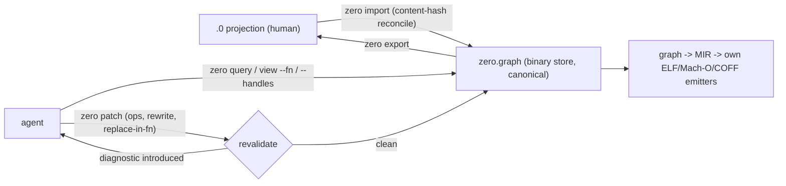

# Zerolang mine — the graph is their answer to a problem Jet solves with teaching

**Source:** https://github.com/vercel-labs/zerolang · zerolang.ai · Apache-2.0 · Chris Tate (Vercel Labs)
**Mined:** 2026-08-20 (mine-for-jet). Clone: depth-50 blobless; binary built and probed live (zero 0.3.4, build afcc72d).
**Vitals:** created 2026-05-15 · 5,330 stars · 339 forks · 65 issues (49 open) · 363 PRs · discussions disabled · 128,228 LoC of C11 · 8 native targets, own ELF/Mach-O/COFF emitters, experimental LLVM · no interpreter, no WASM.

## Verdict

Zerolang is the most direct competitor to Jet's mission that exists: "the programming
language for agents," shipped by Vercel Labs at ferocious speed (0.1.0 → 0.3.4 in ~10
weeks). Its one big idea — the canonical program is a checked semantic graph, text is a
human projection, agents author through validated patches — is a serious answer to a real
problem, and its repair-loop machinery (hash preconditions, atomic revalidation,
call-site-updating signature ops, rewrite-by-example) is the best-executed semantic-edit
surface I have probed. But the popular reading ("agents need a graph language") is wrong.
Their own strongest audience datum proves the real problem is *cold-start syntax
unfamiliarity*: a 60-run frontier-model benchmark ([#104]) failed **0/60**, with 100% of
failures on two trivial reflexes (`fn` vs `fun`, wrong import form). The graph store is a
heavy fix for that; per-edit teaching diagnostics are the cheap one — and live probes show
Jet already delivers the teaching zerolang only promises, while Jet's own reflex coverage
has two holes this mine carded (#2104, #2105). Meanwhile zerolang bought its velocity with
exactly the debt Jet's invariants forbid: wrap-on-overflow release arithmetic, per-target
backend holes shipped as "structured blockers," capability theater, and a test runner whose
documented workaround is "delete the failing test."

[#104]: https://github.com/vercel-labs/zerolang/issues/104

## Coverage and capture quality

| Layer | Coverage | Notes |
|---|---|---|
| Body: docs/skills | Full | README, AGENTS.md, all 8 `skill-data/*.md`, all 56 docs articles, examples README, CHANGELOG |
| Body: code | Deep sample | native/zero-c architecture (250 files), conformance harness, command contracts (8,691-line executable suite), evals, benchmarks, scripts |
| Audience | 55 of 65 issues sampled by strata | Complete issue set retrieved (`incomplete_results:false`), 519 comments across 6 pages; discussions disabled (HTTP 410); PR review comments not read |
| Live probes | zero 0.3.4 built from source; 9 probe scenarios | init/patch/run/check/explain/rewrite/stale-hash/fix-plan/projection-wedge |
| Limits | depth-50 clone (CHANGELOG used for timeline); 6 low-overlap issues untabled; middle chunks of the 8.7K-line contract script elided | Ledger: `/tmp/jet-mine-zerolang.claims.json` (21 claims, validated) |

## What zerolang actually is

- Store integrity is serious: binary magic `ZRGBIN1`, node hashes, load-time reserialize +
  byte-stability requirement, patches gated by `expect graphHash` (GPH002) and full
  post-validation (GPH006).
- The compiler embeds its own agent docs: `zero skills get stdlib --topic std.time`
  returns one version-matched catalog slice.
- 1,149 stdlib entries across 35 modules in ten weeks, caller-buffer/no-hidden-heap style,
  with validators (`std.time` RFC3339 incl. leap-second, `std.inet`, `std.regex`,
  `std.unicode`) agents are told to use instead of hand-writing.
- The repo runs real frontier agents (Opus 4.7 / Sonnet 4.6) against 59 tasks in
  sandboxes, scoring exact output *and* required tool workflow.

## Verified defects (live contrasts)

| # | Defect | The contrast that proves it |
|---|---|---|
| 1 | **Explain promises what the binary doesn't do.** | `zero explain NAM003`: "fails with close matches instead of guessing." Live `rigt` typo → NAM003 with *no* suggestion; `zero fix --plan --json` → generic `requires-human-review`. Jet, same typo: `Fix: did you mean 'right'?` (E0107). |
| 2 | **Jet knows the fix but drops the machine edit.** | Jet's E0107 JSON: `fix: "did you mean 'right'?"`, `fix_edits: []`. The loop #1874 gates cannot apply what the compiler already computed. → card **#2104**. |
| 3 | **Jet lies about foreign declaration keywords.** | `fun add(...) => Int {...}` in Jet → E0003 "computes a value but doesn't do anything with it" — false cause. #1887 fixed loop keywords only. Zerolang #104 shows this exact reflex class caused 100% of frontier failures. → card **#2105**. |
| 4 | **One bad human edit wedges the whole graph loop.** | After one NAM003 typo in `src/main.0`, *every* zero graph command — `patch` on an unrelated function, `view`, `query` — fails validation until the projection is repaired. Two-surface stores carry a wedge cost Jet's single text surface doesn't have. |
| 5 | **Their agent demo is stale.** | `agent-repair-demo.mts:57` invokes `zero new`, a command the binary rejects and their own contracts require to fail; one of its two "fixes" is a no-op string replace. The flagship repair demo cannot run end-to-end. |

## The avoid list

| Mistake | Evidence | Jet's exposure |
|---|---|---|
| Wrap-on-overflow release arithmetic | `safetyFacts.overflow.runtimeArithmetic: "unchecked-machine-wrap"` (live `zero check --json`) | **Immune**: fixed-width overflow traps by default; `wrapping()`/`saturating()`/`checked_*` opt-in (`examples/features/lowlevel/sized_integers.jet:57-64`) |
| Per-target backend holes shipped as normal | darwin-arm64 rejects basic arithmetic ([#96]), 10/33 examples fail ([#230]), Termux runs silently print nothing ([#145]), stdlib helpers type-check but don't lower ([#257]); conformance counts `BLD004` blockers as passes | **Immune by I9** — and this repo is the best live illustration of why I9 exists |
| Language can't express its own stdlib | `Maybe<primitive>` unconstructible from source; C-implemented helpers use private IR constructors ([#316], [#317]) | Low: Prelude is the one semantic home, but "can user source express Core-equivalent shapes" is worth keeping in view |
| Capability theater | `World` gates stdout while most `std.*` effects stay ambient ([#72]) | Immune: effects are sema-checked (I3) |
| Token-optimized human syntax | 0.1.4 shipped Polish-style token-minimal source; users revolted ([#290]); fix was splitting surfaces (0.2.x) | Immune by philosophy: never trade the human surface for token count; win context economy in diagnostics and views |
| Bug workarounds as agent doctrine | Test runner breaks on `std.*` in tests ([#428]); official skill doc teaches "delete the malformed test and recreate simpler coverage" | Avoid pattern: Jet skills must never encode a compiler bug as workflow |
| Velocity over soundness | Checker accepted invalid programs ([#31]); 12/18 audit findings still reproduce ([#318]); maintainer: contracts "may break roughly daily" pre-1.0 ([#151]) | Guarded by I3/I4/I5; the lesson is that 10-week velocity is *possible* — with this exact bill |
| Fragmented diagnostic registries | Three mechanisms (numeric switch, explain table, repository-input formatter); `zero explain PAR100` was broken for weeks ([#111], fixed by 0.3.4) | Guarded by I4 single registry; #2093 tracks the one ratchet gap |

[#96]: https://github.com/vercel-labs/zerolang/issues/96
[#230]: https://github.com/vercel-labs/zerolang/issues/230
[#145]: https://github.com/vercel-labs/zerolang/issues/145
[#257]: https://github.com/vercel-labs/zerolang/issues/257
[#316]: https://github.com/vercel-labs/zerolang/issues/316
[#317]: https://github.com/vercel-labs/zerolang/issues/317
[#72]: https://github.com/vercel-labs/zerolang/issues/72
[#290]: https://github.com/vercel-labs/zerolang/issues/290
[#428]: https://github.com/vercel-labs/zerolang/issues/428
[#31]: https://github.com/vercel-labs/zerolang/issues/31
[#318]: https://github.com/vercel-labs/zerolang/issues/318
[#151]: https://github.com/vercel-labs/zerolang/issues/151
[#111]: https://github.com/vercel-labs/zerolang/issues/111

## Beat vectors (ranked; shipped vs unbuilt marked)

1. **Tier parity as law** — *shipped (I9)*. Zerolang structurally cannot promise "the
   program means the same thing on every advertised target": its conformance suite
   *accepts* backend blockers as passing. A competitor can't adopt I9 without rebuilding
   its backend contract. This is Jet's most categorical win here.
2. **Teaching diagnostics that deliver** — *shipped, two holes carded*. Jet's did-you-mean
   and arrow-teaching (E0070) beat zerolang's promised-but-absent close matches. Close the
   reflex holes (#2105) and the machine-edit hole (#2104) and Jet wins the exact axis
   zerolang's own #104 evidence says decides agent success — without a graph store.
3. **Safe-by-default runtime** — *shipped*. Trap-on-overflow, checked bounds with
   diagnostics-first policy, sema-checked effects vs their wrap/ambient/theater trio.
4. **Semantic edits with receipts** — *ratified, unbuilt (D-DEVR-SEMID1; evidence logged
   on #2062)*. Jet's shipped `jet inspect codemod` already has what zero's rewrite lacks
   (expected match counts, fingerprints, undo logs); the ratified receipts law goes past
   zero's loop (claims render from receipts; never pay twice). Zerolang proves the demand
   and supplies the op-catalog benchmark: call-site-updating signature ops, sub-second
   revalidation, dry-run-by-default.
5. **One canonical surface** — *shipped*. The projection wedge (defect 4) and the
   import/reconcile/RGP006/RGP007 machinery are the permanent tax of two surfaces. Jet
   pays it never.

**Where Jet loses today, honestly:** tiny-loop latency (zero init/patch/run ≈ 20–25 ms
each; Jet warm single-file check 0.50 s / run 0.46 s — fine, but zero is 20× faster and
its 0.2 s package validation beats Jet's project-scale golden wall, owned by c09otnjg /
c0460ur1 / c0m0lmh4, #2074–#2076); topic-scoped agent docs (their `--topic std.time` vs
Jet's one 315 KB digest → #2108); expected-fail tests (they have xfail + unexpectedPasses;
Jet has nothing → #2107); fix-safety grading (their five-level taxonomy → #2106); and a
live agent-eval harness (theirs runs real models today; Jet's corpus program #1165–#1170
is ratified and unbuilt).

## Agent-optimality (the five quantities)

| Q | Zerolang's move | Jet's position |
|---|---|---|
| a. Verdict fidelity | Patch revalidation catches edits pre-store — but checker soundness debt ([#31], [#318]) and wrap-overflow undercut it | Jet stronger by construction (I3, trap defaults) |
| b. Verdict latency | Their strongest quantity: 20–25 ms loop, 0.2 s package validation, memoized graph/MIR caches | Jet's weakest quantity today; owned by the golden-wall cards |
| c. Verdict actionability | fixSafety grades + repair ids; but close matches missing where promised | Jet has typed fix_edits + cause + clears; #2104/#2106 close the gaps |
| d. Context economy | Their design center: `view --fn`, `--outline`, `--around`, topic-scoped skills, handle short-forms | Jet has dossier/semindex/digest; #2108 adds topic slices |
| e. Repair determinism | One mechanism per edit; but three diagnostic registries and daily contract churn ([#151]) | Jet stronger (I8, I4) |

This mine moves (c) and (d) for Jet directly (#2104–#2106, #2108) and confirms (b) as the
priority already on the board.

## Surface coverage

**Covered with proof:** meaning-diff (`jet diff`) and structural merge (`jet merge`) —
zero's `zero diff`/`zero merge` equivalents; rewrite-by-example (`jet inspect codemod`,
Source/CmdCodemod.rs, with expected-match determinism zero lacks); one-file digest
(#1921); did-you-mean (E0107 live); RFC3339 time (Prelude/Core/Time.rs), IP validation
(Core/NetPure.rs), strict UTF-8 (Core/UnicodeString.rs); overflow/bounds safe defaults;
impact analysis (`jet inspect impact` vs `zero query --refs/--calls`).

**Worth checking:** whether Jet machine-enforces "every emitted diagnostic code has
explain text" the way their command-contract suite scans C source for code literals and
requires `zero explain --json` for each (>100 codes) — Jet's I4 ratchet plus #2093 may
already cover it; `jet merge` conflict quality vs zero's node-hash merge; whether `jet
eval`/notebook covers their `zero eval` uses.

**Missing (now carded):** typed fix_edits for suggestions (#2104); foreign
declaration/binding keyword reflexes (#2105); fix safety grades (#2106); expected-fail
tests (#2107); topic-scoped digest (#2108).

**Their stdlib names worth stealing when the owning cards open:** `std.regex` structured
"unsupported feature" statuses (#2056's regex card should return *why* a pattern is
unsupported, not just fail); `std.parse` full-input/overflow-rejecting typed parsers;
`std.inet` hostname/RFC1123 classification; `zero size` retentionReasons +
optimizationHints as explainability shape for `jet budget`/`jet audit`.

## Corrections and disputed claims

- Issue #111 (explain can't explain PAR100) is fixed in 0.3.4 — live-probed.
- Issue #426 (null-deref audit claim) was closed as a false positive by the maintainer
  with the guard cited; automated audit issues (#425 etc.) remain unverified claims.
- The docs' "close matches" claim for NAM003 is contradicted by the live binary (defect 1).
- The README's benchmark framing suggests comparisons; the runner defines exactly one
  language (zero) — no cross-language numbers exist.

## Tower record

| Item | What |
|---|---|
| #2104 (bug, P2, e3-m17) | did-you-mean ships no fix_edits |
| #2105 (bug, P2, e3-m17) | foreign declaration/binding keywords get a false E0003 |
| #2106 (feature, P3, e3-m17) | safety classes on machine fixes |
| #2107 (feature, P3, e3-m18) | expected-fail tests; owner gate: marker spelling ballot |
| #2108 (feature, P3, e3-m17) | topic-scoped digest slices |
| Log on #2062 | zerolang op-catalog + revalidation evidence for D-DEVR-SEMID1 implementation |
| Log on #1165 | eval-harness design evidence (workflow-scored, discrimination checks, cold-start tasks) |

No new ballots: everything semantic-edit-shaped lands under ratified D-DEVR outcomes;
#2107 carries its owner gate explicitly.

## Files

- Ledger: `/tmp/jet-mine-zerolang.claims.json` (21 claims) · manifest: `/tmp/jet-mine-zerolang.manifest.json`
- Clone: `target-mine-zerolang/` (gitignored; delete after review) · probes: `target-mine-zerolang-probe/`

---

**Strongest unverified assumption:** that zerolang's graph store contributes little to
agent success beyond what teaching diagnostics + semantic edit ops provide over text — the
#104 benchmark predates their patch-first loop, and no eval isolates "graph store" from
"good ops + fast validation." If a future zerolang eval shows the store itself moving pass
rates, the D-DEVR receipts design should be re-examined against it.
