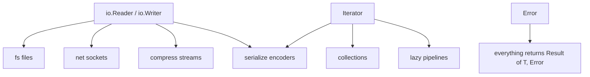

# The Ultimate Standard Library — A Design Blueprint

> **The thesis in one breath:** Take Go's concurrency, Rust's serialization and regex, Java's date/time, Deno's security defaults, Elixir's fault-tolerance instincts, and Python's "one line for the common case" — then enforce a single consistent style across all of it. That synthesis, not any one existing language, is the best standard library that could exist today.

**The kitchen analogy that drives every decision:** A standard library is the *fitted-out kitchen* that comes with the house. You want the essential appliances built in and ready — oven, sink, fridge, knives — so you can cook the moment you move in. But you do **not** weld one specific brand of espresso machine to the countertop forever, because tastes change and that machine will one day be obsolete. The whole design below is about getting the built-ins right *and* leaving clean sockets for the things that should be swappable.

---

## How to read this document

It's layered, on purpose. Read the **Executive Summary** for the whole picture in two minutes. Then drop into any **module** or **principle** you care about — each is self-contained, with a user story and code. Skip freely.

> A note on the code: examples use a clean, illustrative syntax (think Rust/Swift/Go ergonomics merged). `?` propagates errors as values, there is **no `async` keyword** (see Principle 3), and `let`/`fn` should be self-explanatory. The syntax is a vehicle for the *ergonomics*, not a real language proposal.

---

# What's New in v2 — Read These Three Additions First

This revision adds the three things you asked for. If you only want the new material, read these and skip the rest:

| What you asked for | Where it lives now | Size |
|--------------------|--------------------|------|
| **1. A real focus on API design & ergonomics** — "the thing that makes a language *feel* good" | **Part 2½ — API Design & Ergonomics [NEW · v2]** (right after the Principles) | Large — the new centerpiece |
| **2. Quantum-resistant cryptography** | **Part 3, Module G → "Post-Quantum by default" [NEW · v2]** (inside the `crypto` entry) | Medium |
| **3. Embedded / no-runtime support — a creative solution, not an exception** | **Part 3½ — Embedded & No-Runtime [NEW · v2]** (after the Catalog) | Large |

Two existing sections were also **revised** to match: **Principle 3** (the embedded "exception" is gone — replaced by a real answer) and the **Part 5** risk list. Every new or changed heading is tagged **[NEW · v2]** so you can find them by searching that tag.

> On point #3 specifically: you were right to push. My v1 "honest exception" was a cop-out. The v2 answer is that embedded is a *first-class target*, reached not by a parallel mirror library but by **one library with a swappable execution engine** (Part 3½).

---

# Part 1 — Executive Summary

## The 10 Commandments of a great standard library

| # | Principle | One-line analogy |
|---|-----------|------------------|
| 1 | **Consistency beats cleverness** — one naming scheme, one error model, one parameter-order convention, everywhere. | Every door in the house uses the same key. |
| 2 | **Build on a few tiny interfaces.** Reader/Writer/Iterator/Error compose into everything. | Standardized plumbing threads — any pipe fits any pipe. |
| 3 | **No function "colors."** Concurrency is invisible; sync-looking code runs concurrently. | One stove that handles every recipe, not separate gas-only and electric-only ones. |
| 4 | **Errors are values, and they carry context.** No exceptions for control flow. | A returned receipt, not a fire alarm. |
| 5 | **Secure and correct by default; fast on request.** TLS verified, regex linear-time, UTF-8 correct, decimals for money. | The safety catch is *on* unless you deliberately flip it. |
| 6 | **The 80% case is one line; the 20% case is still reachable.** | A microwave button *and* full manual controls. |
| 7 | **Two tiers: a tiny frozen Core, a curated Blessed-Extended set.** | Built-in appliances vs. the ones you plug into a standard socket. |
| 8 | **Observability is a first-class citizen** — structured logging, tracing, and metrics ship in the box. | The house comes pre-wired with smoke detectors. |
| 9 | **Docs are tested.** Every example in the docs runs in CI as a real test. | The instruction manual is physically attached to a working appliance. |
| 10 | **Plan for being wrong.** "Editions" let you fix mistakes without breaking old code. | You can renovate one room without condemning the house. |

## The architecture at a glance

```
┌─────────────────────────────────────────────────────────────┐
│  TIER 0 — CORE  (ships with compiler, frozen-stable forever)  │
│  primitives · collections · iterators · strings · error ·     │
│  time · io · fs · os/process · concurrency · math · random    │
├─────────────────────────────────────────────────────────────┤
│  TIER 1 — BLESSED EXTENDED  (official, versioned separately)   │
│  serialize(json/csv/…) · regex · net(tcp/dns/tls/http/ws) ·   │
│  url · crypto · compress · log · trace · test · cli · uuid    │
├─────────────────────────────────────────────────────────────┤
│  TIER 2 — ECOSYSTEM  (community packages; not our problem)    │
└─────────────────────────────────────────────────────────────┘
```



**Why two tiers (Commandment 7) is the single most important structural choice:** Python taught the world both halves of this lesson. "Batteries included" made it the most productive language of its era — but welding every battery into the language's stability guarantee meant dead modules (`cgi`, `telnetlib`, `nntplib`) lingered for *decades* before PEP 594 finally removed them. The fix is to keep Core tiny and unchanging, and ship the batteries as an officially-maintained set that can evolve, deprecate, and version on its own cadence.

---

# Part 2 — The Design Principles (the "how," not the "what")

These are the cross-cutting rules. Get these wrong and no amount of good modules will save you.

### Principle 1 — One consistent surface

Pick conventions once and never deviate:
- **Naming:** one casing scheme; verbs for actions (`read`, `parse`, `connect`), nouns for things. No `strlen` next to `getLength` next to `.size()`.
- **Parameter order:** subject first, options last, the same way every time.
- **Constructors:** `Type.from(x)` / `Type.parse(s)` / `Type.new()` — predictable across all types.

*Why it matters:* Python's organic growth left `os.path.join` (function) beside `str.join` (method, reversed mental model) beside `pathlib`'s `/` operator — three ways to glue paths. Go's near-religious consistency is *the* most-praised thing about its standard library. Consistency is a feature you feel as "I guessed the API and I was right."

### Principle 2 — A handful of tiny interfaces underpin everything

The crown jewel of Go's stdlib is two interfaces:

```rust
trait Reader { fn read(buf: &mut [byte]) -> Result<int, Error> }
trait Writer { fn write(buf: &[byte])   -> Result<int, Error> }
```

Because a file, a TCP socket, an in-memory buffer, a gzip stream, and an HTTP body *all* implement these, you write a function once and it works on every one of them. This is the plumbing-fitting analogy made literal. **Define the small protocols first** (`Reader`, `Writer`, `Seeker`, `Closer`, `Iterator`, `Error`, `Hash`, `Context`) and let every concrete module plug into them.

### Principle 3 — Solve the function-coloring problem (the biggest decision in the book)

**The problem:** In most async languages, functions come in two "colors." An `async` function can only be called from another `async` function; sync code can't call it directly. The result is that the *entire ecosystem* often gets duplicated — a sync HTTP client *and* an async one, sync DB drivers *and* async ones. (This is the well-known "What Color Is Your Function?" tax.)

**The analogy:** Imagine a kitchen where some recipes only work on the gas stove and others only on the electric one, and a gas pot physically cannot sit on the electric burner. You'd end up writing every recipe twice.

**The decision — green threads + structured concurrency.** Make all code look synchronous; let a runtime multiplex millions of lightweight tasks onto OS threads (Go's model). There is no `async` keyword to spread. Then borrow Trio/Erlang's **structured concurrency**: concurrent tasks live inside a lexical *scope* that cannot exit until its children finish, so leaks and orphaned tasks are impossible by construction.

```rust
// No async keyword anywhere. This BLOCKS the lightweight task,
// not the OS thread — the runtime runs other tasks meanwhile.
fn fetch_all(urls: [Url]) -> Result<[Response], Error> {
    scope |s| {                        // structured: scope can't return until kids finish
        let handles = urls.map(|u| s.spawn(|| http.get(u)))
        handles.map(|h| h.join()?)     // gather results; any error propagates out of the scope
    }
}
```

> **"But what about embedded / no-runtime?" [revised in v2]** A green-thread scheduler needs a heap and a runtime, which a microcontroller or kernel can't afford — so the naive conclusion is "green threads exclude embedded." That conclusion is **wrong**, and chasing the right answer turns out to be one of this design's best ideas. We keep colorblind, sync-looking code on *every* target — including bare metal — by making the *runtime behind the I/O a swappable engine* rather than a syntactic property of the function. The same `socket.read()` compiles against a green-thread engine on a server and a tiny interrupt-driven engine on a microcontroller, with no `async` coloring either place. **The full solution is its own section: see [Part 3½ — Embedded & No-Runtime](#part-3½--embedded--no-runtime-one-library-swappable-engine-new--v2).**

### Principle 4 — Errors are values that carry context

Exceptions-as-control-flow make a function's failure modes invisible at the call site. Use a `Result<T, Error>` return (Rust/Go lineage) with `?` for propagation, and make errors **rich**: wrappable, with a cause chain, structured fields, and a stack capture.

```rust
fn load_config(path: Path) -> Result<Config, Error> {
    let text = fs.read_string(path)?                  // io error bubbles up...
    parse_toml(text).context("invalid config at {path}")?  // ...with a human breadcrumb added
}
// Inspecting later:
match load_config(p) {
    Err(e) if e.is::<IoError>() => retry(),           // typed matching (Rust's errors.As / `is`)
    Err(e) => log.error("config failed", cause = e.chain()),
    Ok(c)  => run(c),
}
```

*Community lesson:* Go's `if err != nil` verbosity is the #1 complaint about an otherwise-loved stdlib; the `?` operator fixes the ergonomics while keeping errors explicit. Pre-1.13 Go also *lacked* error wrapping — losing the cause chain — which proves the "carry context" half is non-negotiable.

### Principle 5 — Safe & correct defaults, escape hatches for speed

| Domain | Default (safe/correct) | Opt-in (fast/sharp) |
|--------|------------------------|---------------------|
| TLS | certificates verified | `danger_accept_invalid_certs()` |
| Regex | linear-time engine (no catastrophic backtracking) | backreference engine, explicitly named |
| Strings | UTF-8, grapheme-aware iteration | raw byte access |
| Money | `Decimal` type | `float` (you asked for it) |
| Hashing a map | DoS-resistant seeded hash | fast non-seeded hash |
| XML/parsers | entity-expansion limits on (no "billion laughs") | limits raised by hand |

The principle: **the sharp edge exists, but you have to reach for it on purpose.**

### Principle 6 — One line for the common case

`read a file to a string`, `parse JSON`, `GET a URL` should each be a single, obvious call. But the layer underneath must remain accessible for streaming, custom buffers, cancellation, etc. (a microwave button *and* manual controls).

### Principle 7 — Two tiers (covered above) — Core frozen, Extended curated & versioned.

### Principle 8 — Observability is built in

Structured logging (`slog`-style key/value, never `printf` strings), distributed tracing spans, and metrics counters ship in Tier 1 with a vendor-neutral wire format. The house comes pre-wired with smoke detectors instead of you bolting them on.

### Principle 9 — Tested documentation

Every doc example compiles and runs as a CI test (Rust's doc-tests, Go's `Example` functions). The manual can never drift from reality. This is the cheapest possible guarantee that examples actually work — and it doubles your test coverage for free.

### Principle 10 — Editions for evolution

A frozen Core can't fix its own mistakes — unless you adopt Rust's **editions**: old code keeps compiling forever, new code opts into improved defaults at the package level. This is the pressure-release valve that lets a "stable forever" library still get better.

---

# Part 2½ — API Design & Ergonomics [NEW · v2]

> *The part that makes it feel good.*

You're right that this is the heart of it. Two libraries can be technically identical — same algorithms, same big-O, same correctness — and one feels like a conversation with a thoughtful colleague while the other feels like arguing with a vending machine. **Ergonomics is the difference, and it's mostly invisible in a feature list.** People choose Python over "faster" languages, and `requests` over the stdlib that shipped in the box, for exactly this reason: it *feels* good. So this part is the most important one in the document.

**The anchoring analogy — the Norman door.** A well-designed door tells you whether to push or pull *without a sign*: a flat plate says push, a graspable handle says pull. A badly-designed door needs a "PUSH" label taped to it — and people still pull. A great API is a door with no sign: its shape tells you how to use it, and you're right on the first try. Every law below is a way to remove the sign.

**The one-sentence test for every API:** *Could a competent developer guess the call correctly without reading the docs — and would they be right?* If yes, it's ergonomic. If they need the manual, you've taped a sign to the door.

---

## The Ergonomic Laws (with before/after)

### Law 1 — The pit of success: the easy path is the correct path
Make the most obvious way to use the API also the safe, fast, correct way. People follow the path of least resistance; put the pit of success at the bottom of that path so they fall into it.

```rust
// ✗ Easy path is the WRONG path: this compiles, runs, and is insecure.
db.query("SELECT * FROM users WHERE id = " + user_input)     // SQL injection

// ✓ Easy path is the ONLY path: parameters are the natural way to write it.
db.query("SELECT * FROM users WHERE id = ?", user_input)     // injection unreachable
```
*Feel:* you can't easily do the wrong thing, so you stop having to think about it.

### Law 2 — Progressive disclosure: simple things simple, complex things possible
The 90% call takes zero ceremony. The 10% call is *reachable* by adding to the same expression — never by switching to a different, scarier API.

```rust
let r = http.get(url)?                          // the whole 90% case

let r = http.get(url)                           // ...and the 10% case grows from the same root
    .header("Authorization", token)
    .timeout(3.s)
    .retry(3)
    .send()?
```
*Feel:* you're never punished with boilerplate for having a simple need, and never hit a wall when your need grows. (Contrast: an API where "add one header" forces you to abandon `get()` and construct a `Request`, a `Client`, and a `Transport` by hand.)

### Law 3 — No boolean traps: name the arguments
A bare `true` at a call site is a mystery the reader must go look up. Named arguments turn the call into its own documentation.

```rust
split(line, true, false)                        // ✗ true what? false what?
split(line, keep_empty = false, trim = true)    // ✓ reads like a sentence
```
*Feel:* you can read code without a second tab open. (This is the single cheapest ergonomic win available, and most stdlibs squander it.)

### Law 4 — Make illegal states unrepresentable: let the types hold the guardrail
The best error message is the one you never see because the bad call *won't compile*. Push invariants into types so whole categories of bug become unwriteable.

```rust
fn fetch(url: string)                           // ✗ "htps://typo" is a valid string; fails at runtime
fn fetch(url: Url)                              // ✓ a Url can only exist if it parsed; typos die at the boundary

// Typestate builder: the type system refuses to send an unbuilt request.
Request.to(url).build().send()?                 // ✓ compiles
Request.to(url).send()?                          // ✗ won't compile — `.build()` not called
```
Other staples: `NonEmpty<T>` (a list that's guaranteed to have a first element), `Positive<int>`, `Validated<Email>`. *Feel:* the compiler becomes a pair-programmer who catches your mistake before you even run it.

### Law 5 — Guessability through symmetry and consistency
If `encode` exists, its inverse is `decode` — not `parse`, not `unmarshal`, not `read`. If one collection has `.map()`, they *all* do, with the same signature. Inverse operations are named as obvious inverses; same-shaped operations share a name everywhere.

```rust
let s = json.encode(user)?      let user = json.decode(s)?      // symmetric
let z = gzip.compress(data)?    let d = gzip.decompress(z)?     // same shape, same instinct
open()/close()  lock()/unlock()  push()/pop()  acquire()/release()
```
*Feel:* after you learn ten APIs you can *guess* the eleventh and be right. That "I guessed and it worked" hit is the purest dopamine in software, and it compounds across the whole library. **Consistency isn't a technical property — it's an emotion.**

### Law 6 — Errors that teach, not errors that scold
A good error message names the cause, the location, *and the fix*. Borrow Rust's and Elm's compiler philosophy: assume the reader is smart but in a hurry, and hand them the next action.

```
✗  Error: invalid input

✓  Error: config.toml:14 — unknown field `timout`
     │  14 │  timout = 30
     │       ^^^^^^ did you mean `timeout`?
     help: valid fields are `timeout`, `retries`, `base_url`
```
*Feel:* the library is on your side. An error is a moment of frustration; a *helpful* error is a moment of relief — and relief is loyalty.

### Law 7 — Huffman-code the API: short names for common things, long scary names for dangerous things
Frequency should set verbosity. The thing you do constantly gets a short name; the thing that's rare or risky gets a long, deliberately-inconvenient one that reads like a warning label.

```rust
text.parse::<int>()?                  // common, safe → short
bytes.decode_utf8()?                  // common, checked → short
bytes.decode_utf8_unchecked()         // skips validation, can cause UB → long + "unchecked" = a warning sign
mem.transmute(x)                      // rare, sharp → verbose on purpose; you feel the danger as you type it
```
*Feel:* dangerous operations are physically annoying to write, so you notice when you're doing one. Safety you can *feel* in your fingers.

### Law 8 — Honor the language's built-in protocols (affordances)
A custom type should work with the language's native syntax — indexing, iteration, `+`, `==`, length, formatting — by implementing the standard protocols. Don't make people learn `myList.getElementAt(i)` when the language has `[]`.

```rust
let users = UserSet.from(rows)
users.len()                           // implements Sized
for u in users { ... }                // implements Iterator
if users.contains(alice) { ... }      // implements Contains
println("{users}")                    // implements Display
```
*Feel:* your type isn't a foreign object; it's a native citizen. There's nothing new to learn because it behaves like everything else already does.

### Law 9 — Fluent builders over option-bags and positional sprawl
For anything with more than ~3 knobs, a chainable builder beats both a 9-argument constructor (which one was the timeout?) and a giant options struct you half-fill with nulls. Each method is self-naming, defaults are implicit, and the result reads top-to-bottom like a description of intent.

```rust
Server(8080, "0.0.0.0", 30, 1024, true, null, null)          // ✗ positional sprawl; what is `true`?

Server.bind(":8080")                                          // ✓ each line names itself; defaults fill the rest
    .max_connections(1024)
    .timeout(30.s)
    .start()?
```
*Feel:* configuration reads like prose, and you only mention the knobs you actually care about.

### Law 10 — Zero-config first contact: "hello" should cost nothing
The very first call a newcomer makes should require no setup, no builder, no context object, no ceremony. The distance from "I installed it" to "it did something" is the first impression, and first impressions are the whole ballgame.

```rust
log.info("up and running")            // works with zero setup; configure handlers later, if ever
http.get("https://example.com")?      // no Client to construct first
```
*Feel:* the library says "yes" before it asks you for anything. Ceremony can be opted *into*; it's never the toll you pay to start.

---

## How ergonomics and the technical design reinforce each other

The laws above aren't decoration on top of Part 2 — they're what *cash in* its technical choices:

- **No function coloring (Principle 3)** is, at bottom, an *ergonomic* victory: it deletes the single most pervasive "two ways to call everything" papercut in modern languages.
- **The misuse-resistant crypto API (Module G)** is Law 1 and Law 4 applied to the most dangerous corner of the library — and it's what makes the **post-quantum migration painless**: because callers say `seal.encrypt`, not `aes_gcm(...)`, the whole ecosystem upgrades to quantum-safe defaults when the *library* changes, with **zero call-site edits**. Crypto-agility is an ergonomics feature.
- **One consistent surface (Principle 1)** is just Law 5 stated as a rule. The technical and the felt are the same thing viewed from two sides.

**The ergonomics scorecard** (the axis a feature list never shows):

| Felt quality | Worst-in-class example | What this design does instead |
|--------------|------------------------|-------------------------------|
| Guessability | C++ STL's `std::`-everything maze | Law 5: symmetric, uniform names |
| First-run friction | Java's `FileReader`+`BufferedReader`+`try`-tower to read a file | Law 10: `fs.read_string(path)?` |
| Boolean mystery | `re.split(s, 0, re.M)` magic flags | Law 3: named args |
| Error helpfulness | `Segmentation fault (core dumped)` | Law 6: errors name the fix |
| Sharp-edge safety | implicit C integer/pointer casts | Law 7: dangerous = verbose |

If Part 2 is why this library is *correct*, Part 2½ is why people will actually *want* to use it. Both are required to be "the best ever" — a technically perfect library nobody enjoys is not the best anything.

---

# Part 3 — The Module Catalog (the "what")

Each entry follows the same compact template:
**Purpose → Implements → Emulate → Avoid**, with a **Story + Code** for the flagship modules.

## A. Language Core (Tier 0)

### `collections` — the everyday data structures
- **Implements:** growable array/vector, hash map, ordered/insertion-map, set, double-ended queue, binary heap, and a sorted map/set. One obvious default per shape.
- **Emulate:** Rust's `Vec`/`HashMap` clarity; Python `dict`'s guaranteed insertion order.
- **Avoid:** C++ STL's paralysis of choice (do you really want six map flavors?); Java's `Vector`/`Hashtable` legacy duplicates of `ArrayList`/`HashMap`.

### `iter` — lazy sequences, the spine of data processing
This is arguably *the* most-used module after `io`. Iterators are like an **assembly line**: each station (`map`, `filter`, `take`) does one thing and passes the item along, and nothing actually moves until someone at the end collects the result — so you can describe processing a billion-row file without loading it into memory.

> **Story:** *As a data engineer, I want to read a huge log file, keep only errors, extract their codes, and tally them — without ever holding the whole file in RAM.*

```rust
let counts = fs.lines("app.log")          // lazy stream of lines (a Reader under the hood)
    .filter(|l| l.contains("ERROR"))
    .map(extract_code)
    .fold(Map.new(), |m, code| m.increment(code))   // single pass, O(1) memory
```

- **Implements:** `map`, `filter`, `flat_map`, `take`/`skip`, `zip`, `enumerate`, `chunk`, `window`, `fold`/`reduce`, `group_by`, plus eager collectors (`to_vec`, `to_map`).
- **Emulate:** Rust iterator adapters; Python's `itertools`; C++20 ranges (the good parts).
- **Avoid:** forcing eager evaluation everywhere (Java pre-Streams); making laziness so implicit that side effects fire at surprising times.

### `text` / `string` — Unicode done right
- **Implements:** UTF-8 strings; iteration by **grapheme cluster** (what a human calls "a character"), by code point, *and* by byte — all clearly distinct; case folding; normalization (NFC/NFD); search/split/trim; a `StringBuilder`.
- **Emulate:** Swift's `String`, which iterates user-perceived characters so `"👩‍👩‍👧".count == 1`, not 7.
- **Avoid:** treating strings as byte arrays and calling it a day (the source of endless emoji/é bugs); UTF-16 surrogate-pair leakage (JavaScript's original sin).

### `fmt` — formatting & string interpolation
- **Implements:** type-safe interpolation (`"hi {name}, you have {count} msgs"`), width/precision/alignment specifiers, a `Display`/`Debug` protocol any type can implement, and a pluggable template engine for the heavier cases.
- **Emulate:** Rust's `Display`/`Debug` split (one for users, one for developers); Python f-strings' readability.
- **Avoid:** `printf`'s type-unsafe `%d`/`%s` mismatches that blow up at runtime.

### `error` — the error model (see Principle 4)
- **Implements:** `Error` trait with message, structured fields, cause chain, and optional captured stack; `?` propagation; `context()` wrapping; typed downcasting (`is`/`as`).
- **Emulate:** Rust's `Result` + the `anyhow`/`thiserror` split (easy app errors vs. precise library errors); Go's `errors.Is`/`As`.
- **Avoid:** stringly-typed errors; losing the cause chain on wrap; exceptions for ordinary control flow.

### `time` — the module everyone gets wrong
Date/time is the **most consistently botched corner of every stdlib ever shipped**, so this one gets extra care and a flagship treatment.

> **Story:** *As a backend dev, I want to store an instant in UTC, display it in the user's local zone, and add "one month" without my code breaking on DST or the day a country changes its time zone rules.*

```rust
let now: Instant = clock.now()                 // unambiguous point on the timeline (UTC under the hood)
let local: ZonedDateTime = now.in_zone("America/New_York")
let next: ZonedDateTime = local.plus(months = 1)   // calendar math, DST handled correctly
println("{local:%Y-%m-%d %H:%M %Z}  →  {next:%Y-%m-%d}")

let elapsed: Duration = clock.now() - now      // typed Duration, not a bare integer of "some unit"
```

- **Implements (keep these *separate types* — conflating them is the root bug):** `Instant` (a timeline point), `Duration` (an amount of time), `Date`/`Time`/`DateTime` (calendar wall-clock), `ZonedDateTime` (wall-clock + zone), an injectable `Clock`, and a bundled, updatable IANA tz database.
- **Emulate:** **`java.time`** (JSR-310, by the author of Joda-Time) — the gold standard; and the **Temporal** API that JavaScript adopted specifically to escape its own `Date`.
- **Avoid, emphatically:** JavaScript's original `Date` (mutable, 0-indexed months, parsing roulette) — *the* canonical disaster; Python's naive-vs-aware `datetime` footgun; Java's old non-thread-safe `SimpleDateFormat`; storing durations as bare `int` "milliseconds maybe?".

### `math` / `num` — numbers, including the ones money needs
- **Implements:** the usual float/int math; **arbitrary-precision integers**; and a **`Decimal`** type for exact base-10 arithmetic.
- **Why `Decimal` is core:** because `0.1 + 0.2 != 0.3` in binary floating point, and people *will* use floats for currency unless you hand them something better. Putting `Decimal` in Core is a public-health measure for financial code.
- **Emulate:** Python's `decimal`; Java's `BigDecimal`.
- **Avoid:** making big-integer or decimal a third-party afterthought (a footgun by omission).

### `random` — and the footgun hiding inside it
- **Implements:** a fast PRNG for simulations/games **and a cryptographically secure RNG**, in *separate, clearly-named* APIs so no one accidentally seeds their password reset tokens with a predictable generator.
- **Emulate:** the explicit `random` vs. `secrets` split Python adopted after exactly this class of bug.
- **Avoid:** a single `random()` that's "secure-ish" — the worst of both worlds.

## B. I/O & System (Tier 0)

### `io` — the abstraction the rest of the library stands on
The plumbing fittings from Principle 2. Define `Reader`, `Writer`, `Seeker`, `Closer`, buffered wrappers, and the copy/pipe helpers — then *every* byte source in the catalog (files, sockets, compressors, encoders) speaks the same language.

> **Story:** *As a dev, I want to gzip a file as I upload it over the network, streaming, without buffering the whole thing.* Because gzip, the file, and the socket are all `Reader`/`Writer`, this is just plumbing:

```rust
let src   = fs.open("big.csv")?              // Reader
let gz    = gzip.writer(socket)?             // Writer wrapping a Writer
io.copy(dst = gz, src = src)?                // one helper, streams in fixed memory
gz.close()?
```

- **Emulate:** Go's `io.Reader`/`io.Writer`/`io.Copy` — the most-imitated I/O design in the industry.
- **Avoid:** Java's sprawling, ceremony-heavy `InputStream`/`Reader` class tower; Node's two incompatible stream generations.

### `fs` — filesystem & paths as first-class objects
- **Implements:** path objects with `/` joining and query methods (never string concatenation); read/write whole-file *and* streaming; directory walking (an iterator); metadata; temp files; atomic write/rename.
- **Emulate:** Python's beloved **`pathlib`** (`path / "sub" / "file.txt"`).
- **Avoid:** `os.path.join` string-munging; APIs that confuse "path" (a value) with "open file" (a resource).

```rust
let cfg = (dirs.config() / "app" / "settings.toml")   // Path arithmetic
if cfg.exists() { Config.parse(fs.read_string(cfg)?)? }
```

### `os` / `process` / `env` — the world outside
- **Implements:** environment variables, args, exit, signals, working dir, platform info, and a **safe subprocess API**.
- **Subprocess must be safe by default:** take an argument *list*, never a shell string, so command injection isn't reachable from the happy path.

```rust
// Safe: args are a list; nothing is handed to a shell to re-parse.
let out = process.run(["git", "log", "--oneline", "-n", n.to_string()])?.stdout
// `process.shell("git log | head")` exists but is named to signal "here be dragons."
```
- **Emulate:** Rust's `Command` builder; Deno's explicit permission gates.
- **Avoid:** Python `subprocess`'s `shell=True` injection trap as anything other than a clearly-labeled escape hatch.

## C. Concurrency (Tier 0) — see Principle 3 for the model

- **Implements:** lightweight tasks (`spawn`), structured-concurrency `scope`s/nurseries, typed **channels** for message passing, `select` over multiple channels, mutex/rwlock/atomics for the rare shared-state case, and **`Context`** for deadlines + cancellation propagation.
- **Emulate:** Go's goroutines + channels; **Erlang/Elixir's supervision trees** for "let it crash and restart" fault tolerance; Trio's nurseries for leak-free structure.
- **Avoid:** raw OS threads as the only primitive; callback hell; cancellation that doesn't propagate (orphaned tasks leaking forever).

> **Story:** *As a service author, I want to query three backends concurrently but give up the whole batch after 200ms.*

```rust
fn enrich(id: Id) -> Result<Profile, Error> {
    let ctx = Context.with_timeout(200.ms)
    scope.with(ctx) |s| {
        let a = s.spawn(|| users.get(id))
        let b = s.spawn(|| billing.get(id))
        let c = s.spawn(|| prefs.get(id))
        Profile { user: a.join()?, billing: b.join()?, prefs: c.join()? }
    }   // if the deadline fires, all three are cancelled together — no leaks
}
```

## D. Data & Serialization (Tier 1)

### `serialize` — one framework, many formats (the highest-leverage module here)
**The single best idea to steal from any ecosystem is Rust's `serde`.** The insight: separate the *data model* of a type from the *wire format*. You annotate a type **once**, and it can be read from or written to JSON, CSV, binary, MessagePack, TOML — anything — through one interface. It's a **universal power adapter**: your data plugs into one socket and comes out in whatever shape the other end needs.

> **Story:** *As a dev, I have a `User` type. I want it as JSON for my web API today and as compact binary for my cache tomorrow — without rewriting a single parser.*

```rust
#[derive(Serialize, Deserialize)]
struct User { id: int, name: string, #[rename("created_at")] created: Instant }

let u: User = json.decode(body)?           // same type...
let bytes  = msgpack.encode(u)?            // ...different format, zero new boilerplate
let back: User = msgpack.decode(bytes)?
```

- **Implements:** derive-able `Serialize`/`Deserialize`; both a **streaming** interface (for huge payloads) and a **document/DOM** interface (for ad-hoc poking); format adapters for JSON, CSV, MessagePack/CBOR, and TOML at minimum.
- **Emulate:** serde (the architecture), and Go's `encoding/json` ergonomics for the common path.
- **Avoid:** reflection-only encoders that are slow and stringly-typed; a separate hand-written parser per format (the thing serde abolishes).

### `json` — the format everyone touches
- **Implements:** the one-liner path (`json.decode`/`encode`), streaming for big data, a document type for schema-less data, and strict-vs-lenient parsing modes.
- **Emulate:** serde_json's speed; Go's struct-tag ergonomics.
- **Avoid:** silently lossy number handling (int vs. float vs. bignum); parsers with no streaming option that OOM on large inputs.

### `csv` — deceptively hard
- **Implements:** RFC-4180-correct quoting/escaping, configurable delimiters, header mapping, streaming rows.
- **Avoid:** "just `split(',')`" — the bug that ships in every junior codebase the moment a field contains a comma.

### `compress` — `gzip`, `zstd`, `brotli`, plus archive formats
- **Implements:** each codec as a `Reader`/`Writer` wrapper (so it composes with `io`), plus `zip`/`tar` archive handling.
- **Emulate:** Go's `compress/*` packages — uniform, stream-shaped.

## E. Text Processing (Tier 1)

### `regex` — and a strong, opinionated default
- **The opinion:** ship an **RE2-style linear-time engine by default.** Classic backtracking engines can hit *catastrophic backtracking* — a pattern that runs for seconds or hours on certain inputs (a search that falls into a black hole and may never return), which is a real denial-of-service vector. A linear-time engine **guarantees** you always come back. Backreferences (which require backtracking) live in a separate, explicitly-named engine.
- **Implements:** compile/match/find/replace/split/captures; named groups; Unicode classes; the linear-time engine as the default export.
- **Emulate:** Rust's `regex` crate; Go's `regexp` (both RE2-lineage).
- **Avoid:** making the backtracking engine the default (the ergonomic trap most languages fell into) without ReDoS guards.

```rust
let re = regex("(?<area>\\d{3})-(?<num>\\d{4})")   // linear-time, no ReDoS possible
if let Some(m) = re.find(s) { println("area: {m['area']}") }
```

## F. Networking (Tier 1) — the crown jewels

These are decoupled using the **sans-IO** principle: the *protocol logic* (how to frame an HTTP request, how to do a TLS handshake) is written *without* owning a socket, then bound to the concurrency runtime. This lets the same battle-tested parser serve clients, servers, and in-memory tests.

### `net` — sockets, DNS, TLS
- **Implements:** TCP/UDP sockets (as `Reader`/`Writer`), a DNS resolver, and **TLS built in with verification on by default**.
- **Avoid:** TLS as a bolt-on third-party concern (the source of countless "we forgot to verify certs" CVEs).

### `http` — client and server, and the bar is "excellent"
This module, more than any other, is what people judge a stdlib by.

> **Story (client):** *As a dev, I want to POST JSON to an API and decode the typed response — in one obvious block.*

```rust
let resp = http.post("https://api.example.com/users")
    .json(NewUser { name: "Ada" })          // sets body + content-type
    .timeout(5.s)
    .send()?
let user: User = resp.json()?               // typed decode via `serialize`
```

> **Story (server):** *As a dev, I want a routed server with middleware in a few lines.*

```rust
let app = Router.new()
    .get("/health", |_| Response.ok("ok"))
    .get("/users/{id}", |req| {
        let id = req.param("id").parse::<int>()?
        Response.json(users.get(id)?)
    })
    .wrap(middleware.logging)               // structured request logs, free
http.serve(addr = ":8080", app)?            // green-threaded: one task per request, scales to millions
```

- **Implements:** HTTP/1.1 + HTTP/2 (ideally /3), client builder, router + middleware server, streaming bodies, automatic decompression, connection pooling.
- **Emulate:** Go's `net/http` (the benchmark for a stdlib HTTP server) for completeness; Python `requests`' API for client ergonomics — note that `requests` was *so* much nicer than stdlib `urllib` that it became the de-facto standard *despite living outside the stdlib*. **That is the bar: make the stdlib client so good no one needs to replace it.**
- **Avoid:** Node's painfully low-level core `http`; Python `urllib`'s clunk; servers with no streaming or no middleware story.

### `url` — small, and almost always botched
- **Implements:** WHATWG-correct parsing/joining, percent-encoding, query-param building.
- **Avoid:** regex-parsing URLs by hand (wrong on IPv6, userinfo, internationalized domains, every time).

### `ws` — WebSockets
- **Implements:** client + server upgrade, message framing, ping/pong, backpressure — all on the same `io`/concurrency foundation.

## G. Crypto & Security (Tier 1)

### `crypto` — primitives, but wrapped in a misuse-resistant layer
**The strongest opinion in the whole document:** raw cryptographic primitives are footguns. Handing a developer AES-CBC, a manual IV, and a "pick your own padding" is like handing them **raw chemicals and a recipe** — one wrong step (a reused nonce, a non-constant-time compare) and the whole thing detonates silently, with no error to warn them.

So: ship the primitives (you must), but make the **headline API a high-level, hard-to-misuse one** — "encrypt this blob with this key" returns an authenticated ciphertext, nonce management handled for you. This is the libsodium / Google-Tink philosophy.

> **Story:** *As a dev who is not a cryptographer, I want to encrypt a token and be unable to do it insecurely.*

```rust
let key = crypto.seal.generate_key()                  // right algorithm chosen for me (AEAD)
let box = crypto.seal.encrypt(key, plaintext)?        // nonce handled, output authenticated
let back = crypto.seal.decrypt(key, box)?             // fails loudly if tampered
```

- **Implements:** hashing (SHA-2/3, BLAKE3), HMAC, AEAD symmetric (AES-GCM, ChaCha20-Poly1305), public-key (Ed25519, X25519), password hashing (Argon2/scrypt), **constant-time comparison**, and the secure RNG — *all* fronted by the high-level `seal`/`sign` API.
- **Emulate:** libsodium and Google Tink (misuse-resistance); Go's solid `crypto/*` primitives.
- **Avoid:** exposing only low-level primitives with no safe default; non-constant-time equality on secrets (a timing-attack classic); letting users hand-roll nonces.

#### Post-Quantum by default [NEW · v2]

**Why this can't wait for a "quantum computer to exist":** the threat is *"harvest now, decrypt later"* — an adversary records your encrypted traffic today and decrypts it years later once a cryptographically-relevant quantum computer arrives. NSA's CNSA 2.0 sets 2030 as the mandatory migration deadline for national-security systems, and any data that must stay secret past ~2030 is *already* at risk. A standard library shipping in this era that isn't quantum-ready is shipping a lock everyone already knows how to pick.

**The standards are finalized, so there's no excuse.** In August 2024 NIST published FIPS 203, 204, and 205: ML-KEM for key exchange (FIPS 203, from Kyber), ML-DSA for signatures (FIPS 204, from Dilithium), and SLH-DSA (FIPS 205, from SPHINCS+) as a conservative hash-based signature fallback whose security rests on different math than the lattice schemes — diversity insurance. A fourth signature standard built on FALCON (FN-DSA) is in draft as FIPS 206, and NIST selected HQC on March 11, 2025 as a backup key-encapsulation mechanism built on a different hard problem than ML-KEM.

**The decision — ship hybrid, and make it the default.** The industry consensus is *not* to bet everything on a young algorithm. Instead, combine a classical exchange with a post-quantum one so the session is safe as long as *either* holds — the digital equivalent of a deadbolt **and** a smart lock. X25519MLKEM768 — ECDHE over X25519 combined with ML-KEM-768 — is the hybrid most TLS clients now enable by default, this is proven in production (Cloudflare measured roughly 38% of human HTTPS traffic using hybrid PQC by March 2025, and OpenSSL 3.5 in April 2025 shipped ML-KEM as a built-in provider needing no patches).

- **Implements:** ML-KEM (203), ML-DSA (204), SLH-DSA (205) now; structured to add FN-DSA (206) and HQC as they land. Default TLS key exchange is the hybrid `X25519 + ML-KEM-768`. The high-level `seal`/`sign` API selects PQC/hybrid automatically.
- **Emulate:** Apple's iMessage PQ3 and the browser/Cloudflare hybrid rollout (hybrid, transparent, no user action).
- **Avoid:** pure-PQC-only with no classical fallback (the algorithms are young); and — the deeper trap — *hardcoding any algorithm at the call site*.

**The real lesson is crypto-agility, and it's an ergonomics lesson.** The migration above is nearly painless *only* for code that called `crypto.seal.encrypt(key, data)` instead of `aes_gcm(...)`. Because the algorithm lives behind the high-level API (Law 1 + Law 4 from Part 2½), the entire ecosystem moves to quantum-safe defaults when the *library* upgrades — **no call-site changes**. Code that reached past the safe API and named a primitive directly is exactly the code that now needs a hand-migration. The misuse-resistant design and the post-quantum story are the same design decision paying off twice.

```rust
// Same call site as v1. The default is now hybrid + PQC under the hood.
let box = crypto.seal.encrypt(key, plaintext)?        // X25519+ML-KEM-derived, AEAD-sealed

// Explicit PQC primitives exist for those who need to name them:
let (pk, sk) = crypto.kem.ml_kem_768.keypair()        // FIPS 203 key exchange
let sig = crypto.sign.ml_dsa_65.sign(sk, msg)?        // FIPS 204 signature
let ok  = crypto.sign.slh_dsa.verify(pk, msg, sig)    // FIPS 205 conservative fallback

// Agility is first-class: ask what you're running, swap without touching call sites.
crypto.policy.set(suite = Suite.hybrid_pqc)           // one switch migrates the whole app
```

## H. Observability & Testing (Tier 1) — a genuine differentiator

Most stdlibs treat these as afterthoughts. Putting them in the box, first-class, is part of what makes this collection the *best* rather than merely complete.

### `log` — structured, not `printf`
- **Implements:** key/value structured records, levels, contextual fields that inherit down a call tree, and pluggable handlers (JSON for prod, pretty for dev).
- **Emulate:** Go's `slog`; Rust's `tracing`.
- **Avoid:** string-formatted log lines you then have to regex back apart in your log aggregator.

```rust
log.info("payment settled", user = id, amount = cents, currency = "USD")
// → {"level":"info","msg":"payment settled","user":42,"amount":1999,"currency":"USD"}
```

### `trace` + `metrics` — distributed tracing & counters in the box
- **Implements:** spans with parent/child propagation across the `Context`, counters/gauges/histograms, exported over a vendor-neutral wire format (OpenTelemetry-shaped).
- **Why it's core to "best":** in a world of microservices, a stdlib that can't show you a request's path across services is shipping you half a kitchen.

### `test` — testing, benchmarking, and (the innovation) property-based testing
- **Implements:** an assertion + test-runner framework, **table-driven tests** as a first-class shape, benchmarks with statistics, fixtures, and — the differentiator — **property-based testing** (QuickCheck/Hypothesis-style) built in. Most stdlibs make you reach for a third-party library for property tests; bundling it nudges the whole community toward better testing.
- **Plus:** doc-tests (Principle 9) live here — examples in your docs *are* tests.
- **Emulate:** Go's `testing` (table tests + benchmarks + examples in one); Python's `hypothesis` for the property-test model; Rust's doc-tests.
- **Avoid:** xUnit-style ceremony (classes and inheritance just to assert `2+2==4`).

```rust
// Property test: "encode then decode is identity, for ALL users the engine can invent."
#[property]
fn roundtrip(u: User) {
    assert_eq(json.decode::<User>(json.encode(u)?)?, u)   // tries hundreds of generated cases
}
```

## I. Utilities (Tier 1)

### `cli` — argument parsing that doesn't hurt
- **Implements:** declarative command/flag/subcommand definitions, auto-generated `--help`, env-var fallback, shell completion.
- **Emulate:** Rust's **`clap`** — the industry gold standard. The stdlib should ship something clap-shaped so CLIs are pleasant out of the box.
- **Avoid:** Python `argparse`'s verbose, imperative boilerplate as the only option.

### `uuid`, `encoding` (base64/hex), `database/sql`
- **`uuid`:** v4 (random) and v7 (time-sortable — increasingly the preferred default for DB keys).
- **`encoding`:** base64/base32/hex as `Reader`/`Writer`-compatible codecs.
- **`database/sql`:** a *driver interface* (not a specific DB), like Go's `database/sql` or Python's DB-API — the stdlib defines the socket, vendors supply the plug. Connection pooling and prepared statements built in; parameterized queries the only ergonomic path (SQL injection unreachable by default).

---

# Part 3½ — Embedded & No-Runtime: One Library, Swappable Engine [NEW · v2]

> *You said: this language must support embedded/no-runtime, and we must find a creative solution. Here it is — and it's better than a mirror library.*

**Why "a mirror library" is the wrong instinct.** The tempting fix is a parallel `embedded-std` that re-implements everything for no-runtime targets. Don't. That's the exact mistake the async/await world made — two ecosystems, every library written twice, knowledge that doesn't transfer, and a permanent schism. A mirror doubles the maintenance surface and *re-introduces* the coloring problem at the package level. The goal is the opposite: **one library, one set of APIs, one ecosystem — that happens to run on a microcontroller too.**

The creative solution is three real techniques stacked, each with shipping precedent:

## Move 1 — Layer the library: `core` ⊂ `alloc` ⊂ `std`

The key realization: **most of the catalog is pure computation that needs neither an OS nor a heap.** Collections, iterators, text, `serialize`, `regex`, `crypto`, `math`, `error` — none of these inherently touch the operating system. Only a *thin top layer* (the green-thread scheduler, OS file I/O, process spawning) actually requires a runtime. So split the library into three rings, and let each target take as many rings as it can afford (Rust proved this exact split works in production):

```
core   →  no OS, no heap.   primitives · iter · text(fixed-buf) · math · error · crypto-core
alloc  →  +a heap allocator. collections · serialize · regex · the String type
std    →  +an OS + runtime.  fs · net/http · process · the green-thread scheduler
```

| Target | Rings available | What you give up |
|--------|-----------------|------------------|
| Server / desktop | `core` + `alloc` + `std` | nothing |
| Phone / richer embedded (has heap) | `core` + `alloc` | OS file/net convenience |
| Bare-metal microcontroller | `core` only | the heap and the scheduler |

The embedded "standard library" is therefore **not a rewrite — it's the same modules, minus the rings the device can't pay for.** A `regex` you learned on the server is the *same* `regex` on the microcontroller. *Analogy:* a phone and a smartwatch run the same apps where they fit; nobody rewrites the calculator for the watch.

## Move 2 — Colorblind I/O: the engine is swappable, the call site is not

This is the heart of the answer to your push on Principle 3. The function-coloring tax comes from `async`/`await` being a *syntactic* property that infects signatures. **Remove it from the signature and make it a value instead.** I/O-performing code is written once against an `Io` capability; *what "waiting" means* is supplied by a platform-chosen engine behind that capability:

```rust
// ONE function. No async keyword. Compiles unchanged for every target below.
fn read_temperature(io: Io, sensor: Pin) -> Result<Celsius, Error> {
    let raw = io.read(sensor)?          // "waiting" is defined by whichever engine io carries
    Ok(decode_celsius(raw))
}
```

Three engines satisfy the same `Io` interface; you pick one at **build/link time**, not at the call site:

| Engine | Target | How "wait" works | Heap? |
|--------|--------|------------------|-------|
| **green-thread** | server/desktop (`std`) | suspend the lightweight task, run millions concurrently | yes |
| **bare-metal** | microcontroller (`core`) | interrupt-driven cooperative state machine (Embassy-style) | **no** |
| **blocking** | CLIs, scripts | a plain synchronous syscall | optional |

The same `read_temperature` is massively-concurrent on a server and a zero-heap interrupt handler on an MCU, **with no color in its signature either place.** *Analogy:* an electric car and a gas car share the same pedals and dashboard — you press "go" the same way; the engine under the hood differs, and you never relearn to drive.

**This isn't speculative — it has three independent proofs of life:**
- **Zig pioneered colorblind async**: the *same* function compiled as blocking or evented depending on an I/O-mode switch. (Zig later pulled the feature to redesign it — but the *idea* was demonstrated to work.)
- **OCaml 5 effect handlers / Eio**: direct-style, color-free concurrency where the scheduler is just a *handler* you install. Install a different handler → different runtime behavior → identical code. This is the academically-blessed version of "the engine is a value."
- **Embassy (Rust)**: proves real async I/O runs on bare metal with no heap and no OS — the existence proof for the bare-metal engine above.

So: take **Zig's colorblindness**, express it through **OCaml-style effect/capability handlers**, and back the embedded case with an **Embassy-style executor**. The synthesis is new; every ingredient already ships somewhere.

## Move 3 — Allocation is explicit at the boundary (Zig's allocator lesson)

Modules that *can* avoid the heap accept a caller-supplied buffer or allocator, so they work in fixed-memory environments. The auto-allocating convenience is the `std`/`alloc` default; the `core` form lets you hand it scratch space. Same function, two entry points — the easy one for servers, the explicit one for constrained devices.

```rust
let n = json.parse(input)?                          // std: allocates freely (Law 10, zero ceremony)
let n = json.parse_into(input, scratch_buffer)?     // core: you own every byte; zero heap
```

## Why this is the *creative* answer, not a compromise

A mirror library would mean two ecosystems and the coloring schism reborn at the package boundary. This design instead delivers **one library, one mental model, one community** — where the *only* thing that changes between a cloud server and a 32 KB microcontroller is which execution engine the linker drops in. You don't relearn the library; you don't recolor your functions; you don't maintain anything twice. Embedded stops being an exception and becomes just another target the *same* code already runs on.

That is the bar "best stdlib ever" actually demands: not "great on servers, with an embedded asterisk," but **genuinely one library, from the data center to the doorbell.**

---

# Part 4 — Why This Is the Best (the receipts)

A synthesis is only "best" if it beats every individual source on the axes that matter. Here's the honest scorecard that the design above is built to top. **● strong · ◐ mixed · ○ weak.**

| Axis | Go | Rust | Python | Deno/JS | Java | Elixir | **This design** |
|------|----|------|--------|---------|------|--------|-----------------|
| API consistency | ● | ● | ◐ | ◐ | ◐ | ● | **●** |
| Concurrency ergonomics | ● | ◐ | ◐ | ◐ | ◐ | ● | **●** (Go model + structured) |
| Serialization | ◐ | ● | ◐ | ◐ | ◐ | ◐ | **●** (serde model) |
| HTTP client+server | ● | ○¹ | ◐² | ● | ◐ | ● | **●** |
| Error model | ◐³ | ● | ◐ | ○ | ◐ | ◐ | **●** |
| Crypto safety | ◐ | ◐ | ◐ | ● | ◐ | ◐ | **●** (misuse-resistant) |
| Date/Time | ◐⁴ | ◐ | ◐ | ○⁵ | ● | ◐ | **●** (java.time model) |
| Regex safety | ● | ● | ○⁶ | ○ | ○ | ◐ | **●** (linear-time) |
| Testing/observability | ◐ | ◐ | ◐ | ◐ | ◐ | ● | **●** (+ property tests, tracing) |
| Security defaults | ◐ | ◐ | ◐ | ● | ◐ | ◐ | **●** |

¹ Rust deliberately keeps HTTP in the ecosystem. ² `requests`/`httpx` live outside stdlib. ³ verbose, wrapping added late. ⁴ divisive format strings. ⁵ legacy `Date`. ⁶ backtracking ReDoS risk.

The design doesn't invent a new column to win — it takes the **●** from whichever language already earned it and refuses to ship any **◐** or **○**. *That* is the claim to "best ever": not novelty for its own sake, but the first library to be best-in-class on **every** axis simultaneously, under one consistent style.

## The genuinely novel bits (not just "best-of")

1. **Zero function colors in a general-purpose language** with structured concurrency baked into Core.
2. **Misuse-resistant crypto as the headline API**, primitives demoted to the basement.
3. **Property-based testing + tracing + structured logging in the standard box**, not the ecosystem.
4. **The two-tier Core/Blessed-Extended split with editions** — solving "batteries included" *and* "batteries rot" at the same time.
5. **Linear-time regex as the default**, closing a DoS hole most languages leave open.
6. **`Decimal` in Core** as a deliberate intervention against float-money bugs.
7. **Ergonomics treated as a first-class deliverable [v2]** — ten named, testable "feel" laws (Part 2½), not vibes.
8. **Post-quantum + crypto-agility by default [v2]** — hybrid PQC behind a high-level API, so the whole ecosystem migrates with zero call-site changes (Part 3, Module G).
9. **One library from data center to doorbell [v2]** — colorblind, swappable I/O engines make bare-metal embedded a first-class target with no mirror library and no function coloring (Part 3½).

---

# Part 5 — Checking the Work (where this could go wrong)

A blueprint that doesn't stress-test itself isn't done. The honest risks:

- **"Batteries included" can rot.** *Mitigation:* that's exactly why Extended is versioned separately from Core and governed by editions — the structural answer to PEP-594's lesson.
- **Green threads were said to cost you embedded — they don't anymore.** *Resolution (v2):* the layered `core`/`alloc`/`std` rings plus a colorblind, swappable I/O engine (Part 3½) make bare-metal a first-class target with no function coloring. The *remaining* honest cost is implementation complexity — building three I/O engines behind one interface is real work, and the effect/capability machinery must be cheap enough to not tax the hot path. That's an engineering burden, not a design hole.
- **A huge stdlib is a huge maintenance and security surface.** *Mitigation:* keep Core tiny; Extended modules each carry an owner and a deprecation path; doc-tests + property tests raise the floor on quality cheaply.
- **One blessed way can frustrate experts.** *Mitigation:* Principle 6's escape hatches — the safe default never *removes* the sharp tool, it just makes you ask for it.
- **Bundling crypto/TLS means the stdlib must ship security fixes fast.** *Mitigation:* Extended's independent versioning exists precisely so security patches don't wait for a language release.

If a future reader can't follow this file, can't find a code example, or finds an axis where a single existing language still beats it — *that's* the failure condition, and each section above is written to avoid exactly that.

---

# Part 6 — Build Order (if you actually implement this)

Dependencies dictate sequence. Build outward from the foundation:

1. **Foundation first:** `error` → `io` → `iter` → `collections` → `text`. Everything else imports these; get the interfaces right before anything depends on them.
2. **The runtime:** `concurrency` (the green-thread scheduler + `Context`). This shapes every I/O-bound module after it, so it can't come late.
3. **System reach:** `fs` → `os/process` → `time` → `math/num` → `random`.
4. **Data:** `serialize` → `json`/`csv` → `compress`. Serialization underpins HTTP and config, so it precedes networking.
5. **Networking:** `net` (incl. TLS) → `url` → `http` → `ws`. The crown jewels, built on every prior layer.
6. **Safety & polish:** `crypto`, `log`/`trace`/`metrics`, `test`, `cli`, `uuid`, `database/sql`.

Each layer is shippable and testable before the next begins — and because docs are tests (Principle 9), "done" for any module means its examples already run green.

---

*This is a design blueprint, synthesized from well-established community sentiment as of early 2026. The language landscape moves — Temporal, new editions, and emerging languages like Zig and Gleam are all evolving — so treat the specific prior-art references as illustrative of the principles, which are the durable part.*
